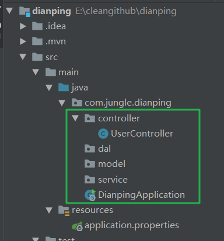
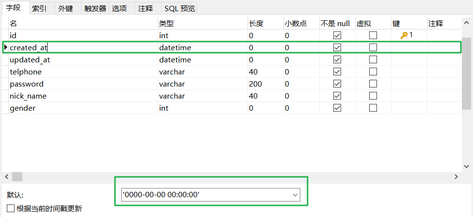
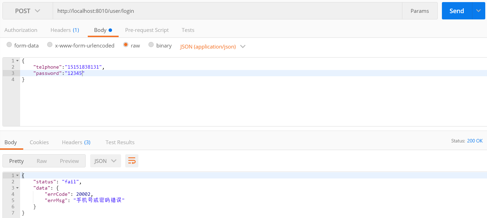
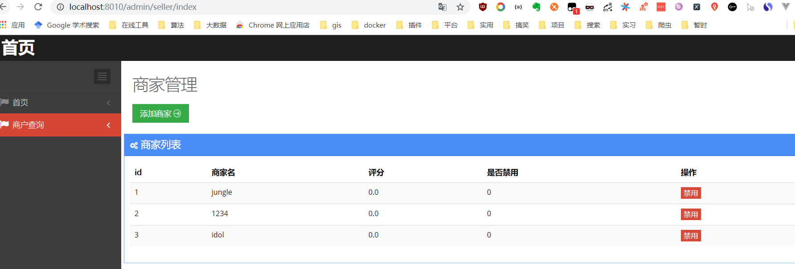
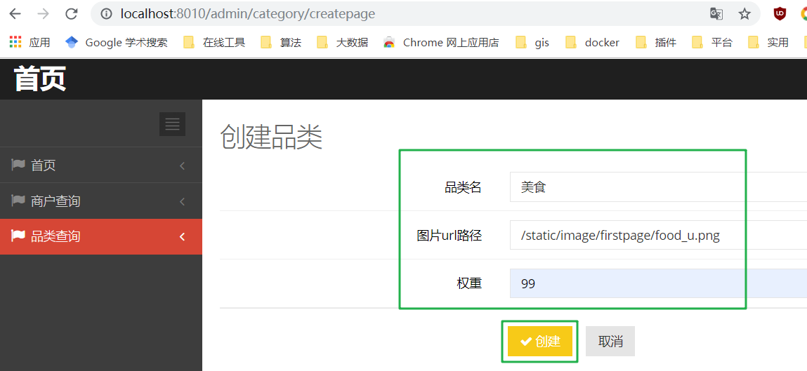
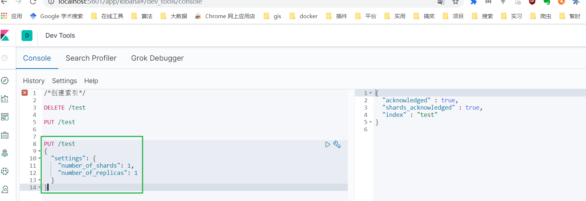
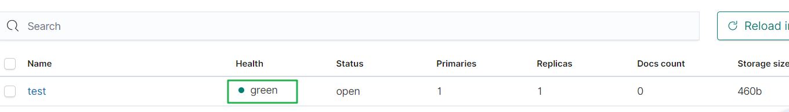
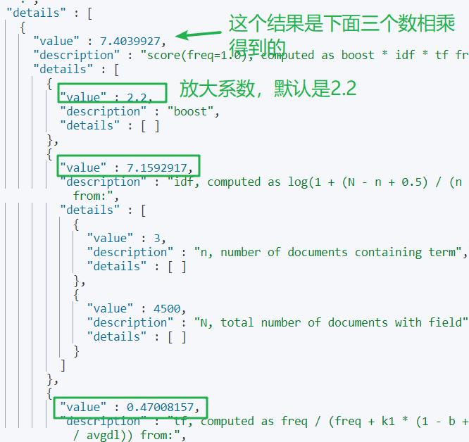
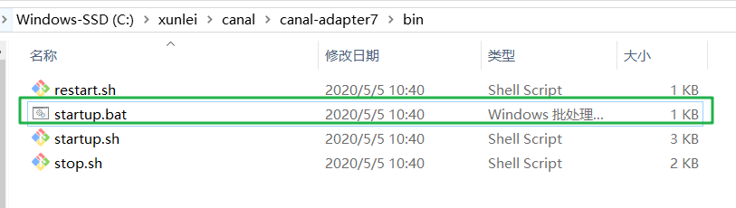
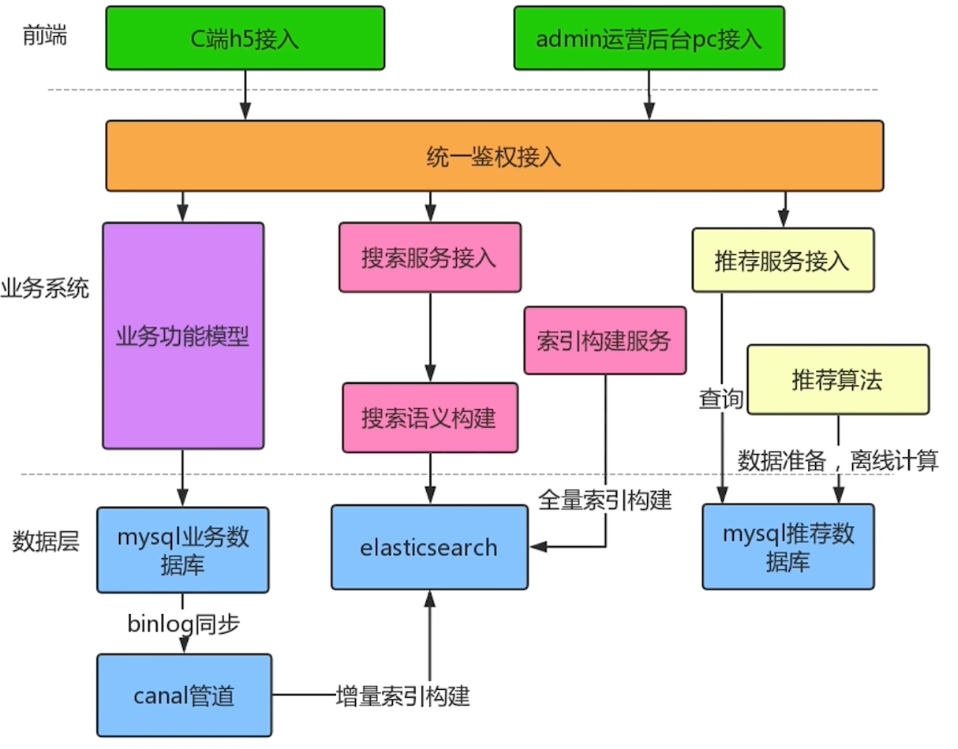

# 第1章 课程导学

 本章综合讲述了点评搜索推荐课程的项目业务背景，架构设计理念以及所需要用到的核心技术能力。 

##   1-1 课程导学 

```
合格的面向C端的系统
	搜索及推荐能力是必不可少的
	快速根据用户关键词搜索给出满意的结果
	结合用户的历史行为、兴趣偏好等推荐给用户想要的服务商品
	提升浏览点击率和交易转化率
```

```
搜索服务必备
	完整丰富的待搜索数据源
	高效且稳定的搜索引擎
	相关性语义的智能理解
```

```
推荐系统必备
	完整丰富的训练及测试数据集
	个性化千人千面的召回及排序机器学习算法
	可解释且有实际意义的评价指标
```

```
项目设计
◆业务需求BRD及产品需求PRD的概念
◆如何将项目需求演化为技术方案,架构设计及落地的操作过程
◆完成项目的技术设计
```

```
项目基础搭建
使用 Spring Boot完成业务系统的基础搭建
接入 mybatis完成mysql数据源的接入
封装通用返回值,通用异常处理的基础能力建设
```

```
业务领域模型能力建设
    用户领域模型能力建设
    服务品类能力建设
    运营后台能力建设
    门店能力建设
    商户能力建设
```

```
搜索推荐1.0架构
◆使用业务系统及数据库能力建设关键词搜索及二次聚合筛选能力
◆结合lbs地理围栏通过距离和评价控制排序策略
◆使用简单的线性推荐策略完成1.0的推荐系统
```

```
ElasticSearch7基础
◆分布式搜索引擎基础原理学习
◆ES7基础语法学习
◆ES7基础应用学习
```

```
ElasticSearch7高端进阶
    结合TMDB开源数据源深入学习ES进阶能力
    理解ES多字段查询能力扩展
    理解ES打分原理并可以自定义打分逻辑
```

```
搜索2.0架构
◆通过中文分词器完成中文分词学习
◆借助logstash-input-jdbc学习全量及非实时增量索引构建
◆改造点评搜索应用,升级搜索2.0架构
```

```
搜索2.0能力进阶
◆通过定制化分词器及同义词扩展丰富搜索准确性
◆通过词性分析及相关性重塑算法打造可理解语义的搜索引擎
◆通过定制化 canal中间件完成准实时增量索引接入
```

```
推荐2.0架构进阶
	通过 Spark Mllib的ALS算法实现个性化召回体系
	通过 Spark Mllib的LR算法实现个性化排序体系
	改造点评推荐架构,升级2.0千人千面的个性化推荐
```

```
环境参数介绍
◆后端业务:Java(jdk1.8), SpringBoot框架(2.1.5)
◆后端存储: mysql数据库(5.6), mybatis接入
◆搜索系统: elasticsearch分布式搜索引擎(7.3.0), canal(1.1.3)
◆推荐系统: spark mllib机器学习组件(2.4.4)
◆前端页面:html,css,js,jquery
```

---

# 第2章 项目设计

 本章中讲述了如何模拟现实情况中，点评搜索推荐项目从业务需求BRD到产品需求PRD，最终到技术方案选型，架构设计及技术落地的整个过程。 

##  2-1 项目设计---业务需求 

```
本章目标
    需求分析,理解需求目标
    技术分解,确定技术选型
    模块设计,完善系统流程
```

```
需求分析
◆业务需求BRD( Business Requirement Document)
◆用户故事( User Story)
◆产品PRD( Product Requirement Document)
```

```
业务需求
◆仿大众点评做H5应用
◆具备搜索线下门店服务功能
◆具备推荐线下门店服务功能,类似于猜你喜欢
```


---

##  2-2 项目设计---技术分解&模块设计 

```
技术分解
    后端业务模块
    搜索系统
    后端存储系统
    推荐系统
    前端页面
```

```
模块设计
    业务模块架构设计
    系统模块架构设计
```

业务模块架构设计：可以对等产品PRD的设计

系统模块架构设计：更多地偏向技术落地细节

### 业务模块架构

```
业务实体
    用户管理
    商家管理
    服务类型管理
    门店管理
```

```
业务实体行为
    用户注册,用户登录
    商家创建,商家浏览
    服务类型创建,服务类型查询浏览
    门店创建,门店搜索及筛选,门店推荐
```

E-R图


### 系统模块架构


##  2-3 阶段小结 

```
总结
了解从业务需求,用户故事,产品prd到业务模块设计系统模块设计的过程
技术选型中考虑的点和面
```

---

##  2-4 【阶段总结】项目设计总结 

**一、BRD**
***全称：***
Business Requirement Document
***定义：***
业务诉求方简略的表述自身想要达到的业务诉求的说明书
**二、点评搜索推荐BRD样例**
***业务目的：***
模仿大众点评应用提供用户线下服务的h5页面
***业务场景：***
让用户可以通过对应h5页面搜索想要的门店服务，并通过猜你喜欢的方式给用户做门店推荐
***使用人员：***
1.业务的运营人员
2.需要获得服务的c端用户
**三、PRD**
***全称：***
Product Requirement Document
***定义：***
产品经理通过业务方的业务需求说明书制定出可以提供给研发上手开发的明确的产品流程，需求，用户使用行为，前后台明确功能等说明书
**四、点评搜索推荐PRD**
***需求背景：***
模仿大众点评应用提供用户线下搜索推荐服务门店的需求
***名词定义：***
用户：使用仿点评应用h5搜索推荐页面的人员
运营后台：提供后台门店，商户，服务类目管理的后台网页
运营：使用运营后台配置门店，商户，服务类目的人员

运营后台功能：
1.运营登录功能：
输入用户名，密码登录运营后台
2.运营商家管理功能，包含：
商家创建：商户名，商家评分
商家列表查询：商户id，商户名，商户评分
商户启用禁用
3.服务类目管理功能，包含：
类目创建：名称，图标，排序
类目列表查询：类目id，名称，图标，排序

---

# 第3章 项目基础搭建【业务系统之基础能力】

 本章中使用了SpringBoot加Mybatis框架完成基础项目能力建设，并加装通用返回值，异常处理，页面请求资源等处理方式完善业务系统的基础能力建设。 

##  3-1 开发工具介绍 

```
开发工具
     Java sdk 1.8
     Apache maven 3.2
     IntelliJ IDEA
```


## 3-2 springboot web搭建

目录结构



---

引入依赖

```xml
<properties>
        <java.version>1.8</java.version>
        <project.build.sourceEncoding>UTF-8</project.build.sourceEncoding>
        <maven.compiler.source>1.8</maven.compiler.source>
        <maven.compile.target>1.8</maven.compile.target>
    </properties>


<dependency>
            <groupId>org.springframework.boot</groupId>
            <artifactId>spring-boot-starter-web</artifactId>
        </dependency>

```

---

测试


---


---


## 3-3 service及mybatis接入（上）




---


---

```sql
CREATE TABLE `dianpingdb`.`user` (
	`id` int NOT NULL AUTO_INCREMENT,
	`created_at` datetime NOT NULL DEFAULT '0000-00-00 00:00:00',
	`updated_at` datetime NOT NULL DEFAULT '0000-00-00 00:00:00',
	`telphone` varchar(40) NOT NULL DEFAULT '',
	`password` varchar(200) NOT NULL DEFAULT '',
	`nick_name` varchar(40) NOT NULL DEFAULT '',
	`gender` int NOT NULL DEFAULT 0,
	PRIMARY KEY (`id`),
	UNIQUE `telphone_unique_index` USING BTREE (`telphone`) comment ''
) COMMENT='';
```

----

引入依赖

```xml
<dependency>
			<groupId>mysql</groupId>
			<artifactId>mysql-connector-java</artifactId>
			<version>5.1.41</version>
		</dependency>
		<dependency>
			<groupId>com.alibaba</groupId>
			<artifactId>druid</artifactId>
			<version>1.1.3</version>
		</dependency>
		<dependency>
			<groupId>org.mybatis.spring.boot</groupId>
			<artifactId>mybatis-spring-boot-starter</artifactId>
			<version>1.3.1</version>
		</dependency>
```


## 3-4 service及mybatis接入（下）

### **生成mapper等文件**

引入依赖

```xml
<pluginManagement><!-- lock down plugins versions to avoid using Maven defaults (may be moved to parent pom) -->
			<plugins>
				<plugin>
					<groupId>org.mybatis.generator</groupId>
					<artifactId>mybatis-generator-maven-plugin</artifactId>
					<version>1.3.5</version>
					<dependencies>
						<dependency>
							<groupId>org.mybatis.generator</groupId>
							<artifactId>mybatis-generator-core</artifactId>
							<version>1.3.5</version>
						</dependency>
						<dependency>
							<groupId>mysql</groupId>
							<artifactId>mysql-connector-java</artifactId>
							<version>5.1.41</version>
						</dependency>
					</dependencies>
					<executions>
						<execution>
							<id>mybatis generator</id>
							<phase>package</phase>
							<goals>
								<goal>generate</goal>
							</goals>
						</execution>
					</executions>
					<configuration>
						<!--允许移动生成的文件-->
						<verbose>true</verbose>
						<!--允许自动覆盖文件-->
						<overwrite>true</overwrite>
						<configurationFile>
							src/main/resources/mybatis-generator.xml
						</configurationFile>
					</configuration>
				</plugin>
			</plugins>
		</pluginManagement>
```


---

在resources目录下新建`mybatis-generator.xml`文件

```xml
<?xml version="1.0" encoding="UTF-8"?>
<!DOCTYPE generatorConfiguration
        PUBLIC "-//mybatis.org//DTD MyBatis Generator Configuration 1.0//EN"
        "http://mybatis.org/dtd/mybatis-generator-config_1_0.dtd">
<generatorConfiguration>

    <context id="DB2Tables"    targetRuntime="MyBatis3">
        <!--数据库链接地址账号密码-->
        <jdbcConnection driverClass="com.mysql.jdbc.Driver" connectionURL="jdbc:mysql://127.0.0.1:3306/dianpingdb" userId="root" password="root">
        </jdbcConnection>
        <!--生成DataObject类存放位置-->
        <javaModelGenerator targetPackage="com.imooc.dianping.model" targetProject="src/main/java">
            <property name="enableSubPackages" value="true"/>
            <property name="trimStrings" value="true"/>
        </javaModelGenerator>
        <!--生成映射文件存放位置-->
        <sqlMapGenerator targetPackage="mapping" targetProject="src/main/resources">
            <property name="enableSubPackages" value="true"/>
        </sqlMapGenerator>
        <!--生成Dao类存放位置-->
        <!-- 客户端代码，生成易于使用的针对Model对象和XML配置文件 的代码
                type="ANNOTATEDMAPPER",生成Java Model 和基于注解的Mapper对象
                type="MIXEDMAPPER",生成基于注解的Java Model 和相应的Mapper对象
                type="XMLMAPPER",生成SQLMap XML文件和独立的Mapper接口
        -->
        <javaClientGenerator type="XMLMAPPER" targetPackage="com.imooc.dianping.dal" targetProject="src/main/java">
            <property name="enableSubPackages" value="true"/>
        </javaClientGenerator>

        <!--生成对应表及类名-->
        <!--
        <table tableName="user_info"  domainObjectName="UserDO" enableCountByExample="false"
        enableUpdateByExample="false" enableDeleteByExample="false"
        enableSelectByExample="false" selectByExampleQueryId="false"></table>
        <table tableName="user_password"  domainObjectName="UserPasswordDO" enableCountByExample="false"
               enableUpdateByExample="false" enableDeleteByExample="false"
               enableSelectByExample="false" selectByExampleQueryId="false"></table>
        -->
        <table tableName="user"  domainObjectName="UserModel" enableCountByExample="false"
               enableUpdateByExample="false" enableDeleteByExample="false"
               enableSelectByExample="false" selectByExampleQueryId="false">
            <generatedKey column="id" sqlStatement="MySql" identity="true" />
        </table>

    </context>
</generatorConfiguration>
```

修改几处要该的部分


---

运行指令

```
mvn mybatis-generator:generate
```

---------

### **集成mybatis数据**

修改`application.properties`

```properties
mybatis.mapperLocations=classpath:mapping/*.xml

#配置数据库链接等数据源
spring.datasource.name=dianpingdb
spring.datasource.url=jdbc:mysql://106.14.105.113:4406/dianpingdb?useUnicode=true&characterEncoding=UTF-8
spring.datasource.username=root
spring.datasource.password=root

#使用druid做链接池管理
spring.datasource.type=com.alibaba.druid.pool.DruidDataSource
spring.datasource.driverClassName=com.mysql.jdbc.Driver
```


在`DianpingApplication`添加新的注解

```java
@SpringBootApplication(scanBasePackages = {"com.jungle.dianping"})
@MapperScan("com.jungle.dianping.dal")
```


----

**使用测试**

`UserService`

```java
package com.jungle.dianping.service;

import com.jungle.dianping.model.UserModel;

/**
 * Created by hzllb on 2019/7/7.
 */
public interface UserService {

    UserModel getUser(Integer id);

}

```

`UserServiceImpl`

```java
package com.jungle.dianping.service.impl;

import com.jungle.dianping.dal.UserModelMapper;
import com.jungle.dianping.model.UserModel;
import com.jungle.dianping.service.UserService;
import org.springframework.beans.factory.annotation.Autowired;
import org.springframework.stereotype.Service;

/**
 * Created by hzllb on 2019/7/7.
 */
@Service
public class UserServiceImpl implements UserService {

    @Autowired
    private UserModelMapper userModelMapper;


    @Override
    public UserModel getUser(Integer id) {
        return userModelMapper.selectByPrimaryKey(id);
    }

}

```

`UserController`

```java
package com.jungle.dianping.controller;


import com.jungle.dianping.model.UserModel;
import com.jungle.dianping.service.UserService;
import org.springframework.beans.factory.annotation.Autowired;
import org.springframework.stereotype.Controller;
import org.springframework.web.bind.annotation.RequestMapping;
import org.springframework.web.bind.annotation.RequestParam;
import org.springframework.web.bind.annotation.ResponseBody;

@Controller("/user")
@RequestMapping("/user")
public class UserController {

    @Autowired
    private UserService userService;

    @RequestMapping("/test")
    @ResponseBody
    public String test() {
        return "test";
    }

    @RequestMapping("/get")
    @ResponseBody
    public UserModel getUser(@RequestParam(name="id") Integer id) {
        return userService.getUser(id);
    }

}

```

**启动测试**

首先数据库中添加一条数据


---


启动程序，浏览器访问 http://localhost:8010/user/get?id=1 


## 3-5 通用返回和异常处理

**定义通用返回类`CommonRes`**

```java
package com.jungle.dianping.common;

/**
 * Created by hzllb on 2019/7/9.
 */
public class CommonRes {

    //表明读经请求的返回处理结果，"success"或"fail"
    private String status;

    //若status=success时，表明对应的返回的json类数据
    //若status=fail时，则data内将使用通用的错误码对应的格式
    private Object data;

    //定义一个通用的创建返回对象的方法
    public static CommonRes create(Object result){
        return CommonRes.create(result,"success");
    }

    public static CommonRes create(Object result,String status){
        CommonRes commonRes = new CommonRes();
        commonRes.setStatus(status);
        commonRes.setData(result);

        return commonRes;
    }


    public String getStatus() {
        return status;
    }

    public void setStatus(String status) {
        this.status = status;
    }

    public Object getData() {
        return data;
    }

    public void setData(Object data) {
        this.data = data;
    }
}

```

测试效果

`UserController`

```java
 @RequestMapping("/get")
    @ResponseBody
    public CommonRes getUser(@RequestParam(name="id") Integer id) {
        UserModel user = userService.getUser(id);
        return CommonRes.create(user);
    }

```


---

**返回处理错误的data方式`CommonError`**

```java
package com.jungle.dianping.common;

/**
 * Created by hzllb on 2019/7/9.
 */
public class CommonError {
    //错误码
    private Integer errCode;


    //错误描述
    private String errMsg;

    public CommonError(Integer errCode, String errMsg) {
        this.errCode = errCode;
        this.errMsg = errMsg;
    }

    public CommonError(EmBusinessError emBusinessError){
        this.errCode = emBusinessError.getErrCode();
        this.errMsg = emBusinessError.getErrMsg();
    }

    public Integer getErrCode() {
        return errCode;
    }

    public void setErrCode(Integer errCode) {
        this.errCode = errCode;
    }

    public String getErrMsg() {
        return errMsg;
    }

    public void setErrMsg(String errMsg) {
        this.errMsg = errMsg;
    }
}

```

**业务系统要处理的异常`EmBusinessError`**

这是个枚举类

```java
package com.jungle.dianping.common;

/**
 * Created by hzllb on 2019/7/9.
 */
public enum EmBusinessError {

    //通用的错误类型10000开头
    NO_OBJECT_FOUND(10001,"请求对象不存在"),
    UNKNOWN_ERROR(10002,"未知错误"),
    NO_HANDLER_FOUND(10003,"找不到执行的路径操作"),
    BIND_EXCEPTION_ERROR(10004,"请求参数错误"),
    PARAMETER_VALIDATION_ERROR(10005,"请求参数校验失败"),

    //用户服务相关的错误类型20000开头
    REGISTER_DUP_FAIL(20001,"用户已存在"),

    LOGIN_FAIL(20002,"手机号或密码错误");

    private Integer errCode;

    private String errMsg;

    EmBusinessError(Integer errCode, String errMsg) {
        this.errCode = errCode;
        this.errMsg = errMsg;
    }

    public Integer getErrCode() {
        return errCode;
    }

    public void setErrCode(Integer errCode) {
        this.errCode = errCode;
    }

    public String getErrMsg() {
        return errMsg;
    }

    public void setErrMsg(String errMsg) {
        this.errMsg = errMsg;
    }
}

```

在`CommonError`使用枚举类

```java
public CommonError(EmBusinessError emBusinessError){
        this.errCode = emBusinessError.getErrCode();
        this.errMsg = emBusinessError.getErrMsg();
    }
```


使用测试

`UserController`

```java
@RequestMapping("/get")
    @ResponseBody
    public CommonRes getUser(@RequestParam(name="id") Integer id) {
        UserModel user = userService.getUser(id);
        if (user!=null) {
            return CommonRes.create(user);
        } else  {
            return CommonRes.create(new CommonError(EmBusinessError.UNKNOWN_ERROR),"fail");
        }

    }
```


浏览器访问 http://localhost:8010/user/get?id=2 


----

**异常类`BusinessException`**

```java
package com.jungle.dianping.common;

/**
 * Created by hzllb on 2019/7/9.
 */
public class BusinessException extends Exception {
    private CommonError commonError;

    public BusinessException(EmBusinessError emBusinessError){
        super();
        this.commonError = new CommonError(emBusinessError);
    }

    public BusinessException(EmBusinessError emBusinessError,String errMsg){
        super();
        this.commonError = new CommonError(emBusinessError);
        this.commonError.setErrMsg(errMsg);
    }

    public CommonError getCommonError() {
        return commonError;
    }

    public void setCommonError(CommonError commonError) {
        this.commonError = commonError;
    }
}

```

使用测试

`UserController`

```java
@RequestMapping("/get")
    @ResponseBody
    public CommonRes getUser(@RequestParam(name="id") Integer id) throws BusinessException {
        UserModel user = userService.getUser(id);
        if (user!=null) {
            return CommonRes.create(user);
        } else  {
            // return CommonRes.create(new CommonError(EmBusinessError.UNKNOWN_ERROR),"fail");
            throw new BusinessException(EmBusinessError.BIND_EXCEPTION_ERROR);
        }

    }
```


上面只是将异常抛出去，并未处理，所以前端是这个样子的


所以，需要定义一个全局处理器

---

**全局异常处理器**

首先，在`DianpingApplication`添加新的注解

```Java
// 可以解析一些aop的配置
@EnableAspectJAutoProxy(proxyTargetClass = true)
```


引入依赖

```xml
<dependency>
			<groupId>org.springframework.boot</groupId>
			<artifactId>spring-boot-starter-aop</artifactId>
		</dependency>
```

`GlobalExceptionHandler`

```java
package com.jungle.dianping.common;

import org.springframework.web.bind.ServletRequestBindingException;
import org.springframework.web.bind.annotation.ControllerAdvice;
import org.springframework.web.bind.annotation.ExceptionHandler;
import org.springframework.web.bind.annotation.ResponseBody;
import org.springframework.web.servlet.NoHandlerFoundException;

import javax.servlet.http.HttpServletRequest;
import javax.servlet.http.HttpServletResponse;

/**
 * Created by hzllb on 2019/7/9.
 */
// 这个注解表示所有执行的controller都会被这个页面所包含
@ControllerAdvice
public class GlobalExceptionHandler {

    // 处理规则
    // 抛出的异常或继承Exception.class都会来到这里被处理
    // 这里返回的是CommonRes
    @ExceptionHandler(Exception.class)
    @ResponseBody
    public CommonRes doError(HttpServletRequest servletRequest, HttpServletResponse httpServletResponse,Exception ex){
        if(ex instanceof BusinessException){
            return CommonRes.create(((BusinessException)ex).getCommonError(),"fail");
        }else if(ex instanceof NoHandlerFoundException){ // 处理404异常
            CommonError commonError = new CommonError(EmBusinessError.NO_HANDLER_FOUND);
            return CommonRes.create(commonError,"fail");
        }else if(ex instanceof ServletRequestBindingException){
            CommonError commonError = new CommonError(EmBusinessError.BIND_EXCEPTION_ERROR);
            return CommonRes.create(commonError,"fail");
        } else {
            CommonError commonError = new CommonError(EmBusinessError.UNKNOWN_ERROR);
            return CommonRes.create(commonError,"fail");
        }

    }
}

```

使用测试


---

**细节分析：处理404的错误**


当访问错误的url时，比如 http://localhost:8010/user/ge2t?id=2 ，会出现下面这种页面


我们现在要自己处理这种页面

`application.properties`

```properties
#add-mappings=true表示如果所有的controller都没有命中，则使用默认的静态资源处理器做匹配
spring.resources.add-mappings=false
spring.mvc.throw-exception-if-no-handler-found=true
```


再次访问http://localhost:8010/user/ge2t?id=2 


## 3-6 页面请求资源处理

**请求静态资源文件**

`application.properties`

```properties
#接入前端静态资源页面
spring.mvc.static-path-pattern=/static/**
```

注意：要将add-mappings设置为true


使用测试


浏览器访问 http://localhost:8010/static/test.html 


---

**使用thymeleaf做动态模板的渲染**

引入依赖

```xml
<dependency>
			<groupId>org.springframework.boot</groupId>
			<artifactId>spring-boot-starter-thymeleaf</artifactId>
		</dependency>
```

引入thymeleaf相关配置

`application.properties`

```properties
#thymeleaf相关的配置
spring.thymeleaf.prefix=classpath:/templates/
spring.thymeleaf.suffix=.html
```

使用测试

`UserController`

```java
@RequestMapping("/index")
    public ModelAndView index(){
        String userName = "imooc";
        ModelAndView modelAndView = new ModelAndView("/index.html");
        modelAndView.addObject("name",userName);
        return modelAndView;
    }
```


---

# 第4章 基础服务之用户，运营，商户能力建设【业务系统主体实现】

 本章中，将项目中业务系统能力划分为C端用户层和运营后台管理层，建设了面向用户的登录注册服务与面向运营配置后台的统一权限管理，并建设了一套点评商户入驻体系的流程。 

```
一、用户服务搭建
用户业务模型后端服务：
1. 用户注册，由于手机号的唯一性，最靠谱的就是使用数据库的唯一索引保证，同时catch duplicatedkey异常，抛出有意义的手机号已注册异常
2. 用户注册，使用密码加密的方式以秘文方式入库，保证用户信息的安全性
3. 用户登录，通过无状态的http session机制，通过cookie传递sessionId信息并保存登录凭证
二、运营后台搭建
运营后台模版：
Metronic通用运营后台模版，可直接使用代码下载区内下载下来的metronic处理前后的代码，处理前的可用于学习控件使用，处理后的可直接应用
课程中，同时课程源代码直接下来下来的也包含处理后的代码
面向切面编程的统一权限管理：
通过引入springboot starter aop jar包，设置权限切面并实现ControllerAspect
三、商户服务搭建
商户服务搭建：
1. 新增创建，单体查询
2. 通过引入PageHelper解决查询分页问题
```


## 4-1 用户服务搭建（上）

```
用户服务
    用户模型
    用户行为-登录注册
    用户登录态管理
```

---

### 1.注册

`UserService`

```java
UserModel register(UserModel register) throws BusinessException, UnsupportedEncodingException, NoSuchAlgorithmException;
```

`UserServiceImpl`

```java
/**
     * 用户注册
     */
    @Override
    @Transactional // 可能涉及多个数据库的插入数据
    public UserModel register(UserModel registerUser) throws BusinessException, UnsupportedEncodingException, NoSuchAlgorithmException {

        // 给密码加密
        registerUser.setPassword(encodeByMd5(registerUser.getPassword()));
        registerUser.setCreatedAt(new Date());
        registerUser.setUpdatedAt(new Date());

        try{
            // 用户注册，手机号码要唯一
            // 号码重复要抛出异常
            userModelMapper.insertSelective(registerUser);
        }catch (DuplicateKeyException ex){
            throw new BusinessException(EmBusinessError.REGISTER_DUP_FAIL);
        }

        return getUser(registerUser.getId());
    }


/**
     * 加密方法
     */
    private String encodeByMd5(String str) throws NoSuchAlgorithmException, UnsupportedEncodingException {
        //确认计算方法MD5
        MessageDigest messageDigest = MessageDigest.getInstance("MD5");
        BASE64Encoder base64Encoder = new BASE64Encoder();
        return base64Encoder.encode(messageDigest.digest(str.getBytes("utf-8")));

    }

```


---

**view模型**


request：对应所有web层界面抛过来的request对象

作用：可以用于入参校验

`RegisterReq`

```java
package com.jungle.dianping.request;

import javax.validation.constraints.NotBlank;
import javax.validation.constraints.NotNull;

/**
 * Created by hzllb on 2019/7/13.
 */
public class RegisterReq {

    @NotBlank(message = "手机号不能为空")
    private String telphone;
    @NotBlank(message = "密码不能为空")
    private String password;
    @NotBlank(message = "昵称不能为空")
    private String nickName;

    @NotNull(message = "性别不能为空")
    private Integer gender;

    public String getTelphone() {
        return telphone;
    }

    public void setTelphone(String telphone) {
        this.telphone = telphone;
    }

    public String getPassword() {
        return password;
    }

    public void setPassword(String password) {
        this.password = password;
    }

    public String getNickName() {
        return nickName;
    }

    public void setNickName(String nickName) {
        this.nickName = nickName;
    }

    public Integer getGender() {
        return gender;
    }

    public void setGender(Integer gender) {
        this.gender = gender;
    }
}

```

----

`UserController`

```java
@RequestMapping("/register")
    @ResponseBody   // @Valid 入参校验 BindingResult中就是错误的信息 @RequestBody 请求入参接受前端传来的json数据
    public CommonRes register(@Valid @RequestBody RegisterReq registerReq, BindingResult bindingResult) throws BusinessException, UnsupportedEncodingException, NoSuchAlgorithmException {
        if(bindingResult.hasErrors()){
            throw new BusinessException(EmBusinessError.PARAMETER_VALIDATION_ERROR, CommonUtil.processErrorString(bindingResult));
        }

        UserModel registerUser = new UserModel();
        registerUser.setTelphone(registerReq.getTelphone());
        registerUser.setPassword(registerReq.getPassword());
        registerUser.setNickName(registerReq.getNickName());
        registerUser.setGender(registerReq.getGender());

        UserModel resUserModel = userService.register(registerUser);

        return CommonRes.create(resUserModel);
    }
```

工具类`CommonUtil`

```java
/**
     * 拼接入参校验d的错误原因
     */
    public static String processErrorString(BindingResult bindingResult){
        if(!bindingResult.hasErrors()){
            return "";
        }
        StringBuilder stringBuilder = new StringBuilder();
        for(FieldError fieldError:bindingResult.getFieldErrors()){
            stringBuilder.append(fieldError.getDefaultMessage()+",");
        }
        return stringBuilder.substring(0,stringBuilder.length()-1);
    }
```


---


## 4-2 用户服务搭建（下）

**使用测试**

错误的注册


正确的注册


---

### 1.用户登录

**数据访问层**

`UserModelMapper`

```java
/**
     * 通过手机和密码查询
     */
    UserModel selectByTelphoneAndPassword(@Param("telphone") String telphone, @Param("password")String password);

```

`UserModelMapper.xml`

```xml
<select id="selectByTelphoneAndPassword" resultMap="BaseResultMap">
    SELECT
    <include refid="Base_Column_List"/>
    from user where telphone=#{telphone} and password = #{password}
  </select>
```

**业务逻辑层**

`UserService`

```java
UserModel login(String telphone,String password) throws UnsupportedEncodingException, NoSuchAlgorithmException, BusinessException;
```

`UserServiceImpl`

```java
 /**
     * 用户登录
     */
    @Override
    public UserModel login(String telphone, String password) throws UnsupportedEncodingException, NoSuchAlgorithmException, BusinessException {
        UserModel userModel = userModelMapper.selectByTelphoneAndPassword(telphone,encodeByMd5(password));
        if(userModel == null){
            throw new BusinessException(EmBusinessError.LOGIN_FAIL);
        }
        return userModel;
    }
```

**controller层**

view模型`LoginReq`

```java
package com.jungle.dianping.request;

import javax.validation.constraints.NotBlank;

/**
 * Created by hzllb on 2019/7/13.
 */
public class LoginReq {
    @NotBlank(message = "手机号不能为空")
    private String telphone;
    @NotBlank(message = "密码不能为空")
    private String password;

    public String getTelphone() {
        return telphone;
    }

    public void setTelphone(String telphone) {
        this.telphone = telphone;
    }

    public String getPassword() {
        return password;
    }

    public void setPassword(String password) {
        this.password = password;
    }
}

```

`UserController`

```java
public static final String CURRENT_USER_SESSION = "currentUserSession";

    @Autowired
    private HttpServletRequest httpServletRequest;
    
    
    
    
    
    @RequestMapping("/login")
    @ResponseBody
    public CommonRes login(@RequestBody @Valid LoginReq loginReq, BindingResult bindingResult) throws BusinessException, UnsupportedEncodingException, NoSuchAlgorithmException {
        if(bindingResult.hasErrors()){
            throw new BusinessException(EmBusinessError.PARAMETER_VALIDATION_ERROR,CommonUtil.processErrorString(bindingResult));
        }

        UserModel userModel = userService.login(loginReq.getTelphone(),loginReq.getPassword());
        // 将用户注册放置httpsession内
        httpServletRequest.getSession().setAttribute(CURRENT_USER_SESSION,userModel);

        return CommonRes.create(userModel);
    }
```

同时，将用户对象`UserModel`序列化,这样才能将session做序列化持久化


---

**使用测试**

错误的登录




正确的登录


---

### 2.用户登出

`UserController`

```java
/**
     * 用户登出
     */
    @RequestMapping("/logout")
    @ResponseBody
    public CommonRes logout() throws BusinessException, UnsupportedEncodingException, NoSuchAlgorithmException {
        httpServletRequest.getSession().invalidate();
        return CommonRes.create(null);
    }

    //获取当前用户信息
    @RequestMapping("/getcurrentuser")
    @ResponseBody
    public CommonRes getCurrentUser(){
        UserModel userModel = (UserModel) httpServletRequest.getSession().getAttribute(CURRENT_USER_SESSION);
        return CommonRes.create(userModel);
    }
```


## 4-3 用户模块前端页面接入

在`resources`引入相关文件`css`,`image`,`script`


引入html文件


## 4-4 运营后台之metronic模版介绍

```
运营后台
    运营后台模版
    运营后台登录授权
    切面权限管理
```


## 4-5 运营后台管理员模块（上）

这里使用的不是前后分离，而是使用了thymeleaf

### 1.**demo展示**

`AdminController`

```java
package com.jungle.dianping.controller.admin;


import org.springframework.stereotype.Controller;
import org.springframework.web.bind.annotation.RequestMapping;
import org.springframework.web.servlet.ModelAndView;

@Controller("/admin/admin")
@RequestMapping("/admin/admin") // 第一个admin代表管理员模块 第二个admin代表管理员
public class AdminController {
    @RequestMapping("/index")
    public ModelAndView index(){
        ModelAndView modelAndView = new ModelAndView("/admin/admin/index");
        return modelAndView;
    }

}

```


----

`index.html`


---

使用测试


---

### 2.登录

在这里登录的用户名和密码是写死的

`application.properties`

```properties
#admin官方账号的用户名和密码
admin.email=admin@imooc.com
#加密后的密码
admin.encryptPassword=4QrcOUm6Wau+VuBX8g+IPg==
```

`AdminController`

```java
 @Value("${admin.email}")
    private String email;


    @Value("${admin.encryptPassword}")
    private String encrptyPassord;

    @Autowired
    private HttpServletRequest httpServletRequest;
    public static final String CURRENT_ADMIN_SESSION = "currentAdminSession";
    
    
    @RequestMapping("/loginpage")
    public ModelAndView loginpage(){
        ModelAndView modelAndView = new ModelAndView("/admin/admin/login");
        return modelAndView;
    }

    @RequestMapping(value = "/login",method = RequestMethod.POST)
    public String login(@RequestParam(name="email")String email,
                        @RequestParam(name="password")String password ) throws BusinessException, UnsupportedEncodingException, NoSuchAlgorithmException {
        if (StringUtils.isEmpty(email) || StringUtils.isEmpty(password)) {
            throw new BusinessException(EmBusinessError.PARAMETER_VALIDATION_ERROR, "用户名密码不能为空");
        }

        if(email.equals(this.email) && encodeByMd5(password).equals(this.encrptyPassord)){
            //登录成功
            // 保存登录信息至session
            httpServletRequest.getSession().setAttribute(CURRENT_ADMIN_SESSION,email);

            // 重定向 注意这里返回值是String，而不是ModelAndView
            return "redirect:/admin/admin/index";
        }else{
            throw new BusinessException(EmBusinessError.PARAMETER_VALIDATION_ERROR,"用户名密码错误");
        }

    }


    /**
     * 加密方法
     */
    private String encodeByMd5(String str) throws NoSuchAlgorithmException, UnsupportedEncodingException {
        //确认计算方法MD5
        MessageDigest messageDigest = MessageDigest.getInstance("MD5");
        BASE64Encoder base64Encoder = new BASE64Encoder();
        return base64Encoder.encode(messageDigest.digest(str.getBytes("utf-8")));

    }
```


---

html页面


---

**使用测试**

浏览器访问 http://localhost:8010/admin/admin/loginpage 


---

## 4-6 运营后台管理员模块（下）

### 1.权限控制

1.新建注解

`AdminPermission`

```java
package com.jungle.dianping.common;

import java.lang.annotation.ElementType;
import java.lang.annotation.Retention;
import java.lang.annotation.RetentionPolicy;
import java.lang.annotation.Target;

@Target({ElementType.METHOD})
@Retention(RetentionPolicy.RUNTIME)
public @interface AdminPermission {
    String produceType() default "text/html";
}

```


2.要在controller上做一个切面

`ControllerAspect`

```java
package com.jungle.dianping.common;

import com.jungle.dianping.controller.admin.AdminController;
import org.aspectj.lang.ProceedingJoinPoint;
import org.aspectj.lang.annotation.Around;
import org.aspectj.lang.annotation.Aspect;
import org.aspectj.lang.reflect.MethodSignature;
import org.springframework.beans.factory.annotation.Autowired;
import org.springframework.context.annotation.Configuration;

import javax.servlet.http.HttpServletRequest;
import javax.servlet.http.HttpServletResponse;
import java.lang.reflect.Method;

@Aspect // 代表这是一个切面
@Configuration // 使其成为一个bean
public class ControllerAspect {

    @Autowired
    private HttpServletRequest httpServletRequest;

    @Autowired
    private HttpServletResponse httpServletResponse;

    // @Around环绕切面的效果
    // com.jungle.dianping.controller.admin目录下的所有方法并且被打上RequestMapping标签的方法
    @Around("execution(* com.jungle.dianping.controller.admin.*.*(..)) && @annotation(org.springframework.web.bind.annotation.RequestMapping)")
    public Object adminControllerBeforeValidation(ProceedingJoinPoint joinPoint) throws Throwable {
        Method method = ((MethodSignature)joinPoint.getSignature()).getMethod();
        AdminPermission adminPermission = method.getAnnotation(AdminPermission.class);
        if(adminPermission == null){
            //公共方法
            // 无需登录
            // 继续执行应该执行的相应的方法
            Object resultObject = joinPoint.proceed();
            return resultObject;
        }
        //判断当前管理员是否登录
        String email = (String) httpServletRequest.getSession().getAttribute(AdminController.CURRENT_ADMIN_SESSION);
        if(email == null){
            if(adminPermission.produceType().equals("text/html")){
                httpServletResponse.sendRedirect("/admin/admin/loginpage");
                return null;
            }else{
                // 如果传过的是json
                CommonError commonError= new CommonError(EmBusinessError.ADMIN_SHOULD_LOGIN);
                return CommonRes.create(commonError,"fail");
            }

        }else{
            Object resultObject = joinPoint.proceed();
            return resultObject;
        }
    }
}

```


3.使用方法

（1）ModelAndView方式


浏览器访问 http://localhost:8010/admin/admin/index ，会自动跳到 http://localhost:8010/admin/admin/loginpage 

（2）Json

 

浏览器访问 http://localhost:8010/admin/admin/index ，出现以下画面


## 4-7 运营后台首页模块

引入常用组件


### **1.获取用户数量**

**数据访问层**

`UserModelMapper`

```javascript
 /**
     * 查询用户数量
     */
    Integer countAllUser();
```

`UserModelMapper.xml`

```xml
<select id="countAllUser" resultType="java.lang.Integer">
    SELECT
    count(1)
    from user
  </select>
```

**业务逻辑层**

`UserService`

```java
Integer countAllUser();
```

`UserServiceImpl`

```java
/**
     * 计算用户数量
     */
    @Override
    public Integer countAllUser() {
        return userModelMapper.countAllUser();
    }
```

**Controller层**

`AdminController`

```java
@Autowired
    private UserService userService;
    
    @RequestMapping("/index")
    @AdminPermission
    public ModelAndView index(){
        ModelAndView modelAndView = new ModelAndView("/admin/admin/index");
        modelAndView.addObject("userCount",userService.countAllUser());
        System.out.println(userService.countAllUser());
        modelAndView.addObject("CONTROLLER_NAME","admin");
        modelAndView.addObject("ACTION_NAME","index");
        return modelAndView;
    }
    
```

---

测试使用效果


## 4-8 商家入驻流程（1）

```
商户服务
◆商户入驻
◆商户查询
◆商户禁用
```

---


新建商家表

```sql
CREATE TABLE `dianpingdb`.`seller`  (
  `id` int(0) NOT NULL AUTO_INCREMENT,
  `name` varchar(80) NOT NULL DEFAULT '',
  `created_at` datetime(0) NOT NULL DEFAULT '0000-00-00 00:00:00',
  `updated_at` datetime(0) NOT NULL DEFAULT '0000-00-00 00:00:00',
  `remark_score` decimal(2, 1) NOT NULL DEFAULT 0,
  `disabled_flag` int(0) NOT NULL DEFAULT 0,
  PRIMARY KEY (`id`)
);
```

---

用mybatis生成对应的mapper

`mybatis-generator.xml`


## 4-9 商家入驻流程（2）

### 1.添加商家

**Controller层**

view模型`SellerCreateReq`

```java
package com.jungle.dianping.request;

import javax.validation.constraints.NotBlank;

public class SellerCreateReq {
    @NotBlank(message = "商户名不能为空")
    private String name;

    public String getName() {
        return name;
    }

    public void setName(String name) {
        this.name = name;
    }
}

```

`SellerController`

```java
@RequestMapping("/createpage")
    @AdminPermission
    public ModelAndView createPage(){
        ModelAndView modelAndView = new ModelAndView("/admin/seller/create.html");
        modelAndView.addObject("CONTROLLER_NAME","seller");
        modelAndView.addObject("ACTION_NAME","create");
        return modelAndView;
    }

    @RequestMapping(value = "/create",method = RequestMethod.POST)
    @AdminPermission
    public String create(@Valid  SellerCreateReq sellerCreateReq, BindingResult bindingResult) throws BusinessException {
        if(bindingResult.hasErrors()){
            throw new BusinessException(EmBusinessError.PARAMETER_VALIDATION_ERROR, CommonUtil.processErrorString(bindingResult));
        }

        SellerModel sellerModel = new SellerModel();
        sellerModel.setName(sellerCreateReq.getName());
        sellerService.create(sellerModel);

        return "redirect:/admin/seller/index";


    }
```

---

**业务逻辑层**

`SellerServiceImpl`

```java
@Override
    @Transactional
    public SellerModel create(SellerModel sellerModel) {
        sellerModel.setCreatedAt(new Date());
        sellerModel.setUpdatedAt(new Date());
        sellerModel.setRemarkScore(new BigDecimal(0));
        sellerModel.setDisabledFlag(0);
        sellerModelMapper.insertSelective(sellerModel);
        return get(sellerModel.getId());
    }

 @Override
    public SellerModel get(Integer id) {
        return sellerModelMapper.selectByPrimaryKey(id);
    }
```

---

使用测试

浏览器访问 http://localhost:8010/admin/seller/createpage 





## 4-10 商家入驻流程（3）

### 1.查询商家优化

**分页查询**

引入依赖

```xml
<dependency>
			<groupId>com.github.pagehelper</groupId>
			<artifactId>pagehelper-spring-boot-starter</artifactId>
			<version>1.2.10</version>
		</dependency>
```

---

使用

view模型`PageQuery`

```java
package com.jungle.dianping.request;

public class PageQuery {

    // 查询第几页，默认从第一页开始
    private Integer page = 1;

    // 一页查询20条数据
    private Integer size = 20;

    public Integer getPage() {
        return page;
    }

    public void setPage(Integer page) {
        this.page = page;
    }

    public Integer getSize() {
        return size;
    }

    public void setSize(Integer size) {
        this.size = size;
    }
}

```

`SellerController`

```java
//商户列表
    @RequestMapping("/index")
    @AdminPermission
    public ModelAndView index(PageQuery pageQuery){
        PageHelper.startPage(pageQuery.getPage(),pageQuery.getSize());
        List<SellerModel> sellerModelList = sellerService.selectAll();
        PageInfo<SellerModel> sellerModelPageInfo = new PageInfo<>(sellerModelList);
        ModelAndView modelAndView = new ModelAndView("/admin/seller/index.html");
        modelAndView.addObject("data",sellerModelPageInfo);
        modelAndView.addObject("CONTROLLER_NAME","seller");
        modelAndView.addObject("ACTION_NAME","index");
        return modelAndView;
    }
```

效果


----


## 4-11 商家入驻流程（4）

### 1.商家的启用禁用

**Controller层**

`SellerController`

```java
@RequestMapping(value="down",method = RequestMethod.POST)
    @AdminPermission
    @ResponseBody
    public CommonRes down(@RequestParam(value="id")Integer id) throws BusinessException {
        SellerModel sellerModel = sellerService.changeStatus(id,1);
        return CommonRes.create(sellerModel);
    }

    @RequestMapping(value="up",method = RequestMethod.POST)
    @AdminPermission
    @ResponseBody
    public CommonRes up(@RequestParam(value="id")Integer id) throws BusinessException {
        SellerModel sellerModel = sellerService.changeStatus(id,0);
        return CommonRes.create(sellerModel);
    }
```

**业务逻辑层**

`SellerServiceImpl`

```java
 @Override
    public SellerModel changeStatus(Integer id, Integer disabledFlag) throws BusinessException {
        SellerModel sellerModel = get(id);
        if(sellerModel == null){
            throw new BusinessException(EmBusinessError.PARAMETER_VALIDATION_ERROR);
        }
        sellerModel.setDisabledFlag(disabledFlag);
        sellerModelMapper.updateByPrimaryKeySelective(sellerModel);
        return sellerModel;
    }
```

效果


---

# 第5章 基础服务之品类，门店能力建设【业务系统主体实现】

 本章中，将扩展运营后台能力，把品类服务与开店能力加入运营后台，完成点评所有基础业务能力建设。 

## 5-1 品类管理服务

```
品类服务
    品类创建
    品类查询
    品类露出
```

新建种类`category`表

```sql
CREATE TABLE `dianpingdb`.`category`  (
  `id` int(0) NOT NULL AUTO_INCREMENT,
  `created_at` datetime(0) NOT NULL DEFAULT '0000-00-00 00:00:00',
  `updated_at` datetime(0) NOT NULL DEFAULT '0000-00-00 00:00:00',
  `name` varchar(20) NOT NULL DEFAULT '',
  `icon_url` varchar(200) NOT NULL DEFAULT '',
  `sort` int(0) NOT NULL DEFAULT 0,
  PRIMARY KEY (`id`),
  UNIQUE INDEX `name_unique_index`(`name`) USING BTREE
);
```

mybatis生成mapper类

`mybatis-generator.xml`

```xml
<table tableName="category"  domainObjectName="CategoryModel" enableCountByExample="false"
               enableUpdateByExample="false" enableDeleteByExample="false"
               enableSelectByExample="false" selectByExampleQueryId="false">
            <generatedKey column="id" sqlStatement="MySql" identity="true" />
        </table>
```

```
mvn mybatis-generator:generate
```

---

**数据访问层**

`CategoryModelMapper`

```java
List<CategoryModel> selectAll();
    Integer countAllCategory();
```

`CategoryModelMapper.xml`

```xml
<select id="selectAll" resultMap="BaseResultMap">
    select <include refid="Base_Column_List"/> from category order by sort DESC,id ASC
  </select>

  <select id="countAllCategory"  resultType="java.lang.Integer">
    select
    count(1)
    from category
  </select>
```

---

**业务逻辑层**

`CategoryService`

```java
package com.jungle.dianping.service;

import com.jungle.dianping.common.BusinessException;
import com.jungle.dianping.model.CategoryModel;

import java.util.List;

public interface CategoryService {

    CategoryModel create(CategoryModel categoryModel) throws BusinessException;
    CategoryModel get(Integer id);
    List<CategoryModel> selectAll();

    Integer countAllCategory();
}

```

`CategoryServiceImpl`

```java
package com.jungle.dianping.service.impl;

import com.jungle.dianping.common.BusinessException;
import com.jungle.dianping.common.EmBusinessError;
import com.jungle.dianping.dal.CategoryModelMapper;
import com.jungle.dianping.model.CategoryModel;
import com.jungle.dianping.service.CategoryService;
import org.springframework.beans.factory.annotation.Autowired;
import org.springframework.dao.DuplicateKeyException;
import org.springframework.stereotype.Service;
import org.springframework.transaction.annotation.Transactional;

import java.util.Date;
import java.util.List;

@Service
public class CategoryServiceImpl implements CategoryService {

    @Autowired
    private CategoryModelMapper categoryModelMapper;

    @Override
    @Transactional
    public CategoryModel create(CategoryModel categoryModel) throws BusinessException {
        categoryModel.setCreatedAt(new Date());
        categoryModel.setUpdatedAt(new Date());

        try{
            categoryModelMapper.insertSelective(categoryModel);
        }catch(DuplicateKeyException ex){
            throw new BusinessException(EmBusinessError.CATEGORY_NAME_DUPLICATED);
        }


        return get(categoryModel.getId());
    }

    @Override
    public CategoryModel get(Integer id) {
        return categoryModelMapper.selectByPrimaryKey(id);
    }

    @Override
    public List<CategoryModel> selectAll() {
        return categoryModelMapper.selectAll();
    }

    @Override
    public Integer countAllCategory() {
        return categoryModelMapper.countAllCategory();
    }
}

```

---

**Controller层**

view模型`CategoryCreateReq`

```java
package com.jungle.dianping.request;

import javax.validation.constraints.NotBlank;
import javax.validation.constraints.NotNull;

public class CategoryCreateReq {
    @NotBlank(message = "名字不能为空")
    private String name;

    @NotBlank(message = "iconUrl不能为空")
    private String iconUrl;

    @NotNull(message = "权重不能为空")
    private Integer sort;


    public String getName() {
        return name;
    }

    public void setName(String name) {
        this.name = name;
    }

    public String getIconUrl() {
        return iconUrl;
    }

    public void setIconUrl(String iconUrl) {
        this.iconUrl = iconUrl;
    }

    public Integer getSort() {
        return sort;
    }

    public void setSort(Integer sort) {
        this.sort = sort;
    }
}

```

后端controller`CategoryController`

```java
package com.jungle.dianping.controller.admin;


import com.github.pagehelper.PageHelper;
import com.github.pagehelper.PageInfo;
import com.jungle.dianping.common.AdminPermission;
import com.jungle.dianping.common.BusinessException;
import com.jungle.dianping.common.CommonUtil;
import com.jungle.dianping.common.EmBusinessError;
import com.jungle.dianping.model.CategoryModel;
import com.jungle.dianping.request.CategoryCreateReq;
import com.jungle.dianping.request.PageQuery;
import com.jungle.dianping.service.CategoryService;
import org.springframework.beans.factory.annotation.Autowired;
import org.springframework.stereotype.Controller;
import org.springframework.validation.BindingResult;
import org.springframework.web.bind.annotation.RequestMapping;
import org.springframework.web.bind.annotation.RequestMethod;
import org.springframework.web.servlet.ModelAndView;

import javax.validation.Valid;
import java.util.List;

@Controller("/admin/category")
@RequestMapping("/admin/category")
public class CategoryController {
    @Autowired
    private CategoryService categoryService;

    //品类列表
    @RequestMapping("/index")
    @AdminPermission
    public ModelAndView index(PageQuery pageQuery){
        PageHelper.startPage(pageQuery.getPage(),pageQuery.getSize());
        List<CategoryModel> categoryModelList = categoryService.selectAll();
        PageInfo<CategoryModel> categoryModelPageInfo = new PageInfo<>(categoryModelList);
        ModelAndView modelAndView = new ModelAndView("/admin/category/index.html");
        modelAndView.addObject("data",categoryModelPageInfo);
        modelAndView.addObject("CONTROLLER_NAME","category");
        modelAndView.addObject("ACTION_NAME","index");
        return modelAndView;
    }

    @RequestMapping("/createpage")
    @AdminPermission
    public ModelAndView createPage(){
        ModelAndView modelAndView = new ModelAndView("/admin/category/create.html");
        modelAndView.addObject("CONTROLLER_NAME","category");
        modelAndView.addObject("ACTION_NAME","create");
        return modelAndView;
    }

    @RequestMapping(value = "/create",method = RequestMethod.POST)
    @AdminPermission
    public String create(@Valid CategoryCreateReq categoryCreateReq, BindingResult bindingResult) throws BusinessException {
        if(bindingResult.hasErrors()){
            throw new BusinessException(EmBusinessError.PARAMETER_VALIDATION_ERROR, CommonUtil.processErrorString(bindingResult));
        }

        CategoryModel categoryModel = new CategoryModel();
        categoryModel.setName(categoryCreateReq.getName());
        categoryModel.setIconUrl(categoryCreateReq.getIconUrl());
        categoryModel.setSort(categoryCreateReq.getSort());

        categoryService.create(categoryModel);

        return "redirect:/admin/category/index";


    }

}

```

---

使用测试

浏览器 http://localhost:8010/admin/category/index 





----


前端controller`CategoryController`

```java
package com.jungle.dianping.controller;

import com.jungle.dianping.common.CommonRes;
import com.jungle.dianping.model.CategoryModel;
import com.jungle.dianping.service.CategoryService;
import org.springframework.beans.factory.annotation.Autowired;
import org.springframework.stereotype.Controller;
import org.springframework.web.bind.annotation.RequestMapping;
import org.springframework.web.bind.annotation.ResponseBody;

import java.util.List;

@Controller("/category")
@RequestMapping("/category")
public class CategoryController {

    @Autowired
    private CategoryService categoryService;

    @ResponseBody
    @RequestMapping("/list")
    public CommonRes list(){
        List<CategoryModel> categoryModelList = categoryService.selectAll();
        return CommonRes.create(categoryModelList);

    }

}

```

使用测试 http://localhost:8010/static/index.html 


## 5-2 门店管理服务

### 1.门店服务

```
门店服务
    门店创建
    门店地理位置
    门店查询
```

新建门店表`shop`

```sql
CREATE TABLE `dianpingdb`.`shop`  (
  `id` int(0) NOT NULL AUTO_INCREMENT,
  `created_at` datetime(0) NOT NULL DEFAULT '0000-00-00 00:00:00',
  `updated_at` datetime(0) NOT NULL DEFAULT '0000-00-00 00:00:00',
  `name` varchar(80) NOT NULL DEFAULT '',
  `remark_score` decimal(2, 1) NOT NULL DEFAULT 0,
  `price_per_man` int(0) NOT NULL DEFAULT 0,
  `latitude` decimal(10, 6) NOT NULL DEFAULT 0,
  `longitude` decimal(10, 6) NOT NULL DEFAULT 0,
  `category_id` int(0) NOT NULL DEFAULT 0,
  `tags` varchar(2000) NOT NULL DEFAULT '',
  `start_time` varchar(200) NOT NULL DEFAULT '',
  `end_time` varchar(200) NOT NULL DEFAULT '',
  `address` varchar(200) NOT NULL DEFAULT '',
  `seller_id` int(0) NOT NULL DEFAULT 0,
  `icon_url` varchar(100) NOT NULL DEFAULT '',
  PRIMARY KEY (`id`)
);
```


mybatis生成mapper类

`mybatis-generator.xml`

```xml
<table tableName="shop"  domainObjectName="ShopModel" enableCountByExample="false"
               enableUpdateByExample="false" enableDeleteByExample="false"
               enableSelectByExample="false" selectByExampleQueryId="false">
            <generatedKey column="id" sqlStatement="MySql" identity="true" />
        </table>
```

```
mvn mybatis-generator:generate
```


---

**数据访问层**

`ShopModelMapper`

```java
Integer countAllShop();
List<ShopModel> selectAll();
List<ShopModel> recommend(@Param("longitude") BigDecimal longitude, @Param("latitude") BigDecimal latitude);
    List<ShopModel> search(@Param("longitude") BigDecimal longitude,
                           @Param("latitude") BigDecimal latitude,
                           @Param("keyword")String keyword,
                           @Param("orderby")Integer orderby,
                           @Param("categoryId")Integer categoryId,
                           @Param("tags")String tags);

    List<Map<String,Object>> searchGroupByTags(@Param("keyword")String keyword,
                                               @Param("categoryId")Integer categoryId,
                                               @Param("tags")String tags);
```

`ShopModelMapper.xml`

```xml
<select id="selectAll" resultMap="BaseResultMap">
    select <include refid="Base_Column_List"/> from shop order by id ASC
  </select>

  <select id="countAllShop"  resultType="java.lang.Integer">
    select
    count(1)
    from shop
  </select>

  <select id="recommend" resultMap="BaseResultMap">
    select
    <include refid="Base_Column_List" />
    ,ceil(1 + 1000*(2 * 6378.137* ASIN(SQRT(POW(SIN(PI() * (#{latitude} - latitude) / 360), 2) + COS(PI() * #{latitude} / 180)
    * COS(latitude* PI() / 180) * POW(SIN(PI() * (#{longitude} - longitude) / 360), 2))))) AS distance
    from shop order by (0.95*1/log10(distance)+ 0.05*remark_score/5)  DESC
</select>

  <select id="search" resultMap="BaseResultMap">
    select
    <include refid="Base_Column_List" />
    ,ceil(1 + 1000*(2 * 6378.137* ASIN(SQRT(POW(SIN(PI() * (#{latitude} - latitude) / 360), 2) + COS(PI() * #{latitude} / 180)
    * COS(latitude* PI() / 180) * POW(SIN(PI() * (#{longitude} - longitude) / 360), 2))))) AS distance
    from shop where name like CONCAT('%',#{keyword},'%')
     <if test="categoryId != null">
      and category_id = #{categoryId}
    </if>
    <if test="tags != null">
      and tags = #{tags}
    </if>

    <if test="orderby == null">
      order by (0.95*1/log10(distance)+ 0.05*remark_score/5)  DESC
    </if>
    <if test="orderby == 1">
      order by price_per_man ASC,id ASC
    </if>


  </select>


  <select id="searchGroupByTags" resultType="java.util.Map">
    select tags,count(1) as num from shop where name like CONCAT('%',#{keyword},'%')
    <if test="categoryId != null">
      and category_id = #{categoryId}
    </if>
    <if test="tags != null">
      and tags = #{tags}
    </if>
    group by tags
  </select>
```

---

**业务逻辑层**

为model`ShopModel`赋予新的属性

```java
 private CategoryModel categoryModel;
 private SellerModel sellerModel;
 
 public CategoryModel getCategoryModel() {
        return categoryModel;
    }

    public void setCategoryModel(CategoryModel categoryModel) {
        this.categoryModel = categoryModel;
    }

    public SellerModel getSellerModel() {
        return sellerModel;
    }

    public void setSellerModel(SellerModel sellerModel) {
        this.sellerModel = sellerModel;
    }
```

`ShopService`

```java
package com.imooc.dianping.service;

import com.imooc.dianping.common.BusinessException;
import com.imooc.dianping.model.ShopModel;

import java.math.BigDecimal;
import java.util.List;
import java.util.Map;

public interface ShopService {
    ShopModel create(ShopModel shopModel) throws BusinessException;
    ShopModel get(Integer id);
    List<ShopModel> selectAll();
    List<ShopModel> recommend(BigDecimal longitude,BigDecimal latitude);

    List<Map<String,Object>> searchGroupByTags(String keyword,Integer categoryId,String tags);

    Integer countAllShop();

    List<ShopModel> search(BigDecimal longitude,BigDecimal latitude,
                           String keyword,Integer orderby,Integer categoryId,String tags);
}

```

`ShopServiceImpl`

```java
package com.jungle.dianping.service.impl;

import com.jungle.dianping.common.BusinessException;
import com.jungle.dianping.common.EmBusinessError;
import com.jungle.dianping.dal.ShopModelMapper;
import com.jungle.dianping.model.CategoryModel;
import com.jungle.dianping.model.SellerModel;
import com.jungle.dianping.model.ShopModel;
import com.jungle.dianping.service.CategoryService;
import com.jungle.dianping.service.SellerService;
import com.jungle.dianping.service.ShopService;
import org.springframework.beans.factory.annotation.Autowired;
import org.springframework.stereotype.Service;
import org.springframework.transaction.annotation.Transactional;

import java.math.BigDecimal;
import java.util.Date;
import java.util.List;
import java.util.Map;

@Service
public class ShopServiceImpl implements ShopService{

    @Autowired
    private ShopModelMapper shopModelMapper;

    @Autowired
    private CategoryService categoryService;

    @Autowired
    private SellerService sellerService;

    @Override
    @Transactional
    public ShopModel create(ShopModel shopModel) throws BusinessException {
        shopModel.setCreatedAt(new Date());
        shopModel.setUpdatedAt(new Date());

        //校验商家是否存在正确
        SellerModel sellerModel = sellerService.get(shopModel.getSellerId());
        if(sellerModel == null){
            throw new BusinessException(EmBusinessError.PARAMETER_VALIDATION_ERROR,"商户不存在");
        }

        if(sellerModel.getDisabledFlag().intValue() == 1){
            throw new BusinessException(EmBusinessError.PARAMETER_VALIDATION_ERROR,"商户已禁用");
        }

        //校验类目
        CategoryModel categoryModel = categoryService.get(shopModel.getCategoryId());
        if(categoryModel == null){
            throw new BusinessException(EmBusinessError.PARAMETER_VALIDATION_ERROR,"类目不存在");
        }
        shopModelMapper.insertSelective(shopModel);

        return get(shopModel.getId());
    }

    @Override
    public ShopModel get(Integer id) {
        ShopModel shopModel = shopModelMapper.selectByPrimaryKey(id);
        if(shopModel == null){
            return null;
        }
        shopModel.setSellerModel(sellerService.get(shopModel.getSellerId()));
        shopModel.setCategoryModel(categoryService.get(shopModel.getCategoryId()));
        return shopModel;
    }

    @Override
    public List<ShopModel> selectAll() {
        List<ShopModel> shopModelList = shopModelMapper.selectAll();
        shopModelList.forEach(shopModel -> {
            shopModel.setSellerModel(sellerService.get(shopModel.getSellerId()));
            shopModel.setCategoryModel(categoryService.get(shopModel.getCategoryId()));
        });
        return shopModelList;
    }

    @Override
    public List<ShopModel> recommend(BigDecimal longitude, BigDecimal latitude) {
        List<ShopModel> shopModelList = shopModelMapper.recommend(longitude, latitude);
        shopModelList.forEach(shopModel -> {
            shopModel.setSellerModel(sellerService.get(shopModel.getSellerId()));
            shopModel.setCategoryModel(categoryService.get(shopModel.getCategoryId()));
        });
        return shopModelList;
    }

    @Override
    public List<Map<String, Object>> searchGroupByTags(String keyword, Integer categoryId, String tags) {
        return shopModelMapper.searchGroupByTags(keyword,categoryId,tags);
    }

    @Override
    public Integer countAllShop() {
        return shopModelMapper.countAllShop();
    }

    @Override
    public List<ShopModel> search(BigDecimal longitude,
                                  BigDecimal latitude, String keyword,Integer orderby,
                                  Integer categoryId,String tags) {
        List<ShopModel> shopModelList = shopModelMapper.search(longitude,latitude,keyword,orderby,categoryId,tags);
        shopModelList.forEach(shopModel -> {
            shopModel.setSellerModel(sellerService.get(shopModel.getSellerId()));
            shopModel.setCategoryModel(categoryService.get(shopModel.getCategoryId()));
        });
        return shopModelList;
    }
}

```

**Controller层**

view模型`ShopCreateReq`

```java
package com.jungle.dianping.request;

import javax.validation.constraints.NotBlank;
import javax.validation.constraints.NotNull;
import java.math.BigDecimal;

public class ShopCreateReq {

    @NotBlank(message = "服务名不能为空")
    private String name;

    @NotNull(message = "人均价格不能为空")
    private Integer pricePerMan;

    @NotNull(message = "纬度不能为空")
    private BigDecimal latitude;

    @NotNull(message = "经度不能为空")
    private BigDecimal longitude;

    @NotNull(message = "服务类目不能为空")
    private Integer categoryId;

    private String tags;

    @NotBlank(message = "营业开始时间不能为空")
    private String startTime;

    @NotBlank(message = "营业结束时间不能为空")
    private String endTime;

    @NotBlank(message = "地址不能为空")
    private String address;

    @NotNull(message = "商家ID不能为空")
    private Integer sellerId;

    @NotBlank(message = "图标不能为空")
    private String iconUrl;


    public String getName() {
        return name;
    }

    public void setName(String name) {
        this.name = name;
    }

    public Integer getPricePerMan() {
        return pricePerMan;
    }

    public void setPricePerMan(Integer pricePerMan) {
        this.pricePerMan = pricePerMan;
    }

    public BigDecimal getLatitude() {
        return latitude;
    }

    public void setLatitude(BigDecimal latitude) {
        this.latitude = latitude;
    }

    public BigDecimal getLongitude() {
        return longitude;
    }

    public void setLongitude(BigDecimal longitude) {
        this.longitude = longitude;
    }

    public Integer getCategoryId() {
        return categoryId;
    }

    public void setCategoryId(Integer categoryId) {
        this.categoryId = categoryId;
    }

    public String getTags() {
        return tags;
    }

    public void setTags(String tags) {
        this.tags = tags;
    }

    public String getStartTime() {
        return startTime;
    }

    public void setStartTime(String startTime) {
        this.startTime = startTime;
    }

    public String getEndTime() {
        return endTime;
    }

    public void setEndTime(String endTime) {
        this.endTime = endTime;
    }

    public String getAddress() {
        return address;
    }

    public void setAddress(String address) {
        this.address = address;
    }

    public Integer getSellerId() {
        return sellerId;
    }

    public void setSellerId(Integer sellerId) {
        this.sellerId = sellerId;
    }

    public String getIconUrl() {
        return iconUrl;
    }

    public void setIconUrl(String iconUrl) {
        this.iconUrl = iconUrl;
    }
}

```

后端controller`ShopController`

```java
package com.jungle.dianping.controller.admin;

import com.github.pagehelper.PageHelper;
import com.github.pagehelper.PageInfo;
import com.jungle.dianping.common.AdminPermission;
import com.jungle.dianping.common.BusinessException;
import com.jungle.dianping.common.CommonUtil;
import com.jungle.dianping.common.EmBusinessError;
import com.jungle.dianping.model.ShopModel;
import com.jungle.dianping.request.PageQuery;
import com.jungle.dianping.request.ShopCreateReq;
import com.jungle.dianping.service.ShopService;
import org.springframework.beans.factory.annotation.Autowired;
import org.springframework.stereotype.Controller;
import org.springframework.validation.BindingResult;
import org.springframework.web.bind.annotation.RequestMapping;
import org.springframework.web.bind.annotation.RequestMethod;
import org.springframework.web.servlet.ModelAndView;

import javax.validation.Valid;
import java.util.List;

@Controller("/admin/shop")
@RequestMapping("/admin/shop")
public class ShopController {
    @Autowired
    private ShopService shopService;

    //门店列表
    @RequestMapping("/index")
    @AdminPermission
    public ModelAndView index(PageQuery pageQuery){
        PageHelper.startPage(pageQuery.getPage(),pageQuery.getSize());
        List<ShopModel> shopModelList = shopService.selectAll();
        PageInfo<ShopModel> shopModelPageInfo = new PageInfo<>(shopModelList);
        ModelAndView modelAndView = new ModelAndView("/admin/shop/index.html");
        modelAndView.addObject("data",shopModelPageInfo);
        modelAndView.addObject("CONTROLLER_NAME","shop");
        modelAndView.addObject("ACTION_NAME","index");
        return modelAndView;
    }

    @RequestMapping("/createpage")
    @AdminPermission
    public ModelAndView createPage(){
        ModelAndView modelAndView = new ModelAndView("/admin/shop/create.html");
        modelAndView.addObject("CONTROLLER_NAME","shop");
        modelAndView.addObject("ACTION_NAME","create");
        return modelAndView;
    }

    @RequestMapping(value = "/create",method = RequestMethod.POST)
    @AdminPermission
    public String create(@Valid ShopCreateReq shopCreateReq, BindingResult bindingResult) throws BusinessException {
        if(bindingResult.hasErrors()){
            throw new BusinessException(EmBusinessError.PARAMETER_VALIDATION_ERROR, CommonUtil.processErrorString(bindingResult));
        }
        ShopModel shopModel = new ShopModel();
        shopModel.setIconUrl(shopCreateReq.getIconUrl());
        shopModel.setAddress(shopCreateReq.getAddress());
        shopModel.setCategoryId(shopCreateReq.getCategoryId());
        shopModel.setEndTime(shopCreateReq.getEndTime());
        shopModel.setStartTime(shopCreateReq.getStartTime());
        shopModel.setLongitude(shopCreateReq.getLongitude());
        shopModel.setLatitude(shopCreateReq.getLatitude());
        shopModel.setName(shopCreateReq.getName());
        shopModel.setPricePerMan(shopCreateReq.getPricePerMan());
        shopModel.setSellerId(shopCreateReq.getSellerId());

        shopService.create(shopModel);


        return "redirect:/admin/shop/index";


    }

}
```

---

使用测试

浏览器访问 http://localhost:8010/admin/shop/index 


---

### 2.首页优化

商户，品类信息放置首页

`AdminController`

```java
@Autowired
    private CategoryService categoryService;

    @Autowired
    private ShopService shopService;

    @Autowired
    private SellerService sellerService;


@RequestMapping("/index")
    @AdminPermission
    public ModelAndView index(){
        ModelAndView modelAndView = new ModelAndView("/admin/admin/index");

        modelAndView.addObject("userCount",userService.countAllUser());
        modelAndView.addObject("shopCount",shopService.countAllShop());
        modelAndView.addObject("categoryCount",categoryService.countAllCategory());
        modelAndView.addObject("sellerCount",sellerService.countAllSeller());
        modelAndView.addObject("CONTROLLER_NAME","admin");
        modelAndView.addObject("ACTION_NAME","index");
        return modelAndView;
    }
```


----

##  5-3 【阶段总结】基础服务之品类，门店能力建设总结 

```
一、品类服务搭建
品类业务模型后端服务：
    1. 新增创建，单体查询
    2. 通过引入PageHelper解决查询分页问题
    3. 前端页面通过品类服务全量查询做效果展示
二、门店服务搭建
门店业务模型后端服务：
    1. 新增创建，单体查询
    2. 通过接入百度地址，使用地理编码组建服务完成地址字符串到地理位置解析
    3. 利用jsonp添加dom的方式原理，完成百度地图api的调用，并且简单易用的封装于ajax请求内
```

---

# 第6章 点评门店搜索推荐1.0时代【搜索业务初体验】

 本章中，将使用业务系统与数据库的能力，建设关键词搜索与多条件筛选聚合过滤的二次搜索能力，并结合LBS地理围栏通过距离控制搜索排序，同时会优先将距离与评价好的商户门店推荐给用户，完成点评门店搜索推荐架构1.0的能力。... 

## 6-1 门店推荐V1.0接入（上）

```
门店搜索推荐
◆门店距离计算
◆门店推荐
◆门店搜索
```

---

**数据访问层**

`ShopModelMapper`

```java
List<ShopModel> recommend(@Param("longitude") BigDecimal longitude, @Param("latitude") BigDecimal latitude);
```

`ShopModelMapper.xml`

这里使用的是最简单的逻辑，先创建的商户优先被推荐出来

```xml
<select id="recommend" resultMap="BaseResultMap">
    select
    <include refid="Base_Column_List" /> from shop order by id ASC 
  </select>
```


---

**业务逻辑层**

`ShopService`

```java
List<ShopModel> recommend(BigDecimal longitude, BigDecimal latitude);
```

`ShopServiceImpl`

```java
 @Override
    public List<ShopModel> recommend(BigDecimal longitude, BigDecimal latitude) {
        List<ShopModel> shopModelList = shopModelMapper.recommend(longitude, latitude);
        shopModelList.forEach(shopModel -> {
            shopModel.setSellerModel(sellerService.get(shopModel.getSellerId()));
            shopModel.setCategoryModel(categoryService.get(shopModel.getCategoryId()));
        });
        return shopModelList;
    }
```


**Controller层**

前端controller`ShopController`

```java
package com.jungle.dianping.controller;

import com.jungle.dianping.common.BusinessException;
import com.jungle.dianping.common.CommonRes;
import com.jungle.dianping.common.EmBusinessError;
import com.jungle.dianping.model.CategoryModel;
import com.jungle.dianping.model.ShopModel;
import com.jungle.dianping.service.CategoryService;
import com.jungle.dianping.service.ShopService;
import org.springframework.beans.factory.annotation.Autowired;
import org.springframework.stereotype.Controller;
import org.springframework.util.StringUtils;
import org.springframework.web.bind.annotation.RequestMapping;
import org.springframework.web.bind.annotation.RequestParam;
import org.springframework.web.bind.annotation.ResponseBody;

import java.math.BigDecimal;
import java.util.HashMap;
import java.util.List;
import java.util.Map;

@Controller("/shop")
@RequestMapping("/shop")
public class ShopController {

    @Autowired
    private ShopService shopService;

    @Autowired
    private CategoryService categoryService;

    //推荐服务V1.0
    @RequestMapping("/recommend")
    @ResponseBody
    public CommonRes recommend(@RequestParam(name="longitude")BigDecimal longitude,
                               @RequestParam(name="latitude")BigDecimal latitude) throws BusinessException {
        if(longitude == null || latitude == null){
            throw new BusinessException(EmBusinessError.PARAMETER_VALIDATION_ERROR);
        }

        List<ShopModel> shopModelList = shopService.recommend(longitude,latitude);
        return CommonRes.create(shopModelList);
    }

}

```

---

使用测试

浏览器访问 http://localhost:8010/shop/recommend?longitude=1&latitude=2 


---


## 6-2 门店推荐V1.0接入（中）

浏览器访问http://localhost:8010/static/index.html


## 6-3 门店推荐V1.0接入（下）

**将表格中插入数据**

1.删除表中原先数据

```sql
delete from shop;
delete from seller;
delete from category;
```

2.插入新的数据

```sql
insert into seller(id,name,created_at,updated_at,remark_score,disabled_flag) values(1,'江苏和府餐饮管理有限公司',now(),now(),2.5 ,0);
insert into seller(id,name,created_at,updated_at,remark_score,disabled_flag) values(2,'北京烤鸭有限公司',now(),now(),2 ,0);
insert into seller(id,name,created_at,updated_at,remark_score,disabled_flag) values(3,'合肥食品制造有限公司',now(),now(),2.6 ,0);
insert into seller(id,name,created_at,updated_at,remark_score,disabled_flag) values(4,'青岛啤酒厂',now(),now(),0.9 ,0);
insert into seller(id,name,created_at,updated_at,remark_score,disabled_flag) values(5,'杭州轻食有限公司',now(),now(),3 ,0);
insert into seller(id,name,created_at,updated_at,remark_score,disabled_flag) values(6,'九竹食品加工公司',now(),now(),5.0 ,0);
insert into seller(id,name,created_at,updated_at,remark_score,disabled_flag) values(7,'奔潮食品加工公司',now(),now(),2.7 ,0);
insert into seller(id,name,created_at,updated_at,remark_score,disabled_flag) values(8,'百沐食品加工公司',now(),now(),2 ,0);
insert into seller(id,name,created_at,updated_at,remark_score,disabled_flag) values(9,'韩蒂衣食品加工公司',now(),now(),1.5 ,0);
insert into seller(id,name,created_at,updated_at,remark_score,disabled_flag) values(10,'城外食品加工公司',now(),now(),1.8 ,0);
insert into seller(id,name,created_at,updated_at,remark_score,disabled_flag) values(11,'雪兔食品加工公司',now(),now(),4.6 ,0);
insert into seller(id,name,created_at,updated_at,remark_score,disabled_flag) values(12,'琳德食品公司',now(),now(),5 ,0);
insert into seller(id,name,created_at,updated_at,remark_score,disabled_flag) values(13,'深圳市盛华莲蓉食品厂',now(),now(),0.7 ,0);
insert into seller(id,name,created_at,updated_at,remark_score,disabled_flag) values(14,'桂林聚德苑食品有限公司',now(),now(),5 ,0);
insert into seller(id,name,created_at,updated_at,remark_score,disabled_flag) values(15,'天津达瑞仿真蛋糕模型厂',now(),now(),1.7 ,0);
insert into seller(id,name,created_at,updated_at,remark_score,disabled_flag) values(16,'上海镭德杰喷码技术有限公司',now(),now(),5 ,0);
insert into seller(id,name,created_at,updated_at,remark_score,disabled_flag) values(17,'凯悦饭店集团',now(),now(),3 ,0);
insert into seller(id,name,created_at,updated_at,remark_score,disabled_flag) values(18,'卡尔森环球酒店公司',now(),now(),3.1 ,0);
insert into seller(id,name,created_at,updated_at,remark_score,disabled_flag) values(19,'喜达屋酒店集团',now(),now(),0.2 ,0);
insert into seller(id,name,created_at,updated_at,remark_score,disabled_flag) values(20,'最佳西方国际集团',now(),now(),3.8 ,0);
insert into seller(id,name,created_at,updated_at,remark_score,disabled_flag) values(21,'精品国际饭店公司',now(),now(),0.2 ,0);
insert into seller(id,name,created_at,updated_at,remark_score,disabled_flag) values(22,'希尔顿集团',now(),now(),1.7 ,0);
insert into seller(id,name,created_at,updated_at,remark_score,disabled_flag) values(23,'雅高集团',now(),now(),1.8 ,0);
insert into seller(id,name,created_at,updated_at,remark_score,disabled_flag) values(24,'万豪国际集团',now(),now(),4.1 ,0);
insert into seller(id,name,created_at,updated_at,remark_score,disabled_flag) values(25,'胜腾酒店集团',now(),now(),3 ,0);
insert into seller(id,name,created_at,updated_at,remark_score,disabled_flag) values(26,'洲际酒店集团',now(),now(),2.8 ,0);


INSERT INTO `category` VALUES ('1', '2019-06-10 15:33:37', '2019-06-10 15:33:37', '美食', '/static/image/firstpage/food_u.png', '99'),
('2', '2019-06-10 15:34:34', '2019-06-10 15:34:34', '酒店', '/static/image/firstpage/snack_u.png', '98'),
('3', '2019-06-10 15:36:36', '2019-06-10 15:36:36', '休闲娱乐', '/static/image/firstpage/bar_o.png', '97'),
('4', '2019-06-10 15:37:09', '2019-06-10 15:37:09', '结婚', '/static/image/firstpage/jiehun.png', '96'),
('5', '2019-06-10 15:37:31', '2019-06-10 15:37:31', '足疗按摩', '/static/image/firstpage/zuliao.png', '96'),
('6', '2019-06-10 15:37:49', '2019-06-10 15:37:49', 'KTV', '/static/image/firstpage/ktv_u.png', '95'),
('7', '2019-06-10 15:38:14', '2019-06-10 15:38:14', '景点', '/static/image/firstpage/jingdian.png', '94'),
('8', '2019-06-10 15:38:35', '2019-06-10 15:38:35', '丽人', '/static/image/firstpage/liren.png', '93');


insert into shop(id,name,created_at,updated_at,remark_score,price_per_man,longitude,latitude,category_id,tags,start_time,end_time,address,seller_id,icon_url)
values(1,'和府捞面(正大乐城店)',now(),now(),4.9,156,120.915855,31.195341,1,'新开业 人气爆棚','10:00','22:00','船厂路36号',1,'/static/image/shopcover/xchg.jpg');

insert into shop(id,name,created_at,updated_at,remark_score,price_per_man,longitude,latitude,category_id,tags,start_time,end_time,address,seller_id,icon_url)
values(2,'和府捞面(飞洲国际店)',now(),now(),0.4,79,121.44355,31.189323,1,'强烈推荐要点小食','10:00','22:00','零陵路899号',1,'/static/image/shopcover/zoocoffee.jpg');

insert into shop(id,name,created_at,updated_at,remark_score,price_per_man,longitude,latitude,category_id,tags,start_time,end_time,address,seller_id,icon_url)
values(3,'和府捞面(百脑汇店)',now(),now(),4.7,101,121.44355,31.189323,1,'有大桌 有WIFI','10:00','22:00','漕溪北路339号',1,'/static/image/shopcover/six.jpg');

insert into shop(id,name,created_at,updated_at,remark_score,price_per_man,longitude,latitude,category_id,tags,start_time,end_time,address,seller_id,icon_url)
values(4,'花悦庭果木烤鸭',now(),now(),2,152,121.524878,31.306419,1,'落地大窗 有WIFI','11:00','21:00','翔殷路1099号',2,'/static/image/shopcover/yjbf.jpg');

insert into shop(id,name,created_at,updated_at,remark_score,price_per_man,longitude,latitude,category_id,tags,start_time,end_time,address,seller_id,icon_url)
values(5,'德泰丰北京烤鸭',now(),now(),2.3,187,121.519875,31.305236,1,'五花肉味道','11:00','21:00','邯郸路国宾路路口',2,'/static/image/shopcover/jbw.jpg');

insert into shop(id,name,created_at,updated_at,remark_score,price_per_man,longitude,latitude,category_id,tags,start_time,end_time,address,seller_id,icon_url)
values(6,'烧肉居酒屋',now(),now(),2.3 ,78,121.524878,31.306419,1,'有包厢','11:00','21:00','翔殷路1099号',4,'/static/image/shopcover/mwsk.jpg');

insert into shop(id,name,created_at,updated_at,remark_score,price_per_man,longitude,latitude,category_id,tags,start_time,end_time,address,seller_id,icon_url)
values(7,'西界',now(),now(),4.7 ,100,121.515074,31.309411,1,'帅哥多','11:00','21:00','大学路246号',4,'/static/image/shopcover/lsy.jpg');

insert into shop(id,name,created_at,updated_at,remark_score,price_per_man,longitude,latitude,category_id,tags,start_time,end_time,address,seller_id,icon_url)
values(8,'LAVA酒吧',now(),now(),2 ,152,121.52136,31.30837,1,'帅哥多','11:00','21:00','淞沪路98号',4,'/static/image/shopcover/jtyjj.jpg');

insert into shop(id,name,created_at,updated_at,remark_score,price_per_man,longitude,latitude,category_id,tags,start_time,end_time,address,seller_id,icon_url)
values(9,'凯悦酒店',now(),now(),2.2 ,176,121.525843,31.306172,2,'落地大窗','11:00','21:00','国定东路88号',17,'/static/image/shopcover/dfjzw.jpg');

insert into shop(id,name,created_at,updated_at,remark_score,price_per_man,longitude,latitude,category_id,tags,start_time,end_time,address,seller_id,icon_url)
values(10,'凯悦嘉轩酒店',now(),now(),0.5 ,182,121.322846,31.196742,2,'自助餐','11:00','21:00','申虹路9号',17,'/static/image/shopcover/secretroom09.jpg');

insert into shop(id,name,created_at,updated_at,remark_score,price_per_man,longitude,latitude,category_id,tags,start_time,end_time,address,seller_id,icon_url)
values(11,'新虹桥凯悦酒店',now(),now(),1,74,121.238362,31.156899,2,'自助餐','11:00','21:00','沪青平公路2799弄',17,'/static/image/shopcover/secretroom08.jpg');

insert into shop(id,name,created_at,updated_at,remark_score,price_per_man,longitude,latitude,category_id,tags,start_time,end_time,address,seller_id,icon_url)
values(12,'凯悦咖啡(新建西路店)',now(),now(),2 ,71,121.651921,30.679819,1,'有包厢','11:00','21:00','南桥环城西路665号',17,'/static/image/shopcover/secretroom07.jpg');

insert into shop(id,name,created_at,updated_at,remark_score,price_per_man,longitude,latitude,category_id,tags,start_time,end_time,address,seller_id,icon_url)
values(13,'上海虹桥元希尔顿酒店',now(),now(),4.5 ,96,121.40127,31.193517,2,'2019年上海必住酒店','11:00','21:00','红松东路1116号',22,'/static/image/shopcover/secretroom06.jpg');

insert into shop(id,name,created_at,updated_at,remark_score,price_per_man,longitude,latitude,category_id,tags,start_time,end_time,address,seller_id,icon_url)
values(14,'国家会展中心希尔顿欢朋酒店',now(),now(),1.7 ,176,121.053774,30.953049,2,'高档','11:00','21:00','华漕镇盘阳路59弄',22,'/static/image/shopcover/secretroom05.jpg');

insert into shop(id,name,created_at,updated_at,remark_score,price_per_man,longitude,latitude,category_id,tags,start_time,end_time,address,seller_id,icon_url)
values(15,'上海绿地万豪酒店',now(),now(),4.1 ,187,121.479098,31.197688,2,'高档','11:00','21:00','江滨路99号',23,'/static/image/shopcover/secretroom04.jpg');

insert into shop(id,name,created_at,updated_at,remark_score,price_per_man,longitude,latitude,category_id,tags,start_time,end_time,address,seller_id,icon_url)
values(16,'上海宝华万豪酒店',now(),now(),3,163,121.452481,31.285934,2,'高档','11:00','21:00','广中西路333号',23,'/static/image/shopcover/secretroom03.jpg');

```

---

效果

浏览器访问http://localhost:8010/static/index.html


---

为ShopModel扩展新的字段

`ShopModel`

```java
private Integer distance;
    
    public Integer getDistance() {
        return distance;
    }

    public void setDistance(Integer distance) {
        this.distance = distance;
    }
```

修改`ShopModelMapper.xml`

1.新增字段

```xml
<result column="distance" jdbcType="INTEGER" property="distance" />
```


2.修改recommand方法

```xml
 <select id="recommend" resultMap="BaseResultMap">
    select
    <include refid="Base_Column_List" />
    ,ceil(1 + 1000*(2 * 6378.137* ASIN(SQRT(POW(SIN(PI() * (#{latitude} - latitude) / 360), 2) + COS(PI() * #{latitude} / 180)
    * COS(latitude* PI() / 180) * POW(SIN(PI() * (#{longitude} - longitude) / 360), 2))))) AS distance
    from shop order by (0.95*1/log10(distance)+ 0.05*remark_score/5)  DESC
</select>
```

注意：`0.95*1/log10(distance)+ 0.05*remark_score/5`是参数归一化的思想

这里推荐是距离和评分两个因素的影响

---

**效果**

浏览器访问http://localhost:8010/static/index.html


## 6-4 门店搜索V1.0接入

从上向下设计

**Controller层**

`ShopController`

```java
//搜索服务V1.0
    @RequestMapping("/search")
    @ResponseBody
    public CommonRes search(@RequestParam(name="longitude")BigDecimal longitude,
                            @RequestParam(name="latitude")BigDecimal latitude,
                            @RequestParam(name="keyword")String keyword,
                            @RequestParam(name="orderby",required = false)Integer orderby,
                            @RequestParam(name="categoryId",required = false)Integer categoryId,
                            @RequestParam(name="tags",required = false)String tags) throws BusinessException {
        if(StringUtils.isEmpty(keyword) || longitude == null || latitude == null){
            throw new BusinessException(EmBusinessError.PARAMETER_VALIDATION_ERROR);
        }

        List<ShopModel> shopModelList = shopService.search(longitude,latitude,keyword,orderby,categoryId,tags);
        List<CategoryModel> categoryModelList = categoryService.selectAll();
        List<Map<String,Object>> tagsAggregation = shopService.searchGroupByTags(keyword,categoryId,tags);
        Map<String,Object> resMap = new HashMap<>();
        resMap.put("shop",shopModelList);
        resMap.put("category",categoryModelList);
        resMap.put("tags",tagsAggregation);
        return CommonRes.create(resMap);

    }
```

---

**业务逻辑层**

`ShopService`

```java
// 标签过滤
    List<Map<String,Object>> searchGroupByTags(String keyword,Integer categoryId,String tags);

    // 搜索功能
    List<ShopModel> search(BigDecimal longitude,BigDecimal latitude,
                           String keyword,Integer orderby,Integer categoryId,String tags);
```

`ShopServiceImpl`

```java
@Override
    public List<Map<String, Object>> searchGroupByTags(String keyword, Integer categoryId, String tags) {
        return shopModelMapper.searchGroupByTags(keyword,categoryId,tags);
    }
    
    
    
@Override
    public List<ShopModel> search(BigDecimal longitude,
                                  BigDecimal latitude, String keyword,Integer orderby,
                                  Integer categoryId,String tags) {
        List<ShopModel> shopModelList = shopModelMapper.search(longitude,latitude,keyword,orderby,categoryId,tags);
        shopModelList.forEach(shopModel -> {
            shopModel.setSellerModel(sellerService.get(shopModel.getSellerId()));
            shopModel.setCategoryModel(categoryService.get(shopModel.getCategoryId()));
        });
        return shopModelList;
    }
```

---

**数据访问层**

`ShopModelMapper`

```java
List<ShopModel> search(@Param("longitude") BigDecimal longitude,
                           @Param("latitude") BigDecimal latitude,
                           @Param("keyword")String keyword,
                           @Param("orderby")Integer orderby,
                           @Param("categoryId")Integer categoryId,
                           @Param("tags")String tags);

    // 标签过滤
    List<Map<String,Object>> searchGroupByTags(@Param("keyword")String keyword,
                                               @Param("categoryId")Integer categoryId,
                                               @Param("tags")String tags);
```

`ShopModelMapper.xml`

```xml
<select id="search" resultMap="BaseResultMap">
    select
    <include refid="Base_Column_List" />
    ,ceil(1 + 1000*(2 * 6378.137* ASIN(SQRT(POW(SIN(PI() * (#{latitude} - latitude) / 360), 2) + COS(PI() * #{latitude} / 180)
    * COS(latitude* PI() / 180) * POW(SIN(PI() * (#{longitude} - longitude) / 360), 2))))) AS distance
    from shop where name like CONCAT('%',#{keyword},'%')
    <if test="categoryId != null">
      and category_id = #{categoryId}
    </if>
    <if test="tags != null">
      and tags = #{tags}
    </if>

    <if test="orderby == null">
      order by (0.95*1/log10(distance)+ 0.05*remark_score/5)  DESC
    </if>
    <if test="orderby == 1">
      order by price_per_man ASC,id ASC
    </if>


  </select>


  <select id="searchGroupByTags" resultType="java.util.Map">
    select tags,count(1) as num from shop where name like CONCAT('%',#{keyword},'%')
    <if test="categoryId != null">
      and category_id = #{categoryId}
    </if>
    <if test="tags != null">
      and tags = #{tags}
    </if>
    group by tags
  </select>
```

---

**效果**

浏览器访问http://localhost:8010/static/index.html


---

**待改进**


----

##   6-5 【阶段总结】搜索推荐v1.0架构总结 

```
一、搜索推荐基础
距离计算：
1. 需要接入百度地图sdk通过api获取用户当前经纬度传给服务端
2. 利用球体平面计算公式，在sql语句层面计算出用户和门店之间的距离
3. 对应距离数值可集成到门店模型内用于展示或后续的排序
应用程序集成
1 通过spring mvc集成搜索和推荐的controller，service和dao
2. 完成前端页面闭环
二、推荐1.0结构
原理：
通过数据库的线性计算公式给门店打分后排序输出给用户
不足：
1. 线性计算公式，人的理解和实际计算操作过程有误差，线性计算公式没有办法很好的满足实际的需求
2. 没有考虑人的特点（当前距离除外），没有办法做到个性化的千人千面推荐
三、搜索1.0结构
原理：
通过数据库的关键词模糊匹配的方式结合线性计算公式给门店打分后排序输出给用户
不足：
1. 关键词模糊匹配，最基础的文本匹配方式，没办法考虑分词，中文特性，用户深层次需求等，连最基本的分词模糊匹配都无法完成。
2. 和推荐一样的线性排序计算公式，人的理解和实际计算操作过程有误差，线性计算公式没有办法很好的满足实际的需求
3. 数据库做搜索性能很差
```

---

# 第7章 引入搜索引擎ElasticSearch7【分布式搜索引擎基础学习】

 本章中，会讲解通过发现搜索1.0架构中的不足引入ElasticSearch7，并讲述了分布式搜索引擎高效和可扩展性的基本原理，同时会介绍es的基础语法。 

## 7-1 本章目标

使用数据库做搜索与推荐的模型是有瓶颈的，排序模型和关键词的分词只能只有数据库的`like`，排序也只能使用最最简单的距离计算加线性加权的排序公式


```
本章目标
    掌握 ElasticSearch原理并部署
    掌握 ElasticSearch基础语法及应用
    掌握 ElasticSearch高级语法及应用
```


## 7-2 搜索的本质及原理（上）

```
ElasticSearch原理
    搜索原理
    名词定义
    分布式原理
```

```
搜索原理
    搜索
    分词
    倒排索引
```

```
ES是什么
    独立的网络上的一个或一组进程节点
    对外提供搜索服务 ( http或transport协议)
    对内就是一个搜索数据库
```


```
索引
    搜索中的数据库或表定义
    构建文档时候的索引创建
```

```
分词
    搜索是以词为单位做最基本的搜索单元
    依靠分词器构建分词
    用分词构建倒排索引
```


传统型数据库搜索：需要遍历所有的文件，找到word


遍历word，找到文件

---

## 7-3 搜索的本质及原理（下）

```
TF-IDF打分
    TF:词频 这个document文档包含了多少个这个词,包含越多表明越相关
    DF：文档频率 包含该词的文档总数目
    IDF:DF取反
```


## 7-4 ElasticSearch及Kibana环境搭建

[ElasticSearch下载]( https://www.elastic.co/cn/downloads/elasticsearch )

[Kibana下载](https://www.elastic.co/cn/downloads/kibana)

```
tar -zvxf elasticsearch-7.6.2-linux-x86_64.tar.gz -C ~/app/
```

启动elasticsearch

```
bin/elasticsearch
```

查看启动状况

```
ps -ef|grep elasticsearch
netstat -an |grep 9200
```

浏览器访问 http://localhost:9200/_cat 


浏览器访问  http://localhost:9200/_cat/health 


---

启动Kibana

```
tar -zvxf kibana-7.6.2-linux-x86_64.tar.gz -C ~/app/
```

```
bin/kibana
```

查看启动状况

```
netstat -an |grep 5601
```

浏览器访问 [http://localhost:5601](http://localhost:5601/) 


## 7-5 分布式搜索引擎的原理（上）


为什么是yellow状态？

因为主分片和从分片位于一个节点之上

```
分布式原理
    分片
    主从
    路由
```


---

指定主分片和从分片个数

```sql
PUT /test
{
  "settings": {
    "number_of_shards": 1, 
    "number_of_replicas": o
  }
}
```


## 7-6 分布式搜索引擎的原理（中）


由上图可知，集群master和主分片并没有直接的联系，master知道所有partition和replicas对应的meta data的位置，由它负责所有协调，转发所有写请求的操作


关闭一个节点，会重新竞选一个master

---


新建索引操作会被发送到master节点上，而写请求不属于P1，属于P0，就会把写操作转发至node3上

---


如果有一个get请求传过来，经过一个路由计算，node1会通知该documId对应的是P0。我们发现node1和node2上分别有一个R0，它就会做一次负载均衡，如果上次访问的是node1上的R0，这次就会访问node2上的R0。

node1作为所有节点读操作的负载均衡器，不一定读请求会命中在node1上，可能会命中在node3上，因为node3上也具有meta data数据，虽然可能没有node1完整，但依然可以找到node2上的R0

master节点只路由写请求，读请求每个节点可以自行做对应的处理，这样就可以做到负载均衡和读写分离

----

## 7-7 分布式搜索引擎的原理（下）


---

修改`config`下的`elasticsearch.yml`文件

elasticsearch-1

```yml
cluster.name: dianping-app
node.name: node-1
network.host: 127.0.0.1
http.port: 9200
# 这个端口是集群间用来通信的
transport.tcp.port: 9300

# 允许前端做跨域访问
http.cors.enabled: true
http.cors.allow-origin: "*"
discovery.seed_hosts: ["127.0.0.1:9300", "127.0.0.1:9301","127.0.0.1:9302"]
cluster.initial_master_nodes: ["127.0.0.1:9300", "127.0.0.1:9301","127.0.0.1:9302"]

```

elasticsearch-2

```yml
cluster.name: dianping-app
node.name: node-2
network.host: 127.0.0.1
http.port: 9201
# 这个端口是集群间用来通信的
transport.tcp.port: 9301

# 允许前端做跨域访问
http.cors.enabled: true
http.cors.allow-origin: "*"
discovery.seed_hosts: ["127.0.0.1:9300", "127.0.0.1:9301","127.0.0.1:9302"]
cluster.initial_master_nodes: ["127.0.0.1:9300", "127.0.0.1:9301","127.0.0.1:9302"]

```

elasticsearch-3

```yml
cluster.name: dianping-app
node.name: node-3
network.host: 127.0.0.1
http.port: 9202
# 这个端口是集群间用来通信的
transport.tcp.port: 9302

# 允许前端做跨域访问
http.cors.enabled: true
http.cors.allow-origin: "*"
discovery.seed_hosts: ["127.0.0.1:9300", "127.0.0.1:9301","127.0.0.1:9302"]
cluster.initial_master_nodes: ["127.0.0.1:9300", "127.0.0.1:9301","127.0.0.1:9302"]

```

---

验证节点是否都成功启动

浏览器访问 http://localhost:9200/_cat/nodes 


浏览器访问 http://localhost:9200/_cat/health 


---

测试

浏览器访问 http://localhost:5601/app/kibana#/dev_tools/console 



浏览器访问 http://localhost:5601/app/kibana#/management/elasticsearch/index_management/indices?_g=() 




---

## 7-8 ES基础语法（上）

```
基础语法
    索引创建,更新,删除
    索引简单查询
    索引复杂查询
```

```sql
//非结构化新建索引

PUT /employee/_doc/1
{
  "name":"凯杰",
  "age":30
}
```


```sql
// 更新操作
PUT /employee/_doc/1
{
  "name":"凯杰2",
  "age":30
}
```


## 7-9 ES基础语法（中）

```sql
/ 更新操作
PUT /employee/_doc/1
{
  "name":"凯杰2",
  "age":30
}

PUT /employee/_doc/1
{
  "name":"凯杰3"
}


// 获取索引记录
GET /employee/_doc/1

// 指定字段修改
POST /employee/_update/1
{
  "doc":{
    "name":"凯杰4"
  }
}
```

---

```sql
// 强制指定创建，若已存在，则失败
POST /employee/_create/1
{
  "name":"123",
  "age":30
}
```


---

```sql
// 删除某个文档
DELETE /employee/_doc/2
```

```sql
// 查询全部文档
GET /employee/_search
```

```sql
// 使用结构化的方式创建索引
PUT /employee
{
  "settings": {
    "number_of_shards": 1, 
    "number_of_replicas": 1
  },
  "mappings": {
    "properties": {
      "name":{"type": "text"},
      "age":{"type": "integer"}
    }
  }
}

POST /employee/_create/2
{
  "name":"123",
  "age":30
}

// 下面插入字符串会报错
POST /employee/_create/2
{
  "name":"123",
  "age":"字符串测试"
}

POST /employee/_create/2
{
  "name":"123",
  "age":30,
  "gender":"男"
}

// 不带条件查询所有记录
GET /employee/_search
{
  "query": {
    "match_all": {}
  }
}

// 分页查询
GET /employee/_search
{
  "query": {
    "match_all": {}
  },
  "from": 0,
  "size": 1
}
```


## 7-10 ES基础语法（下）

```sql
// 带关键字条件的查询
GET /employee/_search
{
  "query": {
    "match": {
      "name": "明凯"
    }
  }
}
```


---

```sql
// 带排序
GET /employee/_search
{
  "query": {
    "match": {
      "name": "明凯"
    }
  },
  "sort": [
    {
      "age": {
        "order": "desc"
      }
    }
  ]
}
```

```sql
// 带filter
// term不会去做分词操作，match会去做分词操作
GET /employee/_search
{
  "query": {
    "bool": {
      "filter": [
        {
          "term": {
            "name": "凯"
          }
        }
        ]
    }
  }
}

GET /employee/_search
{
  "query": {
    "bool": {
      "filter": [
        {
          "match": {
            "name": "凯"
          }
        }
        ]
    }
  }
}
```

---

```sql
// 带聚合
GET /employee/_search
{
  "query": {
    "match": {
      "name": "明凯"
    }
  },
  "sort": [
    {
      "age": {
        "order": "desc"
      }
    }
  ],
  "aggs": {
    "group_by_age": {
      "terms": {
        "field": "age"
      }
    }
  }
}
```


## 7-11 ES高级查询语法

```
高级语法
    analyze分析过程
    相关性查询手段
    Tmdb实例
```

```sql
// 新建一个索引
PUT /movie/_doc/1
{
  "name":"Eating an apple a day & keeps the doctor away"
}

GET /movie/_search
{
  "query": {
    "match": {
      "name": "eat"
    }
  }
}

// 使用analyze api查看分词状态
GET /movie/_analyze
{
  "field": "name",
  "text": "Eating an apple a day & keeps the doctor away"
}
```


----


标准 analyze:分析=分词的过程：字符过滤器->字符处理->分词过滤（分词转换）


---

```sql
// 使用结构重新创建索引
PUT /movie
{
  "settings": {
    "number_of_shards": 1,
    "number_of_replicas": 1
  },
  "mappings": {
    "properties": {
      "name":{
        "type": "text",
        "analyzer": "english"
      }
    }
  }
}
```


english analyze:分析=分词的过程：字符过滤器(过滤特殊符号外加量词，the等等)->字符处理->分词过滤（分词转换，词干转化）


## 7-12 ES字段类型

```
类型
    Text:被分析索引的字符串类型
    Keyword:不能被分析只能被精确匹配的字符串类型
    Date:日期类型,可以配合 format一起使用
    数字类型:long, integer, short, double等
 	boolean: true false
 	Array:["one","two"]
 	Object:json嵌套
	Ip类型
	Geo_ point:地理位置
```

---

##  7-13 【阶段总结】ES基础总结之原理&环境 

```
ES7原理及环境搭建
环境搭建：
1. 官网下载，下载对应的操作系统的版本,课程版本是7.3.0
https://www.elastic.co/cn/downloads/elasticsearch
2. linux或mac下进入对应解压后的目录使用bin/elasticsearch启动，window下双击bin/elasticsearch.bat的脚本启动
3. 浏览器访问localhost:9200端口查看返回判断启动是否正常
4. bin/elasticsearch -d 后台启动
5. 安装kibana，下载对应6.8.1.1版本的kibana,对应配置里有链接elasticsearch的url，确认后，直接bin/kibana启动
6. 默认访问5601端口，另外可以通过localhost:5601/status 查看对应kibana状态
7. 选择dev tool节点后可以产生和es的交互式界面行为
名词定义
ES7之后Type被完全废弃，即只有index(索引，等同于数据库+表定义)和Document（文档，即行记录）
索引有两层含义：
1. 搜索中的数据库或表的定义
2. 构建文档时候的索引创建
分词：
1. 搜索是以词为单位做最基本的搜索单元
2. 依靠分词器构建分词
3. 用分词构建倒排索引
```

---

##  7-14 【阶段总结】ES基础语法之索引&基础查询 

  ES基础语法  

```sql

// 创建一个索引
PUT /test
{
"settings" : {
"number_of_shards" : 1,
"number_of_replicas" : 1
}
} 

// 分布式节点建设
// 更新其replicas状态，但是不能更新shards状态
PUT /test/_settings
{
"settings" : {
"number_of_replicas" : 0
}
} 

// 创建索引，指定id建立索引
PUT /employee/_doc/1
{
"name": "凯杰",
"age": 30
}
 
 // 指定id全量修改索引
PUT /employee/_doc/1
{
"name": "凯dsfsf32杰",
"age"
} 

// 指定id部分字断修改
POST employee/_update/1
{
"doc" : {
"name" : "new_name"
}
}
 
 // 指定_create防止重复创建
POST /employee/_create/1/
{
"name": "凯1213132杰",
"age": 30
}

 // 使用搜索全部
GET /employee/_search
```

----

# 第8章 ElasticSearch7高端进阶【分布式搜索引擎进阶学习】

 本章中，会结合开源数据TMDB，深入学习ES高级的数据导入，进阶的查询语句，多字段查询，过滤排序，tf/idf bm25打分原理与自定义score打分实现，最后会闭环ES的学习。 

## 8-1 tmdb介绍

```
本章目标
    掌握实际应用中的索引建立和数据导入过程
    掌握 Query DSL(Domain Specific Language)
    掌握查全率和查准率
```

[官方文档]( https://www.elastic.co/guide/en/elasticsearch/reference/current/index.html )

```
tmdb学习
    数据下载
    索引建立
    文档导入
```

百度搜索关键词`kaggle tmdb`


##  8-2 tmdb索引创建 

```sql
// 开始玩转tmdb
PUT /movie
{
   "settings" : {
      "number_of_shards" : 1,
      "number_of_replicas" : 1
   },
   "mappings": {
     "properties": {
       "title":{"type":"text","analyzer": "english"},
       "tagline":{"type":"text","analyzer": "english"},
       "release_date":{"type":"date","format": "8yyyy/MM/dd||yyyy/M/dd||yyyy/MM/d||yyyy/M/d"},
       "popularity":{"type":"double"},
       "cast":{
         "type":"object",
         "properties":{
           "character":{"type":"text","analyzer":"standard"},
           "name":{"type":"text","analyzer":"standard"}
         }
       },
       "overview":{"type":"text","analyzer": "english"}
     }
   }
}

```

## 8-4 tmdb文档导入

idea导入`csvimportes`项目

启动项目

浏览器访问 http://localhost:8080/es/importdata 


## 8-5 查询语句进阶（1）

```
tmdb查询学习
    Query DSL
    查全率和查准率
    相关性排序调整
```


```sql
// 搜索内容 match，按照字段上的定义的分词分析后去索引内查询
GET /movie/_search
{
  "query": {
    "match": {
      "title":"steve zissou"
    }
  }
}

GET /movie/_analyze
{
  "field": "title",
  "text":"steve zissou"
}


// term查询，不进行分词的分析，直接去索引内查询
// term查询，不进行词的分析，直接去索引查询，及搜索关键词和索引内词的精确匹配
GET /movie/_search
{
  "query": {
    "term": {
      "title":"steve zissou"
    }
  }
}
```

## 8-6 查询语句进阶（2）

```sql
# ~~~~~~~~~~~~~~~~~~~~~~~~~
GET /movie/_analyze
{
  "field": "title",
  "text":"basketball with cartoom aliens"
}


# 分词后的and和or逻辑,match默认使用的是or
GET /movie/_search
{
  "query": {
    "match": {
      "title":"basketball with cartoom aliens"
    }
  }
}

#改成and
GET /movie/_search
{
  "query": {
    "match": {
      "title":{
        "query": "basketball with cartoom aliens",
        "operator": "and"
      }
    }
  }
}

#最小词匹配项
GET /movie/_search
{
  "query": {
    "match": {
      "title":{
        "query": "basketball love aliens",
        "operator": "or",
        "minimum_should_match": 2
      }
    }
  }
}

#短语查询 不会做分词
GET /movie/_search
{
  "query": {
    "match_phrase": {
      "title":"steve zissou"
    }
  }
}
```


## 8-7 查询语句进阶（3）

```sql
#~~~~~~~~~~~~~~~~~~~~~~~~~~~~~~~~
#多字段查询

GET /movie/_search
{
  "query": {
    "multi_match": {
      "query": "basketball with cartoom aliens",
      "fields": ["title","overview"]
    }
  }
}
```


```
TF IDF TFNORM
    TF: token frequency, basketball这样的一个分词在 document字段(待搜索的字段)中出现的次数
    IDF: inverse document frequency,逆文档频率,代表 basketball这样的一个分词在整个文档中出现的频率,取反
    TFNORM: token frequency nomalized 词频归一化
```

```
tf：词频 这个document文档包含了多少个这个词，包含越多表明越相关 
idf：逆文档频率 包含该词的文档总数目 
tfnorm: 根据field长度做归一化，文档内出现频率越高，field越短越相关
```


## 8-8 查询语句进阶（4）

查看`score`得生成

```sql
#~~~~~~~~~~~~~~~~~~~~~~~
GET /movie/_search
{
  "explain": true,
  "query": {
    "match": {
      "title": "steve"
    }
  }
}

```


## 8-9 查询语句进阶（5）



idf

```json
{
                  "value" : 7.1592917,
                  "description" : "idf, computed as log(1 + (N - n + 0.5) / (n + 0.5)) from:",
                  "details" : [
                    {
                      "value" : 3,
                      "description" : "n, number of documents containing term",
                      "details" : [ ]
                    },
                    {
                      "value" : 4500,
                      "description" : "N, total number of documents with field",
                      "details" : [ ]
                    }
                  ]
                }
```

tf

```json
{
                  "value" : 0.47008157,
                  "description" : "tf, computed as freq / (freq + k1 * (1 - b + b * dl / avgdl)) from:",
                  "details" : [
                    {
                      "value" : 1.0,
                      "description" : "freq, occurrences of term within document",
                      "details" : [ ]
                    },
                    {
                      "value" : 1.2,
                      "description" : "k1, term saturation parameter",
                      "details" : [ ]
                    },
                    {
                      "value" : 0.75,
                      "description" : "b, length normalization parameter",
                      "details" : [ ]
                    },
                    {
                      "value" : 2.0,
                      "description" : "dl, length of field",
                      "details" : [ ]
                    },
                    {
                      "value" : 2.1757777,
                      "description" : "avgdl, average length of field",
                      "details" : [ ]
                    }
                  ]
                }
```


## 8-10 查询语句进阶（6）

BM25:解决词频问题

一篇文档中一个词出现了40次，在另一篇文档中该词出现了80次，并不代表一篇文档的分数是另一篇文档的2倍

BM25:`(freq + k1 * (1 - b + b * dl / avgdl))`


## 8-11 多字段查询进阶（1）

```sql
GET /movie/_search
{
  "explain": true, 
  "query": {
    "multi_match": {
      "query": "basketball with cartoom aliens",
      "fields": ["title","overview"]
    }
  }
}
```


```sql
#优化多字段查询 title字段要比overview字段更加重要
GET /movie/_search
{
  "explain": true, 
  "query": {
    "multi_match": {
      "query": "basketball with cartoom aliens",
      "fields": ["title^10","overview"]
    }
  }
}

```


## 8-12 多字段查询进阶（2）

```sql
# score(title^10)+score(overview)*0.3
GET /movie/_search
{
  "explain": true, 
  "query": {
    "multi_match": {
      "query": "basketball with cartoom aliens",
      "fields": ["title^10","overview"],
      "tie_breaker": 0.3
    }
  }
}
```


## 8-13 多字段查询进阶（3）

```sql
#bool查询
#must:必须都为true
#must not:必须都是 false
#should:其中只有一个为true即可
#为true的越多则得分越高
GET /movie/_search
{
  "explain": true, 
  "query": {
    "bool": {
      "should": [
        {
          "match": {
            "title": "basketball with cartoom aliens"
          }
        },
        {
          "match": {
            "title": "basketball with cartoom aliens"
          }
        }
      ]
    }
  }
}

```


```sql
#不同的multi_query其实是有不同的type
#best_fields:默认的得分方式,取得最高的分数作为对应文档的对应分数,“最匹配模式” dis_max
#best_fields:默认，取得分最高的作为对应的分数，最匹配模式,等同于dismax模式
GET /movie/_search
{
  "explain": true, 
  "query": {
    "multi_match": {
      "query": "basketball with cartoom aliens",
      "fields": ["title","overview"],
      "type": "best_fields"
    }
  }
}

GET /movie/_search
{
  "explain": true, 
  "query": {
    "dis_max": {
      "queries": [
        {
          "match": {
            "title": "basketball with cartoom aliens"
          }
        },
        {
          "match": {
            "title": "basketball with cartoom aliens"
          }
        }
      ]
    }
  }
}
```


## 8-14 多字段查询进阶（4）

```sql
GET /movie/_validate/query?explain
{
  "query": {
    "multi_match": {
      "query": "basketball with cartoom aliens",
      "fields": ["title","overview"],
      "type": "best_fields"
    }
  }
}

```


```json
#most_fields:考虑绝大多数(所有的)文档的字段得分相加,获得我们想要的结果
GET /movie/_search
{
  "explain": true, 
  "query": {
    "multi_match": {
      "query": "basketball with cartoom aliens",
      "fields": ["title^10","overview^0.1"],
      "type": "most_fields"
    }
  }
}

GET /movie/_validate/query?explain
{
  "query": {
    "multi_match": {
      "query": "basketball with cartoom aliens",
      "fields": ["title^10","overview^0.1"],
      "type": "most_fields"
    }
  }
}

#cross_fields:以分词为单位计算栏位的总分,适用于词导向的匹配
GET /movie/_search
{
  "explain": true, 
  "query": {
    "multi_match": {
      "query": "steve job",
      "fields": ["title","overview"],
      "type": "cross_fields"
    }
  }
}

GET /movie/_validate/query?explain
{
  "query": {
    "multi_match": {
      "query": "steve job",
      "fields": ["title","overview"],
      "type": "cross_fields"
    }
  }
}
```


## 8-15 过滤与排序

```json
#query string
# 方便的利用 AND OR NOT
GET /movie/_search
{
  "query": {
    "query_string": {
      "fields": ["title"],
      "query": "steve AND jobs"
    }
  }
}

# filter过滤查询
#单条件过滤
GET /movie/_search
{
  "query": {
    "bool": {
      "filter": {
        "term": {
          "title": "steve"
        }
      }
    }
  }
}

# 多条件过滤
GET /movie/_search
{
  "query": {
    "bool": {
      "filter": [
        {"term": {
          "title": "steve"
        }},
        {"term": {
          "cast.name": "gaspard"
        }},
        {
          "range": {
            "release_date": {
              "lte": "2015/01/01"
            }
          }
        },
        {
          "range": {
            "popularity": {
              "gte": "25"
            }
          }
        }
      ]
    }
  },
  "sort": [
    {
      "popularity": {
        "order": "desc"
      }
    }
  ]
}

#带match打分的filter
GET /movie/_search
{
  "query": {
    "bool": {
      "should": [
        {"match": {
          "title": "life"
        }}
      ], 
     "filter": [
        {"term": {
          "title": "steve"
        }},
        {"term": {
          "cast.name": "gaspard"
        }},
        {
          "range": {
            "release_date": {
              "lte": "2015/01/01"
            }
          }
        },
        {
          "range": {
            "popularity": {
              "gte": "25"
            }
          }
        }
      ] 
    }
  }
}

```


## 8-16 自定义score计算（上）

```
查全率查准率
◆查全率:正确的结果有n个,查询出来正确的有m m/n
◆查准率:查出的n个文档有m个正确 m/n
◆两者不可兼得,但可以调整排序
```

很大程度受用户的主观搜索因素影响

这两者是此消彼长的概念

## 8-17 自定义score计算（下）

```sql
# function score
GET /movie/_search
{
  "query":{
    "function_score": {
      //原始查询得到oldscore
      "query": {      
        "multi_match":{
        "query":"steve job",
        "fields":["title","overview"],
        "operator": "or",
        "type":"most_fields"
      }
    },
    "functions": [
      {"field_value_factor": {
          "field": "popularity",   //对应要处理的字段
          "modifier": "log2p",    //将字段值+2后，计算对数
          "factor": 10    //字段预处理*10
        }
      }
    ], 

    "score_mode": "sum",   //不同的field value之间的得分相加
    "boost_mode": "sum"    //最后在与old value相加
  }
}
}
```

----

# 第9章 重回点评，搜索2.0架构之数据接入【使用ES工具升级数据接入】

 本章中，会带领大家学习并接入IK中文分词器，并且借助logstash-input-jdbc构建点评搜索所需要的全量和增量索引。 

## 9-1 IK分词器构建（1）

```
本章目标
    掌握中文分词器
    掌握全量索引构建工程落地
    掌握增量索引构建工程落地
```


安装IK插件

```
IK analyze:分析=分词的过程：字符过滤器(过滤特殊符号外加量词，的，stopWord停用词)->字符处理（词库词典）->分词过滤（分词转换，词干转化）
```

三个节点都需要安装Ik分词插件

```
elasticsearch-plugin install https://github.com/medcl/elasticsearch-analysis-ik/releases/download/v7.6.2/elasticsearch-analysis-ik-7.6.2.zip
```


重启应用

---

```sql
# 测试ik分词器
GET _analyze?pretty
{
  "analyzer": "ik_smart",
  "text": "中华人民共和国国歌"
}

GET _analyze?pretty
{
  "analyzer": "standard",
  "text": "中华人民共和国国歌"
}

```


## 9-2 IK分词器构建（2）

```sql
# 测试ik分词器,智能分词法
GET _analyze?pretty
{
  "analyzer": "ik_smart",
  "text": "中华人民共和国国歌"
}

GET _analyze?pretty
{
  "analyzer": "standard",
  "text": "中华人民共和国国歌"
}

# 最大化分词
GET _analyze?pretty
{
  "analyzer": "ik_max_word",
  "text": "中华人民共和国国歌"
}

#analyzer指定的是构建索引时候的分词
#search_analyzer指定的是搜索关键字时候的分词

#最佳实践:索引的时候使用max_word,但是查询的时候使用 smartword
```


## 9-6 门店索引构建

```
点评搜索索引定义
    定义字段逻辑
    定义字段类型
    定义字段 analyzer
```

```sql
# 定义门店索引结构
PUT /shop
{
  "settings": {
    "number_of_shards": 1,
    "number_of_replicas": 1
  },
  "mappings": {
    "properties": {
      // 该id尽量和MySQL数据库中的id对应
      "id":{"type": "integer"},
      "name":{"type":"text","analyzer": "ik_max_word","search_analyzer":"ik_smart"},
      // whitespace仅用空格分割，不做其它处理 "fielddata":true声明支持聚合操作
      "tags":{"type":"text","analyzer": "whitespace","fielddata":true},
      "location":{"type":"geo_point"},
      "remark_score":{"type":"double"},
      "price_per_man":{"type":"integer"},
      "category_id":{"type":"integer"},
      "category_name":{"type":"keyword"},
      "seller_id":{"type":"integer"},
      "seller_remark_score":{"type":"double"},
      "seller_disabled_flag":{"type":"integer"}
    }
  }
}

```


## 9-8 logstash-input-jdbc构建索引

```
索引构建
    全量索引构建
    增量索引构建
    增量构建方式
```

 

```
logstash-input-jdbc
◆数据源
◆数据目标
◆同步方式
```


下载logstash

```
https://artifacts.elastic.co/downloads/logstash/logstash-7.6.2.zip
```


----

安装logstash（安装路径不能有中文）

1.首先，安装插件

```
logstash-plugin install logstash-input-jdbc
```


```
logstash-plugin install logstash-integration-jdbc
```

2.`bin`目录下新建`mysql`目录

进入`mysql`包下

引入MySQL连接依赖的jar包

```
cp mysql-connector-java-5.1.34.jar /Users/hzllb/Documents/java/logstash/logstash-7.3.0/bin/mysql/
```

新建文件`jdbc.conf`

```conf
input {
    jdbc {
      #设置timezone
      # jdbc_default_timezone => "Asia/Shanghai"
      # mysql 数据库链接,dianpingdb为数据库名
      jdbc_connection_string => "jdbc:mysql://106.14.105.113:4406/dianpingdb"
      # 用户名和密码
      jdbc_user => "root"
      jdbc_password => "root"
      # 驱动
      jdbc_driver_library => "C:/xunlei/logstash-7.6.2/bin/mysql/mysql-connector-java-5.1.34.jar"
      # 驱动类名
      jdbc_driver_class => "com.mysql.jdbc.Driver"
      jdbc_paging_enabled => "true"
      jdbc_page_size => "50000"
      # last_run_metadata_path => "C:/xunlei/logstash-7.6.2/bin/mysql/last_value_meta" 
    # 执行的sql 文件路径+名称;
      statement_filepath => "C:/xunlei/logstash-7.6.2/bin/mysql/jdbc.sql"
      # 设置监听间隔  各字段含义（由左至右）分、时、天、月、年，全部为*默认含义为每分钟都更新
      schedule => "* * * * *"
    }
}


output {
    elasticsearch {
      # ES的IP地址及端口
        hosts => ["localhost:9200"]
      # 索引名称
        index => "shop"
		document_type => "_doc"
      # 自增ID 需要关联的数据库中有有一个id字段，对应索引的id号
        document_id => "%{id}"
    }
    stdout {
     # JSON格式输出
        codec => json_lines
    }
}


```

新建文件`jdbc.sql`

```sql
select a.id,a.name,a.tags,concat(a.latitude,',',a.longitude) as location,a.remark_score,a.price_per_man,a.category_id,b.name as category_name,a.seller_id,c.remark_score as seller_remark_score,c.disabled_flag as seller_disabled_flag from shop a inner join category b on a.category_id = b.id inner join seller c on c.id = a.seller_id
```

执行程序

```
logstash -f mysql/jdbc.conf
```


上面就实现了全量索引构建

----

增量索引构建


修改`jdbc.conf`

> 全量导入索引完成后我们尝试使用时间戳纬度做增量导入，即logstatsh-input-jdbc每隔一定时间执行某条sql，在对应sql内加入updated_at的时间围，做增量数据捞取后更新到es中  

```conf
input {
    jdbc {
      #设置timezone
      jdbc_default_timezone => "Asia/Shanghai"
      # mysql 数据库链接,dianpingdb为数据库名
      jdbc_connection_string => "jdbc:mysql://106.14.105.113:4406/dianpingdb"
      # 用户名和密码
      jdbc_user => "root"
      jdbc_password => "root"
      # 驱动
      jdbc_driver_library => "C:/xunlei/logstash-7.6.2/bin/mysql/mysql-connector-java-5.1.34.jar"
      # 驱动类名
      jdbc_driver_class => "com.mysql.jdbc.Driver"
      jdbc_paging_enabled => "true"
      jdbc_page_size => "50000"
      last_run_metadata_path => "C:/xunlei/logstash-7.6.2/bin/mysql/last_value_meta" 
	  # 执行的sql 文件路径+名称;
      statement_filepath => "C:/xunlei/logstash-7.6.2/bin/mysql/jdbc.sql"
      # 设置监听间隔  各字段含义（由左至右）分、时、天、月、年，全部为*默认含义为每分钟都更新
      schedule => "* * * * *"
    }
}

output {
    elasticsearch {
      # ES的IP地址及端口
        hosts => ["localhost:9200"]
      # 索引名称
        index => "shop"
		document_type => "_doc"
      # 自增ID 需要关联的数据库中有有一个id字段，对应索引的id号
        document_id => "%{id}"
    }
    stdout {
     # JSON格式输出
        codec => json_lines
    }
}


```


修改文件`jdbc.sql`

```sql
select a.id,a.name,a.tags,concat(a.latitude,',',a.longitude) as location,a.remark_score,a.price_per_man,a.category_id,b.name as category_name,a.seller_id,c.remark_score as seller_remark_score,c.disabled_flag as seller_disabled_flag from shop a inner join category b on a.category_id = b.id inner join seller c on c.id = a.seller_id where a.updated_at > :sql_last_value or b.updated_at > :sql_last_value or c.updated_at > :sql_last_value
```

新建文件`last_value_meta`

```
2019-08-31 10:29:01
```

原理：


---

# 第10章 重回点评，搜索2.0架构之搜索接入【使用ES升级点评搜索应用】

 本章中将升级搜索接入层应用能力，将原本基于业务数据库的1.0搜索架构改成基于ElasicSearch7为搜索引擎并通过RestApi方式接入项目的应用。 

## 10-1 门店搜索（1）

```
本章目标
    掌握搜索测试方式
    掌握搜索模型建立
    掌握搜索 java api
```

```
搜索接入
    基本搜索测试
    搜索模型建立
    Java代码接入
```

```sql
GET /shop/_search
{
  "query": {
    "match": {
      "name": "凯悦"
    }
  }
}

# 输出4个内容，花悦也出来了，用工具分析

GET /shop/_analyze
{
  "analyzer": "ik_smart",
  "text":"凯悦"
}

GET /shop/_analyze
{
  "analyzer": "ik_max_word",
  "text":"花悦庭果木烤鸭"
}
# 查看到分词出凯和悦，而花悦也会被分出花和悦两个字，因此匹配上然后拓展为搜索凯悦酒店，发现酒店相关的内容也出来了
```


## 10-2 门店搜索（2）

```sql
# 带上距离字段
GET /shop/_search
{
  "query": {
    "match": {
      "name": "凯悦"
    }
  },
  # 指定所有的字段一起出来
  "_source": "*",
  "script_fields": {
    "distance": {
      "script": {
        # 脚本：haversin内置函数
        # 参数：传参1，传参2，文档参数1，文档参数2
        "source": "haversin(lat, lon, doc['location'].lat, doc['location'].lon)",
        "lang": "expression",
        # 入参 
        "params": {"lat":31.37,"lon":127.12}
      }
    }
  }
}

GET /shop/_search
{
  "query": {
    "match": {
      "name": "凯悦"
    }
  },
  "_source": "*", 
  "script_fields": {
    "distance": {
      "script": {
        "source": "haversin(lat, lon, doc['location'].lat, doc['location'].lon)",
        "lang": "expression",
        "params": {"lat":31.37,"lon":127.12}
      }
    }
  }
}
# 通过距离排序
GET /shop/_search
{
  "query": {
    "match": {
      "name": "凯悦"
    }
  },
  "_source": "*", 
  "script_fields": {
    "distance": {
      "script": {
        "source": "haversin(lat, lon, doc['location'].lat, doc['location'].lon)",
        "lang": "expression",
        "params": {"lat":31.37,"lon":127.12}
      }
    }
  },
  "sort": [
    {
      "_geo_distance": {
        "location": {
          "lat": 31.37,
          "lon": 127.12
        },
        "order": "desc",
        "unit": "km",
        "distance_type": "arc"
      }
    }
  ]
}

```


## 10-3 门店搜索（3）


```sql
# 使用function score解决排序模型
# 讲距离作为主导性的因素，再去考虑文本相关性的影响
GET /shop/_search
{
  "explain": true, 
  "_source": "*", 
  "script_fields": {
    "distance": {
      "script": {
        "source": "haversin(lat, lon, doc['location'].lat, doc['location'].lon)",
        "lang": "expression",
        "params": {"lat":31.24916171,"lon":121.48789949}
      }
    }
  },
  "query": {
    "function_score": {
      "query": {
        "bool": {
          "must": [
            # boost": 0.1 设置文本的权重
            {"match": {"name": {"query": "凯悦","boost": 0.1}}},
            {"term": { "seller_disabled_flag": 0}}
          ]
        }
      },
      "functions": [
        {
          # 高斯衰减函数做对应的打分 距离的最大值为1分
          "gauss": {
            "location": {
              # 起点
              "origin": "31.24916171,121.48789949",
              "scale": "100km",
              "offset": "0km",
              "decay": 0.5
            }
          },
          "weight": 9
        },
        {
          "field_value_factor": {
            "field": "remark_score"
          },
          "weight": 0.2
        },
        {
          "field_value_factor": {
            "field": "seller_remark_score"
          },
          "weight": 0.1
        }
      ],
      # 对function的打分进行相加操作
      "score_mode": "sum",
      # 对query和function的打分进行相加操作
      # 如果想让文本不起作用，即使query影响为0，可以设置boost_mode为‘replace’
      "boost_mode": "sum"
    }
  },
  "sort": [
    {
      "_score": {
        "order": "desc"
      }
    }
  ]
}

```


## 10-5 java搜索接入（1）

```
Java代码接入
    Node接入 node client
    Transport接入 transport client
    Http接入 http rest client
```


引入依赖

```xml
<dependency>
            <groupId>org.elasticsearch.client</groupId>
            <artifactId>elasticsearch-rest-client</artifactId>
            <version>7.6.2</version>
        </dependency>
        <dependency>
            <groupId>org.elasticsearch</groupId>
            <artifactId>elasticsearch</artifactId>
            <version>7.6.2</version>
        </dependency>
        <dependency>
            <groupId>org.elasticsearch.client</groupId>
            <artifactId>elasticsearch-rest-high-level-client</artifactId>
            <version>7.6.2</version>
        </dependency>
```

---

`application.properties`

```properties
# 声明es服务地址
#elasticsearch.ip1=127.0.0.1:9200
#elasticsearch.ip2=127.0.0.1:9201
#elasticsearch.ip3=127.0.0.1:9202
elasticsearch.ip=127.0.0.1:9200
```

`ElasticsearchRestClient`

```java
package com.jungle.dianping.config;

import org.apache.http.HttpHost;
import org.elasticsearch.client.RestClient;
import org.elasticsearch.client.RestHighLevelClient;
import org.springframework.beans.factory.annotation.Value;
import org.springframework.context.annotation.Bean;
import org.springframework.context.annotation.Configuration;

@Configuration
public class ElasticsearchRestClient {
    @Value("${elasticsearch.ip}")
    String ipAddress;

    @Bean(name = "highLevelClient")
    public RestHighLevelClient highLevelClient() {
        String[] address = ipAddress.split(":");
        String ip = address[0];
        int port = Integer.valueOf(address[1]);
        HttpHost httpHost = new HttpHost(ip, port, "http");
        return new RestHighLevelClient(RestClient.builder(new HttpHost[]{httpHost}));
    }

}

```

`ShopService`

```JAVA
Map<String,Object> searchES(BigDecimal longitude,BigDecimal latitude,
                              String keyword,Integer orderby,Integer categoryId,String tags);
```


---

`ShopServiceImpl`

```java
@Autowired
    private RestHighLevelClient restHighLevelClient;
    
    /**
     * 搜索门店 v2.0
     * @param longitude 经度
     * @param latitude  纬度
     * @param keyword   关键词
     * @param orderby
     * @param categoryId
     * @param tags
     * @return
     */
    @Override
    public Map<String, Object> searchES(BigDecimal longitude, BigDecimal latitude, String keyword, Integer orderby, Integer categoryId, String tags) throws IOException {
        Map<String, Object> result = new HashMap<>();

        // 构建MatchQuery 查询方式
        // 索引
        SearchRequest searchRequest = new SearchRequest("shop");
        SearchSourceBuilder sourceBuilder = new SearchSourceBuilder();
        sourceBuilder.query(QueryBuilders.matchQuery("name", keyword));
        sourceBuilder.timeout(new TimeValue(60,TimeUnit.SECONDS));
        searchRequest.source(sourceBuilder);

        List<Integer> shopIdsList = new ArrayList<>();
        SearchResponse searchResponse = restHighLevelClient.search(searchRequest, RequestOptions.DEFAULT);
        SearchHit[] hits = searchResponse.getHits().getHits();
        for (SearchHit hit : hits) {
            shopIdsList.add(new Integer(hit.getSourceAsMap().get("id").toString()));
        }

        List<ShopModel> shopModelList = shopIdsList.stream().map(id -> {
            return get(id);
        }).collect(Collectors.toList());

        result.put("shop", shopModelList);
        return result;
    }
```

`ShopController`

```java
List<ShopModel> shopModelList = (List<ShopModel>)shopService.searchES(longitude,latitude,keyword,orderby,categoryId,tags);
```


## 10-6 java搜索接入（2）

引入依赖

```xml
<dependency>
            <groupId>com.alibaba</groupId>
            <artifactId>fastjson</artifactId>
            <version>1.2.58</version>
        </dependency>
```

---

**加入分类过滤**

```sql
# 使用function score解决排序模型
# 加入分类过滤
GET /shop/_search
{
  "explain": true, 
  "_source": "*", 
  "script_fields": {
    "distance": {
      "script": {
        "source": "haversin(lat, lon, doc['location'].lat, doc['location'].lon)",
        "lang": "expression",
        "params": {"lat":31.24916171,"lon":121.48789949}
      }
    }
  },
  "query": {
    "function_score": {
      "query": {
        "bool": {
          "must": [
            {"match": {"name": {"query": "凯悦","boost": 0.1}}},
            {"term": { "seller_disabled_flag": 0}},
            {"term": {
              "category_id": 2
            }}
          ]
        }
      },
      "functions": [
        {
          "gauss": {
            "location": {
              "origin": "31.24916171,121.48789949",
              "scale": "100km",
              "offset": "0km",
              "decay": 0.5
            }
          },
          "weight": 9
        },
        {
          "field_value_factor": {
            "field": "remark_score"
          },
          "weight": 0.2
        },
        {
          "field_value_factor": {
            "field": "seller_remark_score"
          },
          "weight": 0.1
        }
      ],
      "score_mode": "sum",
      "boost_mode": "sum"
    }
  },
  "sort": [
    {
      "_score": {
        "order": "desc"
      }
    }
  ]
}
```


-----

`ShopServiceImpl`

```java
 /**
     * 搜索门店 v2.0
     * @param longitude 经度
     * @param latitude  纬度
     * @param keyword   关键词
     * @param orderby
     * @param categoryId
     * @param tags
     * @return
     */
    @Override
    public Map<String, Object> searchES(BigDecimal longitude, BigDecimal latitude, String keyword, Integer orderby, Integer categoryId, String tags) throws IOException {
        Map<String, Object> result = new HashMap<>();
        Request request = new Request("GET","/shop/_search");

        //构建请求
        JSONObject jsonRequestObj = new JSONObject();
        //构建source部分
        jsonRequestObj.put("_source","*");


        /*"script_fields": {
            "distance": {
                "script": {
                    "source": "haversin(lat, lon, doc['location'].lat, doc['location'].lon)",
                            "lang": "expression",
                            "params": {"lat":31.24916171,"lon":121.48789949}
                }
            }
        },*/
        //构建自定义距离字段
        jsonRequestObj.put("script_fields",new JSONObject());
        jsonRequestObj.getJSONObject("script_fields").put("distance",new JSONObject());
        jsonRequestObj.getJSONObject("script_fields").getJSONObject("distance").put("script",new JSONObject());
        jsonRequestObj.getJSONObject("script_fields").getJSONObject("distance").getJSONObject("script")
                .put("source","haversin(lat, lon, doc['location'].lat, doc['location'].lon)");
        jsonRequestObj.getJSONObject("script_fields").getJSONObject("distance").getJSONObject("script")
                .put("lang","expression");
        jsonRequestObj.getJSONObject("script_fields").getJSONObject("distance").getJSONObject("script")
                .put("params",new JSONObject());
        jsonRequestObj.getJSONObject("script_fields").getJSONObject("distance").getJSONObject("script")
                .getJSONObject("params").put("lat",latitude);
        jsonRequestObj.getJSONObject("script_fields").getJSONObject("distance").getJSONObject("script")
                .getJSONObject("params").put("lon",longitude);


        /*"query": {
            "function_score": {
                "query": {
                    "bool": {
                        "must": [
                        {"match": {"name": {"query": "凯悦","boost": 0.1}}},
                        {"term": { "seller_disabled_flag": 0}},
                        {"term": {
                            "category_id": 2
                        }}
          ]
                    }
                },
                "functions": [
                {
                    "gauss": {
                    "location": {
                        "origin": "31.24916171,121.48789949",
                                "scale": "100km",
                                "offset": "0km",
                                "decay": 0.5
                    }
                },
                    "weight": 9
                },
                {
                    "field_value_factor": {
                    "field": "remark_score"
                },
                    "weight": 0.2
                },
                {
                    "field_value_factor": {
                    "field": "seller_remark_score"
                },
                    "weight": 0.1
                }
      ],
                "score_mode": "sum",
                        "boost_mode": "sum"
            }
        },*/

        //构建query
        jsonRequestObj.put("query",new JSONObject());


        //构建function score
        jsonRequestObj.getJSONObject("query").put("function_score",new JSONObject());

        //构建function score内的query
        jsonRequestObj.getJSONObject("query").getJSONObject("function_score").put("query",new JSONObject());
        jsonRequestObj.getJSONObject("query").getJSONObject("function_score").getJSONObject("query").put("bool",new JSONObject());
        jsonRequestObj.getJSONObject("query").getJSONObject("function_score").getJSONObject("query").getJSONObject("bool").put("must",new JSONArray());
        jsonRequestObj.getJSONObject("query").getJSONObject("function_score").getJSONObject("query").getJSONObject("bool")
                .getJSONArray("must").add(new JSONObject());

        //构建match query
        int queryIndex = 0;
        jsonRequestObj.getJSONObject("query").getJSONObject("function_score").getJSONObject("query").getJSONObject("bool")
                .getJSONArray("must").getJSONObject(queryIndex).put("match",new JSONObject());
        jsonRequestObj.getJSONObject("query").getJSONObject("function_score").getJSONObject("query").getJSONObject("bool")
                .getJSONArray("must").getJSONObject(queryIndex).getJSONObject("match").put("name", new JSONObject());
        jsonRequestObj.getJSONObject("query").getJSONObject("function_score").getJSONObject("query").getJSONObject("bool")
                .getJSONArray("must").getJSONObject(queryIndex).getJSONObject("match").getJSONObject("name").put("query",keyword);
        jsonRequestObj.getJSONObject("query").getJSONObject("function_score").getJSONObject("query").getJSONObject("bool")
                .getJSONArray("must").getJSONObject(queryIndex).getJSONObject("match").getJSONObject("name").put("boost",0.1);

        queryIndex++;
        //构建第二个query的条件
        jsonRequestObj.getJSONObject("query").getJSONObject("function_score").getJSONObject("query").getJSONObject("bool")
                .getJSONArray("must").add(new JSONObject());
        jsonRequestObj.getJSONObject("query").getJSONObject("function_score").getJSONObject("query").getJSONObject("bool")
                .getJSONArray("must").getJSONObject(queryIndex).put("term",new JSONObject());
        jsonRequestObj.getJSONObject("query").getJSONObject("function_score").getJSONObject("query").getJSONObject("bool")
                .getJSONArray("must").getJSONObject(queryIndex).getJSONObject("term").put("seller_disabled_flag",0);


        if(categoryId != null){
            queryIndex++;
            jsonRequestObj.getJSONObject("query").getJSONObject("function_score").getJSONObject("query").getJSONObject("bool")
                    .getJSONArray("must").add(new JSONObject());
            jsonRequestObj.getJSONObject("query").getJSONObject("function_score").getJSONObject("query").getJSONObject("bool")
                    .getJSONArray("must").getJSONObject(queryIndex).put("term",new JSONObject());
            jsonRequestObj.getJSONObject("query").getJSONObject("function_score").getJSONObject("query").getJSONObject("bool")
                    .getJSONArray("must").getJSONObject(queryIndex).getJSONObject("term").put("category_id",categoryId);
        }


        //构建functions部分
        jsonRequestObj.getJSONObject("query").getJSONObject("function_score").put("functions",new JSONArray());

        int functionIndex = 0;
        if(orderby == null) {
            //默认以地理位置以及商家商户评价打分排序
            jsonRequestObj.getJSONObject("query").getJSONObject("function_score").getJSONArray("functions").add(new JSONObject());
            jsonRequestObj.getJSONObject("query").getJSONObject("function_score").getJSONArray("functions").getJSONObject(functionIndex).put("gauss", new JSONObject());
            jsonRequestObj.getJSONObject("query").getJSONObject("function_score").getJSONArray("functions").getJSONObject(functionIndex).getJSONObject("gauss").put("location", new JSONObject());
            jsonRequestObj.getJSONObject("query").getJSONObject("function_score").getJSONArray("functions").getJSONObject(functionIndex).getJSONObject("gauss")
                    .getJSONObject("location").put("origin", latitude.toString() + "," + longitude.toString());
            jsonRequestObj.getJSONObject("query").getJSONObject("function_score").getJSONArray("functions").getJSONObject(functionIndex).getJSONObject("gauss")
                    .getJSONObject("location").put("scale", "10000km");
            jsonRequestObj.getJSONObject("query").getJSONObject("function_score").getJSONArray("functions").getJSONObject(functionIndex).getJSONObject("gauss")
                    .getJSONObject("location").put("offset", "0km");
            jsonRequestObj.getJSONObject("query").getJSONObject("function_score").getJSONArray("functions").getJSONObject(functionIndex).getJSONObject("gauss")
                    .getJSONObject("location").put("decay", "0.5");
            jsonRequestObj.getJSONObject("query").getJSONObject("function_score").getJSONArray("functions").getJSONObject(functionIndex).put("weight", 9);

            functionIndex++;
            jsonRequestObj.getJSONObject("query").getJSONObject("function_score").getJSONArray("functions").add(new JSONObject());
            jsonRequestObj.getJSONObject("query").getJSONObject("function_score").getJSONArray("functions").getJSONObject(functionIndex).put("field_value_factor", new JSONObject());
            jsonRequestObj.getJSONObject("query").getJSONObject("function_score").getJSONArray("functions").getJSONObject(functionIndex).getJSONObject("field_value_factor")
                    .put("field", "remark_score");
            jsonRequestObj.getJSONObject("query").getJSONObject("function_score").getJSONArray("functions").getJSONObject(functionIndex).put("weight", 0.2);

            functionIndex++;
            jsonRequestObj.getJSONObject("query").getJSONObject("function_score").getJSONArray("functions").add(new JSONObject());
            jsonRequestObj.getJSONObject("query").getJSONObject("function_score").getJSONArray("functions").getJSONObject(functionIndex).put("field_value_factor", new JSONObject());
            jsonRequestObj.getJSONObject("query").getJSONObject("function_score").getJSONArray("functions").getJSONObject(functionIndex).getJSONObject("field_value_factor")
                    .put("field", "seller_remark_score");
            jsonRequestObj.getJSONObject("query").getJSONObject("function_score").getJSONArray("functions").getJSONObject(functionIndex).put("weight", 0.1);


            jsonRequestObj.getJSONObject("query").getJSONObject("function_score").put("score_mode","sum");
            jsonRequestObj.getJSONObject("query").getJSONObject("function_score").put("boost_mode","sum");
        }


        //排序字段
        jsonRequestObj.put("sort",new JSONArray());
        jsonRequestObj.getJSONArray("sort").add(new JSONObject());
        jsonRequestObj.getJSONArray("sort").getJSONObject(0).put("_score",new JSONObject());
        if(orderby == null){
            jsonRequestObj.getJSONArray("sort").getJSONObject(0).getJSONObject("_score").put("order","desc");
        }else{
            // jsonRequestObj.getJSONArray("sort").getJSONObject(0).getJSONObject("_score").put("order","asc");
        }

        String reqJson = jsonRequestObj.toJSONString();


        //System.out.println(reqJson);
        request.setJsonEntity(reqJson);
        Response response = restHighLevelClient.getLowLevelClient().performRequest(request);
        String responseStr = EntityUtils.toString(response.getEntity());
        //System.out.println(responseStr);
        // 将string变为对象
        JSONObject jsonObject = JSONObject.parseObject(responseStr);
        JSONArray jsonArr = jsonObject.getJSONObject("hits").getJSONArray("hits");
        List<ShopModel> shopModelList = new ArrayList<>();
        for(int i = 0; i < jsonArr.size(); i++){
            JSONObject jsonObj = jsonArr.getJSONObject(i);
            Integer id = new Integer(jsonObj.get("_id").toString());
            BigDecimal distance = new BigDecimal(jsonObj.getJSONObject("fields").getJSONArray("distance").get(0).toString());
            ShopModel shopModel = get(id);
            // 距离*1000 向上取整
            shopModel.setDistance(distance.multiply(new BigDecimal(1000).setScale(0,BigDecimal.ROUND_CEILING)).intValue());
            shopModelList.add(shopModel);
        }

        result.put("shop",shopModelList);
        return result;
    }

```

`ShopController`

```java
//搜索服务V2.0
    @RequestMapping("/search")
    @ResponseBody
    public CommonRes search(@RequestParam(name="longitude")BigDecimal longitude,
                            @RequestParam(name="latitude")BigDecimal latitude,
                            @RequestParam(name="keyword")String keyword,
                            @RequestParam(name="orderby",required = false)Integer orderby,
                            @RequestParam(name="categoryId",required = false)Integer categoryId,
                            @RequestParam(name="tags",required = false)String tags) throws BusinessException, IOException {
        if(StringUtils.isEmpty(keyword) || longitude == null || latitude == null){
            throw new BusinessException(EmBusinessError.PARAMETER_VALIDATION_ERROR);
        }

//        List<ShopModel> shopModelList = (List<ShopModel>)shopService.searchES(longitude,latitude,keyword,orderby,categoryId,tags);
        Map<String,Object> result = shopService.searchES(longitude,latitude,keyword,orderby,categoryId,tags);
        List<ShopModel> shopModelList = (List<ShopModel>) result.get("shop");


        //List<ShopModel> shopModelList = shopService.search(longitude,latitude,keyword,orderby,categoryId,tags);
        List<CategoryModel> categoryModelList = categoryService.selectAll();
        List<Map<String,Object>> tagsAggregation = shopService.searchGroupByTags(keyword,categoryId,tags);
        Map<String,Object> resMap = new HashMap<>();
        resMap.put("shop",shopModelList);
        resMap.put("category",categoryModelList);
        resMap.put("tags",tagsAggregation);
        return CommonRes.create(resMap);

    }
```


## 10-7 java搜索接入（3）

**低价排序模型**

```sql
# 低价排序模型
GET /shop/_search
{
  "explain": true, 
  "_source": "*", 
  "script_fields": {
    "distance": {
      "script": {
        "source": "haversin(lat, lon, doc['location'].lat, doc['location'].lon)",
        "lang": "expression",
        "params": {"lat":31.24916171,"lon":121.48789949}
      }
    }
  },
  "query": {
    "function_score": {
      "query": {
        "bool": {
          "must": [
            {"match": {"name": {"query": "凯悦","boost": 0.1}}},
            {"term": { "seller_disabled_flag": 0}},
            {"term": {
              "category_id": 2
            }}
          ]
        }
      },
      "functions": [
        {
          "field_value_factor": {
            "field": "price_per_man"
          },
          "weight": 1
        }
      ],
      "score_mode": "sum",
      "boost_mode": "replace"
    }
  },
  "sort": [
    {
      "_score": {
        "order": "asc"
      }
    }
  ]
}
```

---

`ShopServiceImpl`

```java
/**
     * 搜索门店 v2.0
     * @param longitude 经度
     * @param latitude  纬度
     * @param keyword   关键词
     * @param orderby
     * @param categoryId
     * @param tags
     * @return
     */
    @Override
    public Map<String, Object> searchES(BigDecimal longitude, BigDecimal latitude, String keyword, Integer orderby, Integer categoryId, String tags) throws IOException {
        Map<String, Object> result = new HashMap<>();
        Request request = new Request("GET","/shop/_search");

        //构建请求
        JSONObject jsonRequestObj = new JSONObject();
        //构建source部分
        jsonRequestObj.put("_source","*");


        /*"script_fields": {
            "distance": {
                "script": {
                    "source": "haversin(lat, lon, doc['location'].lat, doc['location'].lon)",
                            "lang": "expression",
                            "params": {"lat":31.24916171,"lon":121.48789949}
                }
            }
        },*/
        //构建自定义距离字段
        jsonRequestObj.put("script_fields",new JSONObject());
        jsonRequestObj.getJSONObject("script_fields").put("distance",new JSONObject());
        jsonRequestObj.getJSONObject("script_fields").getJSONObject("distance").put("script",new JSONObject());
        jsonRequestObj.getJSONObject("script_fields").getJSONObject("distance").getJSONObject("script")
                .put("source","haversin(lat, lon, doc['location'].lat, doc['location'].lon)");
        jsonRequestObj.getJSONObject("script_fields").getJSONObject("distance").getJSONObject("script")
                .put("lang","expression");
        jsonRequestObj.getJSONObject("script_fields").getJSONObject("distance").getJSONObject("script")
                .put("params",new JSONObject());
        jsonRequestObj.getJSONObject("script_fields").getJSONObject("distance").getJSONObject("script")
                .getJSONObject("params").put("lat",latitude);
        jsonRequestObj.getJSONObject("script_fields").getJSONObject("distance").getJSONObject("script")
                .getJSONObject("params").put("lon",longitude);


        /*"query": {
            "function_score": {
                "query": {
                    "bool": {
                        "must": [
                        {"match": {"name": {"query": "凯悦","boost": 0.1}}},
                        {"term": { "seller_disabled_flag": 0}},
                        {"term": {
                            "category_id": 2
                        }}
          ]
                    }
                },
                "functions": [
                {
                    "gauss": {
                    "location": {
                        "origin": "31.24916171,121.48789949",
                                "scale": "100km",
                                "offset": "0km",
                                "decay": 0.5
                    }
                },
                    "weight": 9
                },
                {
                    "field_value_factor": {
                    "field": "remark_score"
                },
                    "weight": 0.2
                },
                {
                    "field_value_factor": {
                    "field": "seller_remark_score"
                },
                    "weight": 0.1
                }
      ],
                "score_mode": "sum",
                        "boost_mode": "sum"
            }
        },*/

        //构建query
        jsonRequestObj.put("query",new JSONObject());


        //构建function score
        jsonRequestObj.getJSONObject("query").put("function_score",new JSONObject());

        //构建function score内的query
        jsonRequestObj.getJSONObject("query").getJSONObject("function_score").put("query",new JSONObject());
        jsonRequestObj.getJSONObject("query").getJSONObject("function_score").getJSONObject("query").put("bool",new JSONObject());
        jsonRequestObj.getJSONObject("query").getJSONObject("function_score").getJSONObject("query").getJSONObject("bool").put("must",new JSONArray());
        jsonRequestObj.getJSONObject("query").getJSONObject("function_score").getJSONObject("query").getJSONObject("bool")
                .getJSONArray("must").add(new JSONObject());

        //构建match query
        int queryIndex = 0;
        jsonRequestObj.getJSONObject("query").getJSONObject("function_score").getJSONObject("query").getJSONObject("bool")
                .getJSONArray("must").getJSONObject(queryIndex).put("match",new JSONObject());
        jsonRequestObj.getJSONObject("query").getJSONObject("function_score").getJSONObject("query").getJSONObject("bool")
                .getJSONArray("must").getJSONObject(queryIndex).getJSONObject("match").put("name", new JSONObject());
        jsonRequestObj.getJSONObject("query").getJSONObject("function_score").getJSONObject("query").getJSONObject("bool")
                .getJSONArray("must").getJSONObject(queryIndex).getJSONObject("match").getJSONObject("name").put("query",keyword);
        jsonRequestObj.getJSONObject("query").getJSONObject("function_score").getJSONObject("query").getJSONObject("bool")
                .getJSONArray("must").getJSONObject(queryIndex).getJSONObject("match").getJSONObject("name").put("boost",0.1);

        queryIndex++;
        //构建第二个query的条件
        jsonRequestObj.getJSONObject("query").getJSONObject("function_score").getJSONObject("query").getJSONObject("bool")
                .getJSONArray("must").add(new JSONObject());
        jsonRequestObj.getJSONObject("query").getJSONObject("function_score").getJSONObject("query").getJSONObject("bool")
                .getJSONArray("must").getJSONObject(queryIndex).put("term",new JSONObject());
        jsonRequestObj.getJSONObject("query").getJSONObject("function_score").getJSONObject("query").getJSONObject("bool")
                .getJSONArray("must").getJSONObject(queryIndex).getJSONObject("term").put("seller_disabled_flag",0);


        if(categoryId != null){
            queryIndex++;
            jsonRequestObj.getJSONObject("query").getJSONObject("function_score").getJSONObject("query").getJSONObject("bool")
                    .getJSONArray("must").add(new JSONObject());
            jsonRequestObj.getJSONObject("query").getJSONObject("function_score").getJSONObject("query").getJSONObject("bool")
                    .getJSONArray("must").getJSONObject(queryIndex).put("term",new JSONObject());
            jsonRequestObj.getJSONObject("query").getJSONObject("function_score").getJSONObject("query").getJSONObject("bool")
                    .getJSONArray("must").getJSONObject(queryIndex).getJSONObject("term").put("category_id",categoryId);
        }


        //构建functions部分
        jsonRequestObj.getJSONObject("query").getJSONObject("function_score").put("functions",new JSONArray());

        int functionIndex = 0;
        if(orderby == null) {
            //默认以地理位置以及商家商户评价打分排序
            jsonRequestObj.getJSONObject("query").getJSONObject("function_score").getJSONArray("functions").add(new JSONObject());
            jsonRequestObj.getJSONObject("query").getJSONObject("function_score").getJSONArray("functions").getJSONObject(functionIndex).put("gauss", new JSONObject());
            jsonRequestObj.getJSONObject("query").getJSONObject("function_score").getJSONArray("functions").getJSONObject(functionIndex).getJSONObject("gauss").put("location", new JSONObject());
            jsonRequestObj.getJSONObject("query").getJSONObject("function_score").getJSONArray("functions").getJSONObject(functionIndex).getJSONObject("gauss")
                    .getJSONObject("location").put("origin", latitude.toString() + "," + longitude.toString());
            jsonRequestObj.getJSONObject("query").getJSONObject("function_score").getJSONArray("functions").getJSONObject(functionIndex).getJSONObject("gauss")
                    .getJSONObject("location").put("scale", "10000km");
            jsonRequestObj.getJSONObject("query").getJSONObject("function_score").getJSONArray("functions").getJSONObject(functionIndex).getJSONObject("gauss")
                    .getJSONObject("location").put("offset", "0km");
            jsonRequestObj.getJSONObject("query").getJSONObject("function_score").getJSONArray("functions").getJSONObject(functionIndex).getJSONObject("gauss")
                    .getJSONObject("location").put("decay", "0.5");
            jsonRequestObj.getJSONObject("query").getJSONObject("function_score").getJSONArray("functions").getJSONObject(functionIndex).put("weight", 9);

            functionIndex++;
            jsonRequestObj.getJSONObject("query").getJSONObject("function_score").getJSONArray("functions").add(new JSONObject());
            jsonRequestObj.getJSONObject("query").getJSONObject("function_score").getJSONArray("functions").getJSONObject(functionIndex).put("field_value_factor", new JSONObject());
            jsonRequestObj.getJSONObject("query").getJSONObject("function_score").getJSONArray("functions").getJSONObject(functionIndex).getJSONObject("field_value_factor")
                    .put("field", "remark_score");
            jsonRequestObj.getJSONObject("query").getJSONObject("function_score").getJSONArray("functions").getJSONObject(functionIndex).put("weight", 0.2);

            functionIndex++;
            jsonRequestObj.getJSONObject("query").getJSONObject("function_score").getJSONArray("functions").add(new JSONObject());
            jsonRequestObj.getJSONObject("query").getJSONObject("function_score").getJSONArray("functions").getJSONObject(functionIndex).put("field_value_factor", new JSONObject());
            jsonRequestObj.getJSONObject("query").getJSONObject("function_score").getJSONArray("functions").getJSONObject(functionIndex).getJSONObject("field_value_factor")
                    .put("field", "seller_remark_score");
            jsonRequestObj.getJSONObject("query").getJSONObject("function_score").getJSONArray("functions").getJSONObject(functionIndex).put("weight", 0.1);


            jsonRequestObj.getJSONObject("query").getJSONObject("function_score").put("score_mode","sum");
            jsonRequestObj.getJSONObject("query").getJSONObject("function_score").put("boost_mode","sum");
        }else{
            jsonRequestObj.getJSONObject("query").getJSONObject("function_score").getJSONArray("functions").add(new JSONObject());
            jsonRequestObj.getJSONObject("query").getJSONObject("function_score").getJSONArray("functions").getJSONObject(functionIndex).put("field_value_factor",new JSONObject());
            jsonRequestObj.getJSONObject("query").getJSONObject("function_score").getJSONArray("functions").getJSONObject(functionIndex).getJSONObject("field_value_factor")
                    .put("field","price_per_man");

            jsonRequestObj.getJSONObject("query").getJSONObject("function_score").put("score_mode","sum");
            jsonRequestObj.getJSONObject("query").getJSONObject("function_score").put("boost_mode","replace");
        }


        //排序字段
        jsonRequestObj.put("sort",new JSONArray());
        jsonRequestObj.getJSONArray("sort").add(new JSONObject());
        jsonRequestObj.getJSONArray("sort").getJSONObject(0).put("_score",new JSONObject());
        if(orderby == null){
            jsonRequestObj.getJSONArray("sort").getJSONObject(0).getJSONObject("_score").put("order","desc");
        }else{
             jsonRequestObj.getJSONArray("sort").getJSONObject(0).getJSONObject("_score").put("order","asc");
        }

        String reqJson = jsonRequestObj.toJSONString();


        //System.out.println(reqJson);
        request.setJsonEntity(reqJson);
        Response response = restHighLevelClient.getLowLevelClient().performRequest(request);
        String responseStr = EntityUtils.toString(response.getEntity());
        //System.out.println(responseStr);
        // 将string变为对象
        JSONObject jsonObject = JSONObject.parseObject(responseStr);
        JSONArray jsonArr = jsonObject.getJSONObject("hits").getJSONArray("hits");
        List<ShopModel> shopModelList = new ArrayList<>();
        for(int i = 0; i < jsonArr.size(); i++){
            JSONObject jsonObj = jsonArr.getJSONObject(i);
            Integer id = new Integer(jsonObj.get("_id").toString());
            BigDecimal distance = new BigDecimal(jsonObj.getJSONObject("fields").getJSONArray("distance").get(0).toString());
            ShopModel shopModel = get(id);
            // 距离*1000 向上取整
            shopModel.setDistance(distance.multiply(new BigDecimal(1000).setScale(0,BigDecimal.ROUND_CEILING)).intValue());
            shopModelList.add(shopModel);
        }

        result.put("shop",shopModelList);
        return result;
    }

```


## 10-8 java搜索接入（4）

**标签筛选**

```sql
# 标签筛选
GET /shop/_search
{
  "explain": true, 
  "_source": "*", 
  "script_fields": {
    "distance": {
      "script": {
        "source": "haversin(lat, lon, doc['location'].lat, doc['location'].lon)",
        "lang": "expression",
        "params": {"lat":31.24916171,"lon":121.48789949}
      }
    }
  },
  "query": {
    "function_score": {
      "query": {
        "bool": {
          "must": [
            {"match": {"name": {"query": "凯悦","boost": 0.1}}},
            {"term": { "seller_disabled_flag": 0}},
            {"term": { "tags": "落地大窗"}}
          ]
        }
      },
      "functions": [
        {
          "gauss": {
            "location": {
              "origin": "31.24916171,121.48789949",
              "scale": "100km",
              "offset": "0km",
              "decay": 0.5
            }
          },
          "weight": 9
        },
        {
          "field_value_factor": {
            "field": "remark_score"
          },
          "weight": 0.2
        },
        {
          "field_value_factor": {
            "field": "seller_remark_score"
          },
          "weight": 0.1
        }
      ],
      "score_mode": "sum",
      "boost_mode": "sum"
    }
  },
  "sort": [
    {
      "_score": {
        "order": "desc"
      }
    }
  ],
  "aggs": {
    "group_by_tags": {
      "terms": {
        "field": "tags"
      }
    }
  }
}
```

----

`ShopServiceImpl`

```java
/**
     * 搜索门店 v2.0
     * @param longitude 经度
     * @param latitude  纬度
     * @param keyword   关键词
     * @param orderby
     * @param categoryId
     * @param tags
     * @return
     */
    @Override
    public Map<String, Object> searchES(BigDecimal longitude, BigDecimal latitude, String keyword, Integer orderby, Integer categoryId, String tags) throws IOException {
        Map<String, Object> result = new HashMap<>();
        Request request = new Request("GET","/shop/_search");

        //构建请求
        JSONObject jsonRequestObj = new JSONObject();
        //构建source部分
        jsonRequestObj.put("_source","*");


        /*"script_fields": {
            "distance": {
                "script": {
                    "source": "haversin(lat, lon, doc['location'].lat, doc['location'].lon)",
                            "lang": "expression",
                            "params": {"lat":31.24916171,"lon":121.48789949}
                }
            }
        },*/
        //构建自定义距离字段
        jsonRequestObj.put("script_fields",new JSONObject());
        jsonRequestObj.getJSONObject("script_fields").put("distance",new JSONObject());
        jsonRequestObj.getJSONObject("script_fields").getJSONObject("distance").put("script",new JSONObject());
        jsonRequestObj.getJSONObject("script_fields").getJSONObject("distance").getJSONObject("script")
                .put("source","haversin(lat, lon, doc['location'].lat, doc['location'].lon)");
        jsonRequestObj.getJSONObject("script_fields").getJSONObject("distance").getJSONObject("script")
                .put("lang","expression");
        jsonRequestObj.getJSONObject("script_fields").getJSONObject("distance").getJSONObject("script")
                .put("params",new JSONObject());
        jsonRequestObj.getJSONObject("script_fields").getJSONObject("distance").getJSONObject("script")
                .getJSONObject("params").put("lat",latitude);
        jsonRequestObj.getJSONObject("script_fields").getJSONObject("distance").getJSONObject("script")
                .getJSONObject("params").put("lon",longitude);


        /*"query": {
            "function_score": {
                "query": {
                    "bool": {
                        "must": [
                        {"match": {"name": {"query": "凯悦","boost": 0.1}}},
                        {"term": { "seller_disabled_flag": 0}},
                        {"term": {
                            "category_id": 2
                        }}
          ]
                    }
                },
                "functions": [
                {
                    "gauss": {
                    "location": {
                        "origin": "31.24916171,121.48789949",
                                "scale": "100km",
                                "offset": "0km",
                                "decay": 0.5
                    }
                },
                    "weight": 9
                },
                {
                    "field_value_factor": {
                    "field": "remark_score"
                },
                    "weight": 0.2
                },
                {
                    "field_value_factor": {
                    "field": "seller_remark_score"
                },
                    "weight": 0.1
                }
      ],
                "score_mode": "sum",
                        "boost_mode": "sum"
            }
        },*/

        //构建query
        jsonRequestObj.put("query",new JSONObject());


        //构建function score
        jsonRequestObj.getJSONObject("query").put("function_score",new JSONObject());

        //构建function score内的query
        jsonRequestObj.getJSONObject("query").getJSONObject("function_score").put("query",new JSONObject());
        jsonRequestObj.getJSONObject("query").getJSONObject("function_score").getJSONObject("query").put("bool",new JSONObject());
        jsonRequestObj.getJSONObject("query").getJSONObject("function_score").getJSONObject("query").getJSONObject("bool").put("must",new JSONArray());
        jsonRequestObj.getJSONObject("query").getJSONObject("function_score").getJSONObject("query").getJSONObject("bool")
                .getJSONArray("must").add(new JSONObject());

        //构建match query
        int queryIndex = 0;
        jsonRequestObj.getJSONObject("query").getJSONObject("function_score").getJSONObject("query").getJSONObject("bool")
                .getJSONArray("must").getJSONObject(queryIndex).put("match",new JSONObject());
        jsonRequestObj.getJSONObject("query").getJSONObject("function_score").getJSONObject("query").getJSONObject("bool")
                .getJSONArray("must").getJSONObject(queryIndex).getJSONObject("match").put("name", new JSONObject());
        jsonRequestObj.getJSONObject("query").getJSONObject("function_score").getJSONObject("query").getJSONObject("bool")
                .getJSONArray("must").getJSONObject(queryIndex).getJSONObject("match").getJSONObject("name").put("query",keyword);
        jsonRequestObj.getJSONObject("query").getJSONObject("function_score").getJSONObject("query").getJSONObject("bool")
                .getJSONArray("must").getJSONObject(queryIndex).getJSONObject("match").getJSONObject("name").put("boost",0.1);

        queryIndex++;
        //构建第二个query的条件
        jsonRequestObj.getJSONObject("query").getJSONObject("function_score").getJSONObject("query").getJSONObject("bool")
                .getJSONArray("must").add(new JSONObject());
        jsonRequestObj.getJSONObject("query").getJSONObject("function_score").getJSONObject("query").getJSONObject("bool")
                .getJSONArray("must").getJSONObject(queryIndex).put("term",new JSONObject());
        jsonRequestObj.getJSONObject("query").getJSONObject("function_score").getJSONObject("query").getJSONObject("bool")
                .getJSONArray("must").getJSONObject(queryIndex).getJSONObject("term").put("seller_disabled_flag",0);

        if(tags != null){
            queryIndex++;
            jsonRequestObj.getJSONObject("query").getJSONObject("function_score").getJSONObject("query").getJSONObject("bool")
                    .getJSONArray("must").add(new JSONObject());
            jsonRequestObj.getJSONObject("query").getJSONObject("function_score").getJSONObject("query").getJSONObject("bool")
                    .getJSONArray("must").getJSONObject(queryIndex).put("term",new JSONObject());
            jsonRequestObj.getJSONObject("query").getJSONObject("function_score").getJSONObject("query").getJSONObject("bool")
                    .getJSONArray("must").getJSONObject(queryIndex).getJSONObject("term").put("tags",tags);
        }

        if(categoryId != null){
            queryIndex++;
            jsonRequestObj.getJSONObject("query").getJSONObject("function_score").getJSONObject("query").getJSONObject("bool")
                    .getJSONArray("must").add(new JSONObject());
            jsonRequestObj.getJSONObject("query").getJSONObject("function_score").getJSONObject("query").getJSONObject("bool")
                    .getJSONArray("must").getJSONObject(queryIndex).put("term",new JSONObject());
            jsonRequestObj.getJSONObject("query").getJSONObject("function_score").getJSONObject("query").getJSONObject("bool")
                    .getJSONArray("must").getJSONObject(queryIndex).getJSONObject("term").put("category_id",categoryId);
        }


        //构建functions部分
        jsonRequestObj.getJSONObject("query").getJSONObject("function_score").put("functions",new JSONArray());

        int functionIndex = 0;
        if(orderby == null) {
            //默认以地理位置以及商家商户评价打分排序
            jsonRequestObj.getJSONObject("query").getJSONObject("function_score").getJSONArray("functions").add(new JSONObject());
            jsonRequestObj.getJSONObject("query").getJSONObject("function_score").getJSONArray("functions").getJSONObject(functionIndex).put("gauss", new JSONObject());
            jsonRequestObj.getJSONObject("query").getJSONObject("function_score").getJSONArray("functions").getJSONObject(functionIndex).getJSONObject("gauss").put("location", new JSONObject());
            jsonRequestObj.getJSONObject("query").getJSONObject("function_score").getJSONArray("functions").getJSONObject(functionIndex).getJSONObject("gauss")
                    .getJSONObject("location").put("origin", latitude.toString() + "," + longitude.toString());
            jsonRequestObj.getJSONObject("query").getJSONObject("function_score").getJSONArray("functions").getJSONObject(functionIndex).getJSONObject("gauss")
                    .getJSONObject("location").put("scale", "10000km");
            jsonRequestObj.getJSONObject("query").getJSONObject("function_score").getJSONArray("functions").getJSONObject(functionIndex).getJSONObject("gauss")
                    .getJSONObject("location").put("offset", "0km");
            jsonRequestObj.getJSONObject("query").getJSONObject("function_score").getJSONArray("functions").getJSONObject(functionIndex).getJSONObject("gauss")
                    .getJSONObject("location").put("decay", "0.5");
            jsonRequestObj.getJSONObject("query").getJSONObject("function_score").getJSONArray("functions").getJSONObject(functionIndex).put("weight", 9);

            functionIndex++;
            jsonRequestObj.getJSONObject("query").getJSONObject("function_score").getJSONArray("functions").add(new JSONObject());
            jsonRequestObj.getJSONObject("query").getJSONObject("function_score").getJSONArray("functions").getJSONObject(functionIndex).put("field_value_factor", new JSONObject());
            jsonRequestObj.getJSONObject("query").getJSONObject("function_score").getJSONArray("functions").getJSONObject(functionIndex).getJSONObject("field_value_factor")
                    .put("field", "remark_score");
            jsonRequestObj.getJSONObject("query").getJSONObject("function_score").getJSONArray("functions").getJSONObject(functionIndex).put("weight", 0.2);

            functionIndex++;
            jsonRequestObj.getJSONObject("query").getJSONObject("function_score").getJSONArray("functions").add(new JSONObject());
            jsonRequestObj.getJSONObject("query").getJSONObject("function_score").getJSONArray("functions").getJSONObject(functionIndex).put("field_value_factor", new JSONObject());
            jsonRequestObj.getJSONObject("query").getJSONObject("function_score").getJSONArray("functions").getJSONObject(functionIndex).getJSONObject("field_value_factor")
                    .put("field", "seller_remark_score");
            jsonRequestObj.getJSONObject("query").getJSONObject("function_score").getJSONArray("functions").getJSONObject(functionIndex).put("weight", 0.1);


            jsonRequestObj.getJSONObject("query").getJSONObject("function_score").put("score_mode","sum");
            jsonRequestObj.getJSONObject("query").getJSONObject("function_score").put("boost_mode","sum");
        }else{
            jsonRequestObj.getJSONObject("query").getJSONObject("function_score").getJSONArray("functions").add(new JSONObject());
            jsonRequestObj.getJSONObject("query").getJSONObject("function_score").getJSONArray("functions").getJSONObject(functionIndex).put("field_value_factor",new JSONObject());
            jsonRequestObj.getJSONObject("query").getJSONObject("function_score").getJSONArray("functions").getJSONObject(functionIndex).getJSONObject("field_value_factor")
                    .put("field","price_per_man");

            jsonRequestObj.getJSONObject("query").getJSONObject("function_score").put("score_mode","sum");
            jsonRequestObj.getJSONObject("query").getJSONObject("function_score").put("boost_mode","replace");
        }


        //排序字段
        jsonRequestObj.put("sort",new JSONArray());
        jsonRequestObj.getJSONArray("sort").add(new JSONObject());
        jsonRequestObj.getJSONArray("sort").getJSONObject(0).put("_score",new JSONObject());
        if(orderby == null){
            jsonRequestObj.getJSONArray("sort").getJSONObject(0).getJSONObject("_score").put("order","desc");
        }else{
             jsonRequestObj.getJSONArray("sort").getJSONObject(0).getJSONObject("_score").put("order","asc");
        }

        //聚合字段
        jsonRequestObj.put("aggs",new JSONObject());
        jsonRequestObj.getJSONObject("aggs").put("group_by_tags",new JSONObject());
        jsonRequestObj.getJSONObject("aggs").getJSONObject("group_by_tags").put("terms",new JSONObject());
        jsonRequestObj.getJSONObject("aggs").getJSONObject("group_by_tags").getJSONObject("terms").put("field","tags");


        String reqJson = jsonRequestObj.toJSONString();


        //System.out.println(reqJson);
        request.setJsonEntity(reqJson);
        Response response = restHighLevelClient.getLowLevelClient().performRequest(request);
        String responseStr = EntityUtils.toString(response.getEntity());
        //System.out.println(responseStr);
        // 将string变为对象
        JSONObject jsonObject = JSONObject.parseObject(responseStr);
        JSONArray jsonArr = jsonObject.getJSONObject("hits").getJSONArray("hits");
        List<ShopModel> shopModelList = new ArrayList<>();
        for(int i = 0; i < jsonArr.size(); i++){
            JSONObject jsonObj = jsonArr.getJSONObject(i);
            Integer id = new Integer(jsonObj.get("_id").toString());
            BigDecimal distance = new BigDecimal(jsonObj.getJSONObject("fields").getJSONArray("distance").get(0).toString());
            ShopModel shopModel = get(id);
            // 距离*1000 向上取整
            shopModel.setDistance(distance.multiply(new BigDecimal(1000).setScale(0,BigDecimal.ROUND_CEILING)).intValue());
            shopModelList.add(shopModel);
        }

        List<Map> tagsList = new ArrayList<>();
        JSONArray tagsJsonArray = jsonObject.getJSONObject("aggregations").getJSONObject("group_by_tags").getJSONArray("buckets");
        for(int i = 0; i < tagsJsonArray.size();i++){
            JSONObject jsonObj = tagsJsonArray.getJSONObject(i);
            Map<String,Object> tagMap = new HashMap<>();
            tagMap.put("tags",jsonObj.getString("key"));
            tagMap.put("num",jsonObj.getInteger("doc_count"));
            tagsList.add(tagMap);
        }
        result.put("tags",tagsList);

        result.put("shop",shopModelList);
        return result;
    }

```


`ShopController`

```java
//搜索服务V2.0
    @RequestMapping("/search")
    @ResponseBody
    public CommonRes search(@RequestParam(name="longitude")BigDecimal longitude,
                            @RequestParam(name="latitude")BigDecimal latitude,
                            @RequestParam(name="keyword")String keyword,
                            @RequestParam(name="orderby",required = false)Integer orderby,
                            @RequestParam(name="categoryId",required = false)Integer categoryId,
                            @RequestParam(name="tags",required = false)String tags) throws BusinessException, IOException {
        if(StringUtils.isEmpty(keyword) || longitude == null || latitude == null){
            throw new BusinessException(EmBusinessError.PARAMETER_VALIDATION_ERROR);
        }

//        List<ShopModel> shopModelList = (List<ShopModel>)shopService.searchES(longitude,latitude,keyword,orderby,categoryId,tags);
        Map<String,Object> result = shopService.searchES(longitude,latitude,keyword,orderby,categoryId,tags);
        List<ShopModel> shopModelList = (List<ShopModel>) result.get("shop");


        //List<ShopModel> shopModelList = shopService.search(longitude,latitude,keyword,orderby,categoryId,tags);
        List<CategoryModel> categoryModelList = categoryService.selectAll();
        List<Map<String,Object>> tagsAggregation = (List<Map<String, Object>>) result.get("tags");
        Map<String,Object> resMap = new HashMap<>();
        resMap.put("shop",shopModelList);
        resMap.put("category",categoryModelList);
        resMap.put("tags",tagsAggregation);
        return CommonRes.create(resMap);

    }
```


## 10-12 遗留问题

```
遗留问题
    分词定制化能力
    同义词及词性
    索引实时性
```

---

# 第11章 点评搜索进阶之相关性改造【相关性改造能力建设】

 在本章中，通过发掘搜索2.0中的不足，结合定制化分词器，同义词扩展，词性相关性重塑等多维度技术优化搜索算法。 

## 11-1 定制化分词器之扩展词库（上）

```
本章目标
    定制化中文分词器
    相关性重塑
    canal准实时索引搭建
```

```
定制化中文分词器
    扩展词库
    同义词
```

不想让“凯悦”分词

```sql
GET /shop/_search
{
  "query": {
    "match": {
      "name": "凯悦"
    }
  }
}

GET /shop/_analyze
{
  "analyzer": "ik_smart",
  "text": "凯悦"
}
```

---

进入目录`elasticsearch-1\config\analysis-ik`

新建文件`new_word.dic`

```
凯悦
```

修改`IKAnalyzer.cfg.xml`

```xml
<?xml version="1.0" encoding="UTF-8"?>
<!DOCTYPE properties SYSTEM "http://java.sun.com/dtd/properties.dtd">
<properties>
	<comment>IK Analyzer 扩展配置</comment>
	<!--用户可以在这里配置自己的扩展字典 -->
	<entry key="ext_dict">new_word.dic</entry>
	 <!--用户可以在这里配置自己的扩展停止词字典-->
	<entry key="ext_stopwords"></entry>
	<!--用户可以在这里配置远程扩展字典 -->
	<!-- <entry key="remote_ext_dict">words_location</entry> -->
	<!--用户可以在这里配置远程扩展停止词字典-->
	<!-- <entry key="remote_ext_stopwords">words_location</entry> -->
</properties>

```


将上面两个文件`new_word.dic`,`IKAnalyzer.cfg.xml`复制到节点`node-2`,`node-3`

重启`elasticsearch`

---

测试


---

进行索引的重建

1.删掉索引，使用`logstash-input-jdbc`进行全量索引的构建

2.使用`_update_by_query`

```sql
POST /shop/_update_by_query
{
  "query":{
    "bool":{
      "must":[
        {"term":{"name":"凯"}},
        {"term":{"name":"悦"}}
        ]
    }
  }
}

```


## 11-2 定制化分词器之扩展词库（下）


## 11-3 同义词扩展

```
同义词
    语义相近或相同
    品牌类目关联
    搜索它等于搜索它
```

进入目录`elasticsearch-1\config\analysis-ik`

新建文件`synomyms.txt`

```
凯悦,锡伯,红桃
```

将上面文件`synomyms.txt`放入另外两个节点中

----

```sql
DELETE /shop
# 定义支持同义词的门店索引结构
PUT /shop
{
  "settings": {
    "number_of_shards": 1,
    "number_of_replicas": 1,
    "analysis":{
      "filter":{
        "my_synonym_filter":{
          "type":"synonym",
          "synonyms_path":"analysis-ik/synonyms.txt"
        }
      },
      "analyzer":{
        "ik_syno":{
          "type":"custom",
          "tokenizer":"ik_smart",
          "filter":["my_synonym_filter"]
        },
        "ik_syno_max":{
          "type":"custom",
          "tokenizer":"ik_max_word",
          "filter":["my_synonym_filter"]
        }
      }
    }
  },
  "mappings": {
    "properties": {
      "id":{"type": "integer"},
      "name":{"type":"text","analyzer": "ik_syno_max","search_analyzer":"ik_syno"},
      "tags":{"type":"text","analyzer": "whitespace","fielddata":true},
      "location":{"type":"geo_point"},
      "remark_score":{"type":"double"},
      "price_per_man":{"type":"integer"},
      "category_id":{"type":"integer"},
      "category_name":{"type":"keyword"},
      "seller_id":{"type":"integer"},
      "seller_remark_score":{"type":"double"},
      "seller_disabled_flag":{"type":"integer"}
    }
  }
}
```

测试

```sql
GET /shop/_analyze
{
  "field": "name",
  "text": "凯悦"
}

GET /shop/_search
{
  "query": {
    "match": {
      "name": "红桃"
    }
  }
}
```


## 11-4 相关性重塑（上）

```
重塑相关性
    相关性搜索
    让搜索引擎理解语义
    影响召回及排序
```

```sql
#采取词性影响召回策略模型
GET /shop/_search
{
  "_source": "*", 
  "script_fields": {
    "distance": {
      "script": {
        "source": "haversin(lat, lon, doc['location'].lat, doc['location'].lon)",
        "lang": "expression",
        "params": {"lat":31.24916171,"lon":121.48789949}
      }
    }
  },
  "query": {
    "function_score": {
      "query": {
        "bool": {
          "must": [
            {
              "bool": {
                "should": [
                  {"match": {"name": {"query": "住宿","boost": 0.1}}},
                  {"term": {
                    "category_id": {
                      "value": 2,
                      "boost": 0.1
                    }
                  }}
                ]
              }
            },
            {"term": { "seller_disabled_flag": 0}}
          ]
        }
      },
      "functions": [
        {
          "gauss": {
            "location": {
              "origin": "31.24916171,121.48789949",
              "scale": "100km",
              "offset": "0km",
              "decay": 0.5
            }
          },
          "weight": 9
        },
        {
          "field_value_factor": {
            "field": "remark_score"
          },
          "weight": 0.2
        },
        {
          "field_value_factor": {
            "field": "seller_remark_score"
          },
          "weight": 0.1
        }
      ],
      "score_mode": "sum",
      "boost_mode": "sum"
    }
  },
  "sort": [
    {
      "_score": {
        "order": "desc"
      }
    }
  ],
  "aggs": {
    "group_by_tags": {
      "terms": {
        "field": "tags"
      }
    }
  }
}
```

## 11-5 相关性重塑（中）

`ShopServiceImpl`

```java
//构建query
        Map<String,Object> cixingMap = analyzeCategoryKeyword(keyword);
        boolean isAffectFilter = true;
        jsonRequestObj.put("query",new JSONObject());
//构建match query
        int queryIndex = 0;
        if(cixingMap.keySet().size() > 0 && isAffectFilter){
            jsonRequestObj.getJSONObject("query").getJSONObject("function_score").getJSONObject("query").getJSONObject("bool")
                    .getJSONArray("must").getJSONObject(queryIndex).put("bool",new JSONObject());
            jsonRequestObj.getJSONObject("query").getJSONObject("function_score").getJSONObject("query").getJSONObject("bool")
                    .getJSONArray("must").getJSONObject(queryIndex).getJSONObject("bool").put("should", new JSONArray());
            int filterQueryIndex = 0;
            jsonRequestObj.getJSONObject("query").getJSONObject("function_score").getJSONObject("query").getJSONObject("bool")
                    .getJSONArray("must").getJSONObject(queryIndex).getJSONObject("bool").getJSONArray("should").add(new JSONObject());
            jsonRequestObj.getJSONObject("query").getJSONObject("function_score").getJSONObject("query").getJSONObject("bool")
                    .getJSONArray("must").getJSONObject(queryIndex).getJSONObject("bool").getJSONArray("should").getJSONObject(filterQueryIndex)
                    .put("match",new JSONObject());
            jsonRequestObj.getJSONObject("query").getJSONObject("function_score").getJSONObject("query").getJSONObject("bool")
                    .getJSONArray("must").getJSONObject(queryIndex).getJSONObject("bool").getJSONArray("should").getJSONObject(filterQueryIndex)
                    .getJSONObject("match").put("name",new JSONObject());
            jsonRequestObj.getJSONObject("query").getJSONObject("function_score").getJSONObject("query").getJSONObject("bool")
                    .getJSONArray("must").getJSONObject(queryIndex).getJSONObject("bool").getJSONArray("should").getJSONObject(filterQueryIndex)
                    .getJSONObject("match").getJSONObject("name").put("query",keyword);
            jsonRequestObj.getJSONObject("query").getJSONObject("function_score").getJSONObject("query").getJSONObject("bool")
                    .getJSONArray("must").getJSONObject(queryIndex).getJSONObject("bool").getJSONArray("should").getJSONObject(filterQueryIndex)
                    .getJSONObject("match").getJSONObject("name").put("boost",0.1);

            for(String key : cixingMap.keySet()) {
                filterQueryIndex++;
                Integer cixingCategoryId = (Integer) cixingMap.get(key);
                jsonRequestObj.getJSONObject("query").getJSONObject("function_score").getJSONObject("query").getJSONObject("bool")
                        .getJSONArray("must").getJSONObject(queryIndex).getJSONObject("bool").getJSONArray("should").add(new JSONObject());
                jsonRequestObj.getJSONObject("query").getJSONObject("function_score").getJSONObject("query").getJSONObject("bool")
                        .getJSONArray("must").getJSONObject(queryIndex).getJSONObject("bool").getJSONArray("should").getJSONObject(filterQueryIndex)
                        .put("term", new JSONObject());
                jsonRequestObj.getJSONObject("query").getJSONObject("function_score").getJSONObject("query").getJSONObject("bool")
                        .getJSONArray("must").getJSONObject(queryIndex).getJSONObject("bool").getJSONArray("should").getJSONObject(filterQueryIndex)
                        .getJSONObject("term").put("category_id", new JSONObject());
                jsonRequestObj.getJSONObject("query").getJSONObject("function_score").getJSONObject("query").getJSONObject("bool")
                        .getJSONArray("must").getJSONObject(queryIndex).getJSONObject("bool").getJSONArray("should").getJSONObject(filterQueryIndex)
                        .getJSONObject("term").getJSONObject("category_id").put("value", cixingCategoryId);
                jsonRequestObj.getJSONObject("query").getJSONObject("function_score").getJSONObject("query").getJSONObject("bool")
                        .getJSONArray("must").getJSONObject(queryIndex).getJSONObject("bool").getJSONArray("should").getJSONObject(filterQueryIndex)
                        .getJSONObject("term").getJSONObject("category_id").put("boost", 0.1);
            }


        }else{
            jsonRequestObj.getJSONObject("query").getJSONObject("function_score").getJSONObject("query").getJSONObject("bool")
                    .getJSONArray("must").getJSONObject(queryIndex).put("match",new JSONObject());
            jsonRequestObj.getJSONObject("query").getJSONObject("function_score").getJSONObject("query").getJSONObject("bool")
                    .getJSONArray("must").getJSONObject(queryIndex).getJSONObject("match").put("name", new JSONObject());
            jsonRequestObj.getJSONObject("query").getJSONObject("function_score").getJSONObject("query").getJSONObject("bool")
                    .getJSONArray("must").getJSONObject(queryIndex).getJSONObject("match").getJSONObject("name").put("query",keyword);
            jsonRequestObj.getJSONObject("query").getJSONObject("function_score").getJSONObject("query").getJSONObject("bool")
                    .getJSONArray("must").getJSONObject(queryIndex).getJSONObject("match").getJSONObject("name").put("boost",0.1);

        }
        
         //构造分词函数识别器

    /**
     * 1. 获取查询内容分词
     * 2. 分词后单词匹配大类
     * @param keyword
     * @return
     * @throws IOException
     */
    private Map<String,Object> analyzeCategoryKeyword(String keyword) throws IOException {
        Map<String,Object> res = new HashMap<>();

        Request request = new Request("GET","/shop/_analyze");
        request.setJsonEntity("{" + "  \"field\": \"name\"," + "  \"text\":\""+keyword+"\"\n" + "}");
        Response response = restHighLevelClient.getLowLevelClient().performRequest(request);
        String responseStr = EntityUtils.toString(response.getEntity());
        JSONObject jsonObject = JSONObject.parseObject(responseStr);
        JSONArray jsonArray = jsonObject.getJSONArray("tokens");
        for(int i = 0; i < jsonArray.size(); i++){
            String token = jsonArray.getJSONObject(i).getString("token");
            Integer categoryId = getCategoryIdByToken(token);
            if(categoryId != null){
                res.put(token,categoryId);
            }
        }

        return res;
    }

    private Map<Integer,List<String>> categoryWorkMap = new HashMap<>();
    private Integer getCategoryIdByToken(String token){
        for(Integer key : categoryWorkMap.keySet()){
            List<String> tokenList = categoryWorkMap.get(key);
            if(tokenList.contains(token)){
                return key;
            }
        }
        return null;
    }

    @PostConstruct
    public void init(){
        categoryWorkMap.put(1,new ArrayList<>());
        categoryWorkMap.put(2,new ArrayList<>());

        categoryWorkMap.get(1).add("吃饭");
        categoryWorkMap.get(1).add("下午茶");

        categoryWorkMap.get(2).add("休息");
        categoryWorkMap.get(2).add("睡觉");
        categoryWorkMap.get(2).add("住宿");

    }

```


## 11-6 相关性重塑（下）

影响排序的对应词性策略的因子

```sql
GET /shop/_search
{
  "_source": "*", 
  "script_fields": {
    "distance": {
      "script": {
        "source": "haversin(lat, lon, doc['location'].lat, doc['location'].lon)",
        "lang": "expression",
        "params": {"lat":31.24916171,"lon":121.48789949}
      }
    }
  },
  "query": {
    "function_score": {
      "query": {
        "bool": {
          "must": [
            {
              "bool": {
                "should": [
                  {"match": {"name": {"query": "住宿","boost": 0.1}}},
                  {"term": {
                    "category_id": {
                      "value": 2,
                      "boost": 0
                    }
                  }}
                ]
              }
            },
            {"term": { "seller_disabled_flag": 0}}
          ]
        }
      },
      "functions": [
        {
          "gauss": {
            "location": {
              "origin": "31.24916171,121.48789949",
              "scale": "100km",
              "offset": "0km",
              "decay": 0.5
            }
          },
          "weight": 9
        },
        {
          "field_value_factor": {
            "field": "remark_score"
          },
          "weight": 0.2
        },
        {
          "field_value_factor": {
            "field": "seller_remark_score"
          },
          "weight": 0.1
        },
        {
          "filter": {"term": {
            "category_id": 2
          }},
          "weight": 0.2
        }
      ],
      "score_mode": "sum",
      "boost_mode": "sum"
    }
  },
  "sort": [
    {
      "_score": {
        "order": "desc"
      }
    }
  ],
  "aggs": {
    "group_by_tags": {
      "terms": {
        "field": "tags"
      }
    }
  }
}
```

`ShopServiceImpl`

```java
 //构建query
        Map<String,Object> cixingMap = analyzeCategoryKeyword(keyword);
        boolean isAffectFilter = false;
        boolean isAffectOrder =  true;
        jsonRequestObj.put("query",new JSONObject());


if(cixingMap.keySet().size() > 0 && isAffectOrder){
                for(String key : cixingMap.keySet()){
                    functionIndex++;
                    jsonRequestObj.getJSONObject("query").getJSONObject("function_score").getJSONArray("functions").add(new JSONObject());
                    jsonRequestObj.getJSONObject("query").getJSONObject("function_score").getJSONArray("functions").getJSONObject(functionIndex).put("filter",new JSONObject());
                    jsonRequestObj.getJSONObject("query").getJSONObject("function_score").getJSONArray("functions").getJSONObject(functionIndex).getJSONObject("filter")
                            .put("term",new JSONObject());
                    jsonRequestObj.getJSONObject("query").getJSONObject("function_score").getJSONArray("functions").getJSONObject(functionIndex).getJSONObject("filter")
                            .getJSONObject("term").put("category_id",cixingMap.get(key));
                    jsonRequestObj.getJSONObject("query").getJSONObject("function_score").getJSONArray("functions").getJSONObject(functionIndex).put("weight",3);

                }

            }
```

---

# 第12章 点评搜索进阶之准实时性索引【准实时索引能力建设】

 在本章中，通过发掘搜索2.0中的不足，结合定制化canal中间件的学习，完成了准实时索引能力的建设。 

## 12-1 canal索引构建进阶（1）

```
增量构建要求
◆准实时性
◆性能要求
◆编程简化要求
```

```
阿里 canal
    消息管道
    source为mysql数据库
    target为其他存储
```


## 12-2 canal索引构建进阶（2）

[下载]( https://github.com/alibaba/canal/releases )


  **开启binlog**

找到mysql的`my.conf`文件,添加

```
server-id=1
binlog_format=ROW
log_bin=mysql_bin
```

  连接数据库

```
mysql -P 4406 -h 127.0.0.1 -u root -p
```

验证`binlog`是否开启

```
show variables like 'log_bin'
```


## 12-3 canal索引构建进阶（3）

  **设置一个拥有replication权限的账户**

```mysql
CREATE USER 'canal'@'%' IDENTIFIED BY 'canal';
GRANT SELECT, REPLICATION SLAVE, REPLICATION CLIENT ON *.* TO 'canal'@'%' IDENTIFIED BY 'canal';
GRANT SELECT, REPLICATION SLAVE, REPLICATION CLIENT ON *.* TO 'canal'@'localhost' IDENTIFIED BY 'canal';
FLUSH PRIVILEGES;
```

**解压canal.deployer用于部署canal**

```
conf/canal.properties是主配置文件，如其中canal.port用以指定服务端监听的端口
conf/example/instance.properties是实例的配置文件，主要配置项
修改instance.properties
canal.instance.mysql.slaveId=2 不能和serverid冲突
canal.instance.dbUsername=canal
canal.instance.dbPassword=canal
```

bin/startup.sh启动，观察logs/canal/canal.log以及logs/example/example.log日志
验证11111端口是否启动成功  

----

**解压canal.deployer用于部署canal**

由于canal adapter官方只支持到es6，若要es7，下载修改源代码，修改pom文件内的es版本，然后修改esadapter内245行totalhit这一步，编译打包然后修改配置文件  


```
mvn clean package -DskipTests
```


----

```
[ERROR] /C:/xunlei/canal/canal-master/client-adapter/elasticsearch/src/main/java/com/alibaba/otter/canal/client/adapter/es/ESAdapter.java:[225,56]
不兼容的类型: org.apache.lucene.search.TotalHits无法转换为long

```


```
[ERROR] /C:/xunlei/canal/canal-master/client-adapter/elasticsearch/src/main/java/com/alibaba/otter/canal/client/adapter/es/support/ESConnection.jav
a:[420,47] 无法将类 org.elasticsearch.client.RestHighLevelClient中的方法 bulk应用到给定类型;
  需要: org.elasticsearch.action.bulk.BulkRequest,org.elasticsearch.client.RequestOptions
  找到: org.elasticsearch.action.bulk.BulkRequest
  原因: 实际参数列表和形式参数列表长度不同

```


---


## 12-4 canal索引构建进阶（4）

修改文件`canal-adapter7\conf\application.yml`

```yaml
srcDataSources:
    defaultDS:
      url: jdbc:mysql://106.14.105.113:4406/dianpingdb?useUnicode=true
      username: canal
      password: canal
      
      
      
       - name: es
        hosts: 127.0.0.1:9300
        properties:
          # security.auth: test:123456 #  only used for rest mode
          cluster.name: dianping-app
```


---

  在conf/es/目录下可新建shop.yml

```yaml
dataSourceKey: defaultDS
destination: example
groupId:
esMapping:
  _index: shop
  _type: _doc
  _id: id
  upsert: true
  sql: "select a.id,a.name,a.tags,concat(a.latitude,',',a.longitude) as location,a.remark_score,a.price_per_man,a.category_id,b.name as category_name,a.seller_id,c.remark_score as seller_remark_score,c.disabled_flag as seller_disabled_flag from shop a inner join category b on a.category_id = b.id inner join seller c on c.id = a.seller_id"
#  3000为一批，做批量batch
  commitBatch: 3000
```


## 12-5 canal索引构建进阶（5）

启动



报错：com.alibaba.otter.canal.protocol.exception.CanalClientException: unsupported version at this client.

---

将deploy换成1.1.4版本


将1.1.3中的`startup.bat`和`example/instance.properties`替换1.1.4中的文件

`startup.bat`

```bat
@echo off
@if not "%ECHO%" == ""  echo %ECHO%
@if "%OS%" == "Windows_NT"  setlocal

set ENV_PATH=.\
if "%OS%" == "Windows_NT" set ENV_PATH=%~dp0%

set conf_dir=%ENV_PATH%\..\conf
set canal_conf=%conf_dir%\canal.properties
set logback_configurationFile=%conf_dir%\logback.xml

set CLASSPATH=%conf_dir%
set CLASSPATH=%conf_dir%\..\lib\*;%CLASSPATH%

set JAVA_MEM_OPTS= -Xms128m -Xmx512m -XX:PermSize=128m
set JAVA_OPTS_EXT= -Djava.awt.headless=true -Djava.net.preferIPv4Stack=true -Dapplication.codeset=UTF-8 -Dfile.encoding=UTF-8
set JAVA_DEBUG_OPT= -server -Xdebug -Xnoagent -Djava.compiler=NONE -Xrunjdwp:transport=dt_socket,address=9099,server=y,suspend=n
set CANAL_OPTS= -DappName=otter-canal -Dlogback.configurationFile="%logback_configurationFile%" -Dcanal.conf="%canal_conf%"

set JAVA_OPTS= %JAVA_MEM_OPTS% %JAVA_OPTS_EXT% %JAVA_DEBUG_OPT% %CANAL_OPTS%

set CMD_STR= java %JAVA_OPTS% -classpath "%CLASSPATH%" java %JAVA_OPTS% -classpath "%CLASSPATH%" com.alibaba.otter.canal.deployer.CanalLauncher
echo start cmd : %CMD_STR%

java %JAVA_OPTS% -classpath "%CLASSPATH%" com.alibaba.otter.canal.deployer.CanalLauncher
```

---

启动deployer


启动adapter


---

测试


## 12-7 canal自定义接入（1）

使用canal自定义接入的话，我们就不使用1.1.4了，而是使用1.1.3


## 12-8 canal自定义接入（2）

```
Java canal接入
    接入 canal client
    接入消息消费模型
    接入消息处理模型
```

引入依赖

```xml
<dependency>
            <groupId>com.alibaba.otter</groupId>
            <artifactId>canal.client</artifactId>
            <version>1.1.3</version>
        </dependency>
        <dependency>
            <groupId>com.alibaba.otter</groupId>
            <artifactId>canal.common</artifactId>
            <version>1.1.3</version>
        </dependency>
        <dependency>
            <groupId>com.alibaba.otter</groupId>
            <artifactId>canal.protocol</artifactId>
            <version>1.1.3</version>
        </dependency>
```

新建文件夹`canal`

新建`CanalClient`

```java
package com.jungle.dianping.canal;

import com.alibaba.otter.canal.client.CanalConnector;
import com.alibaba.otter.canal.client.CanalConnectors;
import com.google.common.collect.Lists;
import org.springframework.beans.factory.DisposableBean;
import org.springframework.context.annotation.Bean;
import org.springframework.stereotype.Component;

import java.net.InetSocketAddress;

/**
 * 连接动作Bean
 */
@Component
public class CanalClient implements DisposableBean {


    private CanalConnector canalConnector;

    @Bean
    public CanalConnector getCanalConnector(){
        canalConnector = CanalConnectors.newClusterConnector(Lists.newArrayList(
                new InetSocketAddress("127.0.0.1",11111)),
                "example","canal","canal"
        );
        canalConnector.connect();//执行连接
        //指定filter，格式{database}.{table}
        canalConnector.subscribe();
        //回滚寻找上次中断位置
        canalConnector.rollback();
        return canalConnector;
    }


    // DisposableBean  实现方法，程序销毁时断开canal
    //防止连接泄露
    @Override
    public void destroy() throws Exception {
        if (canalConnector != null){
            canalConnector.disconnect();
        }
    }
}

```


## 12-9 canal自定义接入（3）


`ShopModelMapper`

```java
List<Map<String,Object>> buildESQuery(@Param("sellerId")Integer sellerId,@Param("categoryId")Integer categoryId,
                                          @Param("shopId")Integer shopId);
```

`ShopModelMapper.xml`

```xml
<select id="buildESQuery" resultType="java.util.Map">
    select a.id,a.name,a.tags,concat(a.latitude,',',a.longitude) as location,
    a.remark_score,a.price_per_man,a.category_id,b.name as category_name,a.seller_id,
    c.remark_score as seller_remark_score,c.disabled_flag as seller_disabled_flag
    from shop a inner join category b on a.category_id = b.id inner join seller c on c.id=a.seller_id
    <if test="sellerId != null">
      and c.id = #{sellerId}
    </if>
    <if test="categoryId != null">
      and b.id = #{categoryId}
    </if>
    <if test="shopId != null">
      and a.id = #{shopId}
    </if>
  </select>
```


## 12-10 canal自定义接入（4）

`CanalScheduling`

```java
package com.jungle.dianping.canal;

import com.alibaba.otter.canal.client.CanalConnector;
import com.alibaba.otter.canal.protocol.CanalEntry;
import com.alibaba.otter.canal.protocol.Message;
import com.google.protobuf.InvalidProtocolBufferException;
import com.jungle.dianping.dal.ShopModelMapper;
import org.apache.commons.lang3.StringUtils;
import org.elasticsearch.action.index.IndexRequest;
import org.elasticsearch.client.RequestOptions;
import org.elasticsearch.client.RestHighLevelClient;
import org.springframework.beans.BeansException;
import org.springframework.beans.factory.annotation.Autowired;
import org.springframework.context.ApplicationContext;
import org.springframework.context.ApplicationContextAware;
import org.springframework.scheduling.annotation.Scheduled;
import org.springframework.stereotype.Component;

import javax.annotation.Resource;
import java.io.IOException;
import java.util.ArrayList;
import java.util.HashMap;
import java.util.List;
import java.util.Map;

/**
 * 消费消息
 */
@Component
public class CanalScheduling implements Runnable,ApplicationContextAware {

    private ApplicationContext applicationContext;

    @Autowired
    private ShopModelMapper shopModelMapper;
    @Resource
    private CanalConnector canalConnector;

    @Autowired
    private RestHighLevelClient restHighLevelClient;

    @Override
    @Scheduled(fixedDelay = 100) // 100毫秒执行一次
    public void run() {
        long batchId = -1;
        try{
            // 一次拉取1000条消息
            int batchSize = 1000;
            Message message = canalConnector.getWithoutAck(batchSize);
            // 获取批次的id
            batchId = message.getId();
            List<CanalEntry.Entry> entries = message.getEntries();//获取事务阶段提交次数的sql
            if(batchId != -1 && entries.size() > 0){
                entries.forEach(entry -> {
                    if(entry.getEntryType() == CanalEntry.EntryType.ROWDATA){
                        //解析处理
                        publishCanalEvent(entry);
                    }
                });
            }
            canalConnector.ack(batchId);
        }catch(Exception e){
            e.printStackTrace();
            // 没有消费成功，需要回滚
            canalConnector.rollback(batchId);
        }

    }

    private void publishCanalEvent(CanalEntry.Entry entry){
        // 获取事件类型 比如INSERT，UPDATE，DELETE
        CanalEntry.EventType eventType = entry.getHeader().getEventType();
        String database = entry.getHeader().getSchemaName();
        String table = entry.getHeader().getTableName();
        CanalEntry.RowChange change = null;
        try {
            // 这条记录发生了哪些变化
            change = CanalEntry.RowChange.parseFrom(entry.getStoreValue());
        } catch (InvalidProtocolBufferException e) {
            e.printStackTrace();
            return;
        }
        change.getRowDatasList().forEach(rowData -> {//影响行数
            List<CanalEntry.Column> columns = rowData.getAfterColumnsList();
            String primaryKey = "id";
            CanalEntry.Column idColumn = columns.stream().filter(column -> column.getIsKey()
                    && primaryKey.equals(column.getName())).findFirst().orElse(null);

            Map<String,Object> dataMap = parseColumnsToMap(columns);

            try {
                indexES(dataMap,database,table);
            } catch (IOException e) {
                e.printStackTrace();
            }
        });
    }


    Map<String,Object> parseColumnsToMap(List<CanalEntry.Column> columns){
        Map<String,Object> jsonMap = new HashMap<>();
        columns.forEach(column -> {
            if(column == null){
                return;
            }
            jsonMap.put(column.getName(),column.getValue());
        });
        return jsonMap;
    }


    private void indexES(Map<String,Object> dataMap,String database,String table) throws IOException {

        System.out.println(dataMap+database+table);
        if(!StringUtils.equals("dianpingdb",database)){
            return;
        }
        List<Map<String,Object>> result = new ArrayList<>();
        // 如果发生变化的表是seller表
        if(StringUtils.equals("seller",table)){
            result = shopModelMapper.buildESQuery(new Integer((String)dataMap.get("id")),null,null);
        }else if(StringUtils.equals("category",table)){
            result = shopModelMapper.buildESQuery(null,new Integer((String)dataMap.get("id")),null);
        }else if(StringUtils.equals("shop",table)){
            result = shopModelMapper.buildESQuery(null,null,new Integer((String)dataMap.get("id")));
        }else{
            return;
        }

        System.out.println(result);
        // 更新索引
        for(Map<String,Object>map : result){
            IndexRequest indexRequest = new IndexRequest("shop");
            indexRequest.id(String.valueOf(map.get("id")));
            indexRequest.source(map);
            restHighLevelClient.index(indexRequest, RequestOptions.DEFAULT);
        }


    }
    @Override
    public void setApplicationContext(ApplicationContext applicationContext) throws BeansException {
        this.applicationContext = applicationContext;
    }
}

```


## 12-11 搜索课程总结



----

